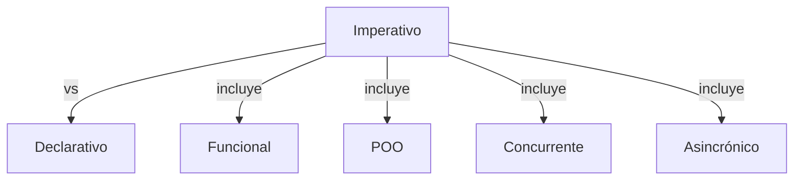
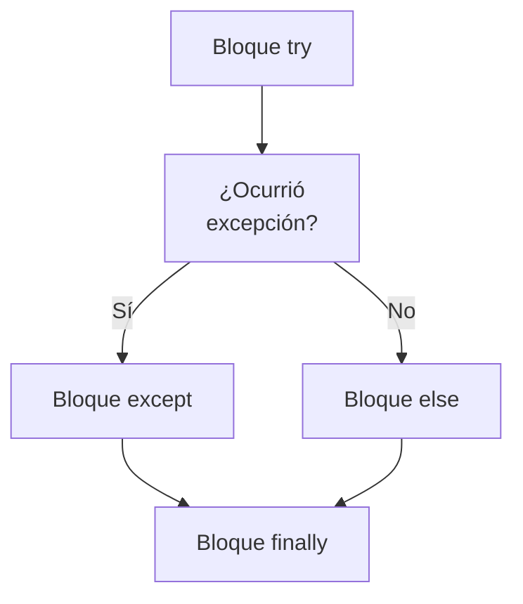
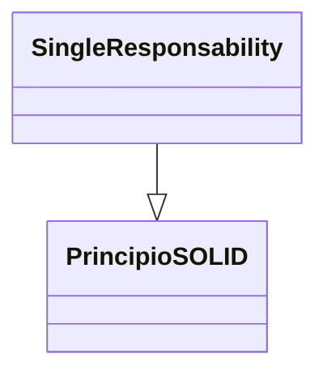
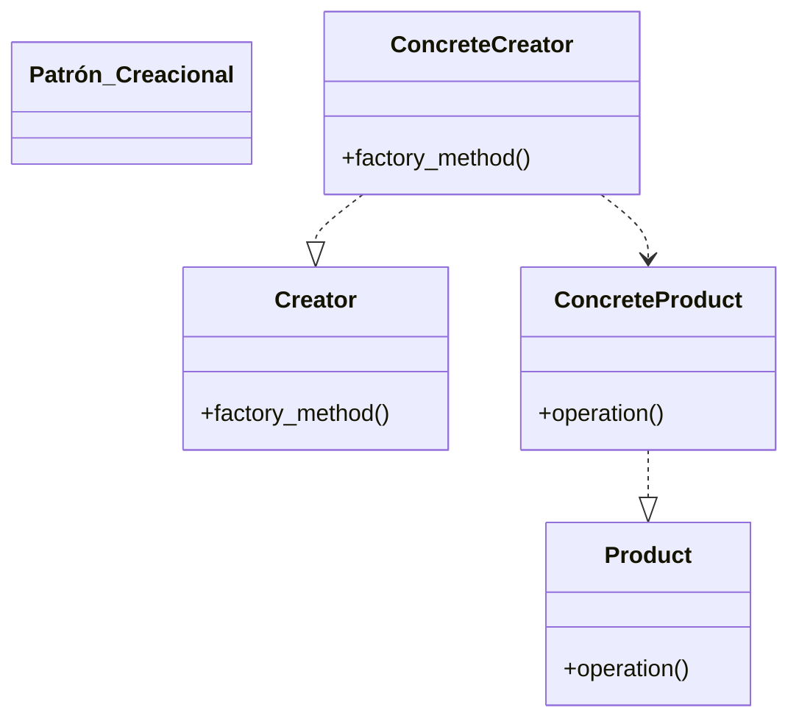

> [!abstract] **Etiquetas:** `POO` `basico` `decoradores` `design-patterns` `excepciones` `funcional` `generalizacion` `git-github` `refactorizacion` `solid`

# Código limpio

- El propósito principal de la refactorización es luchar contra la deuda técnica. 
- Transforma un desorden en código limpio y un diseño simple.

Genial Pero, que es el código limpio de todos modos? Aquí hay algunas 
de sus características:

## El código limpio es obvio para otros programadores.

Y no estoy hablando de algoritmos super sofisticados. Nombres de variables pobres, 
clases y métodos inflados, números mágicos: 
todo eso hace que el código sea descuidado y difícil de entender.

## El código limpio no contiene duplicación.

- Cada vez que tienes que hacer un cambio en un código duplicado, 
tienes que recordar hacer el mismo cambio en cada instancia. 
- Esto aumenta la carga cognitiva y ralentiza el progreso.

## El código limpio contiene un numero mínimo de clases y otras partes móviles.

- Menos código es menos cosas que mantener en tu cabeza. 
- Menos código es menos mantenimiento. 
- Menos código son menos errores. 
- El código es una responsabilidad, mantenlo corto y simple.

## El código limpio pasa todas las pruebas.

- Sabes que tu código es sucio cuando solo el 95% de tus pruebas pasaron. 
- Sabes que estas en problemas cuando la cobertura de tus pruebas es del 0%.

El código limpio es mas fácil y mas barato de mantener
