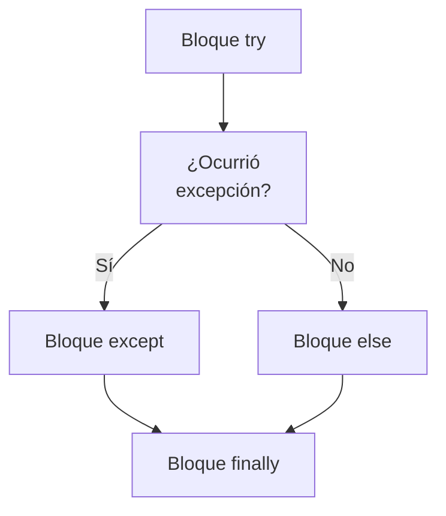
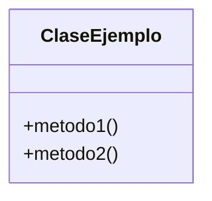

> [!abstract] **Etiquetas:** `POO` `design-patterns` `excepciones`

# Simplificando Llamadas a Métodos
Estas técnicas **hacen que las llamadas a métodos sean más simples y fáciles de entender**. 
Esto, a su vez, simplifica las interfaces para la interacción entre clases.

- [[simplificar-llamadas-a-metodos/renombrar-metodo|Renombrar Método]]
- [[simplificar-llamadas-a-metodos/agregar-parametro|Agregar Parámetro]]
- [[simplificar-llamadas-a-metodos/eliminar-parametro|Eliminar Parámetro]]
- [[simplificar-llamadas-a-metodos/separar-consulta-de-modificador|Separar Consulta de Modificador]]
- [[simplificar-llamadas-a-metodos/parametrizar-metodo|Parametrizar Método]]
- [[simplificar-llamadas-a-metodos/reemplazar-parametro-con-metodos-explicitos|Reemplazar Parámetro con Métodos Explícitos]]
- [[simplificar-llamadas-a-metodos/preservar-objeto-completo|Preservar Objeto Completo]]
- [[simplificar-llamadas-a-metodos/reemplazar-parametro-con-llamada-a-metodo|Reemplazar Parámetro con Llamada a Método]]
- [[simplificar-llamadas-a-metodos/introducir-objeto-de-parametros|Introducir Objeto de Parámetros]]
- [[simplificar-llamadas-a-metodos/eliminar-metodo-de-establecimiento|Eliminar Método de Establecimiento]]
- [[simplificar-llamadas-a-metodos/ocultar-metodo|Ocultar Método]]
- [[simplificar-llamadas-a-metodos/reemplazar-constructor-con-metodo-de-fabrica|Reemplazar Constructor con Método de Fábrica]]
- [[simplificar-llamadas-a-metodos/reemplazar-codigo-de-error-con-excepcion|Reemplazar Código de Error con Excepción]]
- [[simplificar-llamadas-a-metodos/reemplazar-excepcion-con-prueba|Reemplazar Excepción con Prueba]]

## Contenido relacionado

### POO

- [[01-intro-paradigmas-imperativo-declarativo|Paradigmas en python]]
- [[02-funcional|Paradigma Funcional]]
- [[03-reflexivo|Paradigma reflexivo]]
- [[git|Git]]
- [[github|Conectando los repositorios de GIT y GitHub.]]
- [[librerias-para-python|Librerias para Python]]
- [[sistemas_numericos|Sistemas numéricos]]
- [[como_crear_un_programa_en_linux|Creando un script ejecutable.]]
- [[04-comentarios|Comentarios de triple comilla]]
- [[02-metodos-magicos|Métodos mágicos]]
- [[colapso-de-jerarquia|Colapso de jerarquia]]
- [[delegacion-con-herencia|Reemplazar Delegación con Herencia]]
- [[extract-subclass|Extract Subclass (Extraer Subclase)]]
- [[extract-superclass|Extract Superclass:]]
- [[extract-interface|Extract interface]]
- [[form-template-method|Form Template Method]]
- [[herencia-con-delegacion|Reemplazar la herencia con delegación]]
- [[pull-up-field|Pull Up Field]]
- [[pull-up-method|Pull Up Method]]
- [[pull-up-constructor-body|Pull Up Constructor Body]]
- [[push-downf-field|Push Down Field:]]
- [[push-down-method|Push Down Method]]
- [[tratar-con-generalización|Tratar con generalización]]
- [[refactorización-code-smells|Codigo limpio]]
- [[01-unique-responsability|1. Principio de responsabilidad única]]
- [[02-open-close|2. Principio abierto-cerrado]]
- [[03-liskov-sustitution|3. Principio de sustitución de Liskov]]
- [[04-interface-segregation|4. Principio de segregación de interfaces]]
- [[05-dependency-inversion|5. Principio de inversión de la dependencia]]
- [[abstract-factory|Ejemplo conceptual]]
- [[builder|Builder en Python]]
- [[factory-method|Método de fábrica en Python]]
- [[prototype|Ejemplos de uso:]]
- [[inteligencia_artificial|Funcion dir() de Python]]
