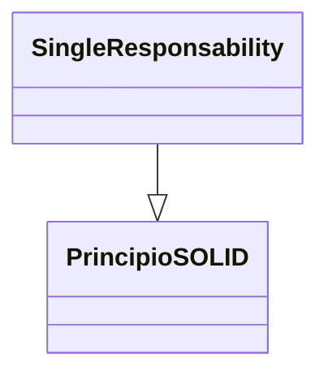

> [!abstract] **Etiquetas:** `POO` `basico` `generalizacion` `refactorizacion` `solid`



# Colapso de jerarquia

## Problema
Tienes una jerarquía de clases en la que una subclase es prácticamente igual que su superclase.

## Solución
Combina la subclase y la superclase.

## Por qué refactorizar
Tu programa ha crecido con el tiempo y una subclase y una superclase se 
han vuelto prácticamente iguales. Se eliminó una característica de una subclase, 
se movió un método a la superclase... y ahora tienes dos clases que se parecen mucho.

## Beneficios
Se reduce la complejidad del programa. Menos clases significan menos cosas que 
recordar y menos piezas móviles frágiles en las que preocuparse durante futuros 
cambios de código.

Es más fácil navegar por tu código cuando los métodos están definidos en una sola clase. 
No tienes que revisar toda la jerarquía para encontrar un método en particular.

## Cuándo no usar
¿La jerarquía de clases que estás refactorizando tiene más de una subclase? Si es así, 
después de que se complete la refactorización, las subclases restantes deben 
convertirse en herederas de la clase en la que se colapsó la jerarquía.

Pero ten en cuenta que esto puede llevar a violaciones del principio 
de sustitución de Liskov. 

Por ejemplo, si tu programa emula redes de transporte de la ciudad 
y accidentalmente colapsas la superclase Transport en la subclase Car, 
entonces la clase Plane puede convertirse en heredera de Car. ¡Ups!

## Cómo refactorizar
Selecciona qué clase es más fácil de eliminar: la superclase o su subclase.

Utiliza Pull Up Field y Pull Up Method si decides deshacerte de la subclase. 
Si eliges eliminar la superclase, utiliza Push Down Field y Push Down Method.

Reemplaza todos los usos de la clase que estás eliminando con la clase a la 
que se van a migrar los campos y métodos. A menudo, esto será el código para crear clases, 
la tipificación de variables y parámetros, y la documentación en los comentarios de código.

Elimina la clase vacía.


---

```python

"""
¡Claro! Aquí te muestro un ejemplo sencillo de cómo aplicar el refactoring "Collapse Hierarchy" en Python:

Antes:

"""
class Animal:
    def __init__(self, name):
        self.name = name

    def get_name(self):
        return self.name

class Cat(Animal):
    def __init__(self, name, color):
        super().__init__(name)
        self.color = color

    def meow(self):
        return "Meow!"

class Dog(Animal):
    def __init__(self, name, breed):
        super().__init__(name)
        self.breed = breed

    def bark(self):
        return "Woof!"

class Poodle(Dog):
    def __init__(self, name):
        super().__init__(name, "Poodle")

    def bark(self):
        return "Yip!"
```

---

```python

"""Después:"""


class Animal:
    def __init__(self, name):
        self.name = name

    def get_name(self):
        return self.name

class Cat:
    def __init__(self, name, color):
        self.animal = Animal(name)
        self.color = color

    def meow(self):
        return "Meow!"

    def get_name(self):
        return self.animal.get_name()

class Dog:
    def __init__(self, name, breed):
        self.animal = Animal(name)
        self.breed = breed

    def bark(self):
        return "Woof!"

    def get_name(self):
        return self.animal.get_name()

class Poodle(Dog):
    def __init__(self, name):
        super().__init__(name, "Poodle")

    def bark(self):
        return "Yip!"
```

---


##### En este ejemplo:
- Antes teníamos una jerarquía de clases Animal -> Cat, Animal -> Dog -> Poodle. 
- Después de aplicar "**Collapse Hierarchy**", hemos eliminado la `clase Animal` y hemos reemplazado sus referencias en `Cat y Dog` con un objeto de `Animal` que se crea en el constructor. Esto simplifica la jerarquía de clases y reduce la complejidad del código.

## Contenido relacionado

### POO

- [[01-intro-paradigmas-imperativo-declarativo|Paradigmas en python]]
- [[02-funcional|Paradigma Funcional]]
- [[03-reflexivo|Paradigma reflexivo]]
- [[git|Git]]
- [[github|Conectando los repositorios de GIT y GitHub.]]
- [[librerias-para-python|Librerias para Python]]
- [[sistemas_numericos|Sistemas numéricos]]
- [[como_crear_un_programa_en_linux|Creando un script ejecutable.]]
- [[04-comentarios|Comentarios de triple comilla]]
- [[02-metodos-magicos|Métodos mágicos]]
- [[simplificar-llamadas-a-metodos|Simplificando Llamadas a Métodos]]
- [[delegacion-con-herencia|Reemplazar Delegación con Herencia]]
- [[extract-subclass|Extract Subclass (Extraer Subclase)]]
- [[extract-superclass|Extract Superclass:]]
- [[extract-interface|Extract interface]]
- [[form-template-method|Form Template Method]]
- [[herencia-con-delegacion|Reemplazar la herencia con delegación]]
- [[pull-up-field|Pull Up Field]]
- [[pull-up-method|Pull Up Method]]
- [[pull-up-constructor-body|Pull Up Constructor Body]]
- [[push-downf-field|Push Down Field:]]
- [[push-down-method|Push Down Method]]
- [[tratar-con-generalización|Tratar con generalización]]
- [[refactorización-code-smells|Codigo limpio]]
- [[01-unique-responsability|1. Principio de responsabilidad única]]
- [[02-open-close|2. Principio abierto-cerrado]]
- [[03-liskov-sustitution|3. Principio de sustitución de Liskov]]
- [[04-interface-segregation|4. Principio de segregación de interfaces]]
- [[05-dependency-inversion|5. Principio de inversión de la dependencia]]
- [[abstract-factory|Ejemplo conceptual]]
- [[builder|Builder en Python]]
- [[factory-method|Método de fábrica en Python]]
- [[prototype|Ejemplos de uso:]]
- [[inteligencia_artificial|Funcion dir() de Python]]

### basico

- [[00-caracteristicas_python|Anotaciones lenguaje Python]]
- [[00-esoterismos-de-python|Esoterismos de python]]
- [[01-intro-paradigmas-imperativo-declarativo|Paradigmas en python]]
- [[02-funcional|Paradigma Funcional]]
- [[03-reflexivo|Paradigma reflexivo]]
- [[git|Git]]
- [[github|Conectando los repositorios de GIT y GitHub.]]
- [[librerias-para-python|Librerias para Python]]
- [[trucos_de_refactorización|Trucos de refactorizacion.]]
- [[sistemas_numericos|Sistemas numéricos]]
- [[como_crear_un_programa_en_linux|Creando un script ejecutable.]]
- [[04-comentarios|Comentarios de triple comilla]]
- [[02-metodos-magicos|Métodos mágicos]]
- [[07-excepciones-try-except|Tipos de error]]
- [[extract-subclass|Extract Subclass (Extraer Subclase)]]
- [[pull-up-constructor-body|Pull Up Constructor Body]]
- [[refactorización-code-smells|Codigo limpio]]
- [[03-liskov-sustitution|3. Principio de sustitución de Liskov]]
- [[abstract-factory|Ejemplo conceptual]]
- [[builder|Builder en Python]]
- [[factory-method|Método de fábrica en Python]]
- [[prototype|Ejemplos de uso:]]
- [[../../frameworks/pandas/BloodyRoarTierList|Bloody Roar Tier List]]
- [[../../../ejercicios/Ejercicio_1|Ejercicio 1]]
- [[../../../ejercicios/Ejercicio_2|Ejercicio 1]]
- [[../../../prueba-tecnica|prueba-tecnica]]

### generalizacion

- [[delegacion-con-herencia|Reemplazar Delegación con Herencia]]
- [[extract-subclass|Extract Subclass (Extraer Subclase)]]
- [[extract-superclass|Extract Superclass:]]
- [[extract-interface|Extract interface]]
- [[form-template-method|Form Template Method]]
- [[herencia-con-delegacion|Reemplazar la herencia con delegación]]
- [[pull-up-field|Pull Up Field]]
- [[pull-up-method|Pull Up Method]]
- [[pull-up-constructor-body|Pull Up Constructor Body]]
- [[push-downf-field|Push Down Field:]]
- [[push-down-method|Push Down Method]]
- [[tratar-con-generalización|Tratar con generalización]]
- [[refactorización-code-smells|Codigo limpio]]

### refactorizacion

- [[trucos_de_refactorización|Trucos de refactorizacion.]]
- [[delegacion-con-herencia|Reemplazar Delegación con Herencia]]
- [[extract-subclass|Extract Subclass (Extraer Subclase)]]
- [[extract-superclass|Extract Superclass:]]
- [[extract-interface|Extract interface]]
- [[form-template-method|Form Template Method]]
- [[herencia-con-delegacion|Reemplazar la herencia con delegación]]
- [[pull-up-field|Pull Up Field]]
- [[pull-up-method|Pull Up Method]]
- [[pull-up-constructor-body|Pull Up Constructor Body]]
- [[push-downf-field|Push Down Field:]]
- [[push-down-method|Push Down Method]]
- [[tratar-con-generalización|Tratar con generalización]]
- [[refactorización-code-smells|Codigo limpio]]
- [[abstract-factory|Ejemplo conceptual]]

### solid

- [[00-caracteristicas_python|Anotaciones lenguaje Python]]
- [[00-esoterismos-de-python|Esoterismos de python]]
- [[github|Conectando los repositorios de GIT y GitHub.]]
- [[librerias-para-python|Librerias para Python]]
- [[delegacion-con-herencia|Reemplazar Delegación con Herencia]]
- [[extract-interface|Extract interface]]
- [[form-template-method|Form Template Method]]
- [[herencia-con-delegacion|Reemplazar la herencia con delegación]]
- [[tratar-con-generalización|Tratar con generalización]]
- [[refactorización-code-smells|Codigo limpio]]
- [[01-unique-responsability|1. Principio de responsabilidad única]]
- [[02-open-close|2. Principio abierto-cerrado]]
- [[03-liskov-sustitution|3. Principio de sustitución de Liskov]]
- [[04-interface-segregation|4. Principio de segregación de interfaces]]
- [[05-dependency-inversion|5. Principio de inversión de la dependencia]]
- [[abstract-factory|Ejemplo conceptual]]
- [[builder|Builder en Python]]
- [[factory-method|Método de fábrica en Python]]
- [[prototype|Ejemplos de uso:]]
