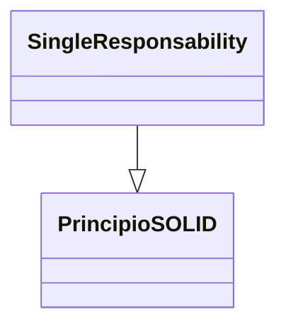

> [!abstract] **Etiquetas:** `POO` `generalizacion` `git-github` `refactorizacion` `solid`



# Reemplazar Delegación con Herencia

## Problema
Una clase contiene muchos métodos simples que delegan todos los métodos de otra clase.

## Solución
Hacer que la clase sea una clase heredera delegada, 
lo que hace innecesarios los métodos de delegación.

Reemplazar Delegación con Herencia - Antes
Reemplazar Delegación con Herencia - Después

## Por qué Refactorizar
La delegación es un enfoque más flexible que la herencia, ya que permite cambiar 
cómo se implementa la delegación y colocar otras clases allí también. 

No obstante, la delegación deja de ser beneficiosa si delegas acciones 
a solo una clase y a todos sus métodos públicos.

En tal caso, si reemplazas la delegación con la herencia, limpias la clase 
de una gran cantidad de métodos de delegación y te ahorras tener que crearlos 
para cada nuevo método de clase delegado.

## Beneficios
Reduce la longitud del código. Todos estos métodos de delegación ya no son necesarios.

## Cuándo no usar
No use esta técnica si la clase contiene delegación solo a una parte de los 
métodos públicos de la clase delegada. 
Al hacerlo, violaría el principio de sustitución de Liskov.

Esta técnica solo se puede usar si la clase aún no tiene padres.

## Cómo Refactorizar
Haz que la clase sea una subclase de la clase delegada.

Coloca el objeto actual en un campo que contenga una referencia al objeto delegado.

Elimina los métodos con simple delegación uno por uno. Si sus nombres eran diferentes, usa Renombrar Método para darles a todos los métodos un solo nombre.

Reemplaza todas las referencias al campo delegado con referencias al objeto actual.

Elimina el campo delegado.


---

```python
"""
¡Por supuesto! Aquí te muestro un ejemplo en Python de cómo reemplazar la delegación con herencia:

Antes de la refactorización:

"""
class Printer:
    def __init__(self):
        self.print_engine = PrintEngine()

    def print(self, text):
        self.print_engine.print(text)

class PrintEngine:
    def print(self, text):
        print(text)

printer = Printer()
printer.print("Hello, world!")
```

---

```python
"""

Después de la refactorización:

"""
class Printer(PrintEngine):
    pass

class PrintEngine:
    def print(self, text):
        print(text)

printer = Printer()
printer.print("Hello, world!")
```

---


##### En este ejemplo:
La clase `Printer` delega la tarea de imprimir en la clase `PrintEngine`, pero como la clase `Printer` solo tiene un método que delega la llamada a la clase `PrintEngine`, 
es más fácil y más limpio simplemente hacer que la clase `Printer` herede de la clase `PrintEngine` y use su método `print` directamente. De esta manera, podemos eliminar el método `print` de la clase `Printer` y todo el código de delegación asociado.

## Contenido relacionado

### POO

- [[01-intro-paradigmas-imperativo-declarativo|Paradigmas en python]]
- [[02-funcional|Paradigma Funcional]]
- [[03-reflexivo|Paradigma reflexivo]]
- [[git|Git]]
- [[github|Conectando los repositorios de GIT y GitHub.]]
- [[librerias-para-python|Librerias para Python]]
- [[sistemas_numericos|Sistemas numéricos]]
- [[como_crear_un_programa_en_linux|Creando un script ejecutable.]]
- [[04-comentarios|Comentarios de triple comilla]]
- [[02-metodos-magicos|Métodos mágicos]]
- [[simplificar-llamadas-a-metodos|Simplificando Llamadas a Métodos]]
- [[colapso-de-jerarquia|Colapso de jerarquia]]
- [[extract-subclass|Extract Subclass (Extraer Subclase)]]
- [[extract-superclass|Extract Superclass:]]
- [[extract-interface|Extract interface]]
- [[form-template-method|Form Template Method]]
- [[herencia-con-delegacion|Reemplazar la herencia con delegación]]
- [[pull-up-field|Pull Up Field]]
- [[pull-up-method|Pull Up Method]]
- [[pull-up-constructor-body|Pull Up Constructor Body]]
- [[push-downf-field|Push Down Field:]]
- [[push-down-method|Push Down Method]]
- [[tratar-con-generalización|Tratar con generalización]]
- [[refactorización-code-smells|Codigo limpio]]
- [[01-unique-responsability|1. Principio de responsabilidad única]]
- [[02-open-close|2. Principio abierto-cerrado]]
- [[03-liskov-sustitution|3. Principio de sustitución de Liskov]]
- [[04-interface-segregation|4. Principio de segregación de interfaces]]
- [[05-dependency-inversion|5. Principio de inversión de la dependencia]]
- [[abstract-factory|Ejemplo conceptual]]
- [[builder|Builder en Python]]
- [[factory-method|Método de fábrica en Python]]
- [[prototype|Ejemplos de uso:]]
- [[inteligencia_artificial|Funcion dir() de Python]]

### generalizacion

- [[colapso-de-jerarquia|Colapso de jerarquia]]
- [[extract-subclass|Extract Subclass (Extraer Subclase)]]
- [[extract-superclass|Extract Superclass:]]
- [[extract-interface|Extract interface]]
- [[form-template-method|Form Template Method]]
- [[herencia-con-delegacion|Reemplazar la herencia con delegación]]
- [[pull-up-field|Pull Up Field]]
- [[pull-up-method|Pull Up Method]]
- [[pull-up-constructor-body|Pull Up Constructor Body]]
- [[push-downf-field|Push Down Field:]]
- [[push-down-method|Push Down Method]]
- [[tratar-con-generalización|Tratar con generalización]]
- [[refactorización-code-smells|Codigo limpio]]

### git-github

- [[git|Git]]
- [[github|Conectando los repositorios de GIT y GitHub.]]
- [[sistemas_numericos|Sistemas numéricos]]
- [[refactorización-code-smells|Codigo limpio]]
- [[05-dependency-inversion|5. Principio de inversión de la dependencia]]
- [[../../frameworks/pandas/configurar|configurar]]
- [[inteligencia_artificial|Funcion dir() de Python]]
- [[../../../ejercicios/Ejercicio_2|Ejercicio 1]]

### refactorizacion

- [[trucos_de_refactorización|Trucos de refactorizacion.]]
- [[colapso-de-jerarquia|Colapso de jerarquia]]
- [[extract-subclass|Extract Subclass (Extraer Subclase)]]
- [[extract-superclass|Extract Superclass:]]
- [[extract-interface|Extract interface]]
- [[form-template-method|Form Template Method]]
- [[herencia-con-delegacion|Reemplazar la herencia con delegación]]
- [[pull-up-field|Pull Up Field]]
- [[pull-up-method|Pull Up Method]]
- [[pull-up-constructor-body|Pull Up Constructor Body]]
- [[push-downf-field|Push Down Field:]]
- [[push-down-method|Push Down Method]]
- [[tratar-con-generalización|Tratar con generalización]]
- [[refactorización-code-smells|Codigo limpio]]
- [[abstract-factory|Ejemplo conceptual]]

### solid

- [[00-caracteristicas_python|Anotaciones lenguaje Python]]
- [[00-esoterismos-de-python|Esoterismos de python]]
- [[github|Conectando los repositorios de GIT y GitHub.]]
- [[librerias-para-python|Librerias para Python]]
- [[colapso-de-jerarquia|Colapso de jerarquia]]
- [[extract-interface|Extract interface]]
- [[form-template-method|Form Template Method]]
- [[herencia-con-delegacion|Reemplazar la herencia con delegación]]
- [[tratar-con-generalización|Tratar con generalización]]
- [[refactorización-code-smells|Codigo limpio]]
- [[01-unique-responsability|1. Principio de responsabilidad única]]
- [[02-open-close|2. Principio abierto-cerrado]]
- [[03-liskov-sustitution|3. Principio de sustitución de Liskov]]
- [[04-interface-segregation|4. Principio de segregación de interfaces]]
- [[05-dependency-inversion|5. Principio de inversión de la dependencia]]
- [[abstract-factory|Ejemplo conceptual]]
- [[builder|Builder en Python]]
- [[factory-method|Método de fábrica en Python]]
- [[prototype|Ejemplos de uso:]]
