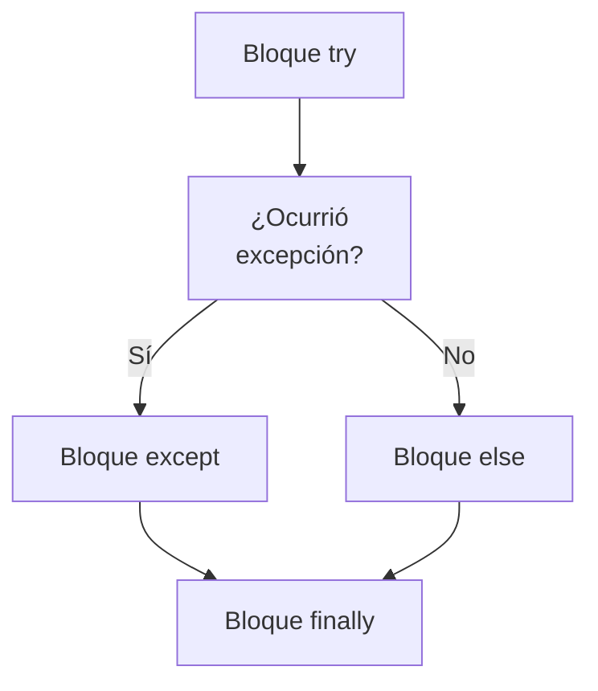

> [!abstract] **Etiquetas:** `POO` `excepciones` `generalizacion` `refactorizacion` `solid`



# Extract interface

## Problema
Múltiples clientes están utilizando la misma parte de la interfaz de una clase. 
> **Otro caso**: parte de la interfaz en dos clases es la misma.

## Solución
Mueva esta porción idéntica a su propia interfaz.

## Por qué refactorizar
Las interfaces son muy apropiadas cuando las clases juegan roles especiales 
en diferentes situaciones. Utilice "Extract Interface" para indicar explícitamente 
qué papel desempeña.

Otro caso conveniente surge cuando necesita describir las operaciones que 
realiza una clase en su servidor. 

Si se planea permitir eventualmente el uso de servidores de múltiples tipos, 
todos los servidores deben implementar la interfaz.

## Bueno saber

Hay cierta similitud entre "Extract Superclass" y "Extract Interface".

La extracción de una interfaz permite aislar solo las interfaces comunes, 
no el código común. En otras palabras, si las clases contienen código duplicado, 
extraer la interfaz no lo ayudará a deduplicar.

De todos modos, este problema se puede mitigar aplicando "Extract Class" 
para mover el comportamiento que contiene la duplicación a un componente separado 
y delegando todo el trabajo a él. 
Si el comportamiento común es grande, siempre puede utilizar "Extract Superclass". 
Esto es incluso más fácil, por supuesto, pero recuerde que si toma este 
camino solo obtendrá una clase principal.

## Cómo refactorizar

- Cree una interfaz vacía.

- Declare las operaciones comunes en la interfaz.

- Declare las clases necesarias como implementadoras de la interfaz.

- Cambie las declaraciones de tipo en el código del cliente para usar la nueva interfaz.


---

```python

"""
Un ejemplo en Python de cómo se puede aplicar el refactoring Extract Interface:

Antes del refactoring:

"""
class Car:
    def start_engine(self):
        pass
    
    def accelerate(self):
        pass
    
    def brake(self):
        pass


class ElectricCar(Car):
    def start_engine(self):
        raise NotImplementedError("Electric cars don't have engines!")
    
    def accelerate(self):
        print("Speeding up with electric motor...")
    
    def brake(self):
        print("Slowing down with regenerative braking...")
```

---

```python

"""Después del refactoring:"""


class Car:
    def start_engine(self):
        pass
    
    def accelerate(self):
        pass
    
    def brake(self):
        pass


class ElectricCarInterface:
    def accelerate(self):
        pass
    
    def brake(self):
        pass
    

class ElectricCar(Car, ElectricCarInterface):
    def start_engine(self):
        raise NotImplementedError("Electric cars don't have engines!")
    
    def accelerate(self):
        print("Speeding up with electric motor...")
    
    def brake(self):
        print("Slowing down with regenerative braking...")
```

---


##### En este ejemplo:

Hemos creado una nueva interfaz llamada `ElectricCarInterface` que define los métodos 
`accelerate` y `brake`. 

Luego, hemos hecho que la clase `ElectricCar` implemente esta interfaz en lugar  de heredar directamente de `Car`. 

Ahora, cualquier clase que quiera utilizar el comportamiento específico de los autos eléctricos puede implementar `ElectricCarInterface` en lugar de heredar de `ElectricCar`. 

Esto ayuda a reducir la dependencia de la jerarquía de clases y hace que el código sea más modular y fácil de mantener.

## Contenido relacionado

### POO

- [[01-intro-paradigmas-imperativo-declarativo|Paradigmas en python]]
- [[02-funcional|Paradigma Funcional]]
- [[03-reflexivo|Paradigma reflexivo]]
- [[git|Git]]
- [[github|Conectando los repositorios de GIT y GitHub.]]
- [[librerias-para-python|Librerias para Python]]
- [[sistemas_numericos|Sistemas numéricos]]
- [[como_crear_un_programa_en_linux|Creando un script ejecutable.]]
- [[04-comentarios|Comentarios de triple comilla]]
- [[02-metodos-magicos|Métodos mágicos]]
- [[simplificar-llamadas-a-metodos|Simplificando Llamadas a Métodos]]
- [[colapso-de-jerarquia|Colapso de jerarquia]]
- [[delegacion-con-herencia|Reemplazar Delegación con Herencia]]
- [[extract-subclass|Extract Subclass (Extraer Subclase)]]
- [[extract-superclass|Extract Superclass:]]
- [[form-template-method|Form Template Method]]
- [[herencia-con-delegacion|Reemplazar la herencia con delegación]]
- [[pull-up-field|Pull Up Field]]
- [[pull-up-method|Pull Up Method]]
- [[pull-up-constructor-body|Pull Up Constructor Body]]
- [[push-downf-field|Push Down Field:]]
- [[push-down-method|Push Down Method]]
- [[tratar-con-generalización|Tratar con generalización]]
- [[refactorización-code-smells|Codigo limpio]]
- [[01-unique-responsability|1. Principio de responsabilidad única]]
- [[02-open-close|2. Principio abierto-cerrado]]
- [[03-liskov-sustitution|3. Principio de sustitución de Liskov]]
- [[04-interface-segregation|4. Principio de segregación de interfaces]]
- [[05-dependency-inversion|5. Principio de inversión de la dependencia]]
- [[abstract-factory|Ejemplo conceptual]]
- [[builder|Builder en Python]]
- [[factory-method|Método de fábrica en Python]]
- [[prototype|Ejemplos de uso:]]
- [[inteligencia_artificial|Funcion dir() de Python]]

### excepciones

- [[00-esoterismos-de-python|Esoterismos de python]]
- [[02-funcional|Paradigma Funcional]]
- [[03-reflexivo|Paradigma reflexivo]]
- [[git|Git]]
- [[github|Conectando los repositorios de GIT y GitHub.]]
- [[04-comentarios|Comentarios de triple comilla]]
- [[07-excepciones-try-except|Tipos de error]]
- [[decorador|Decorador]]
- [[simplificar-llamadas-a-metodos|Simplificando Llamadas a Métodos]]
- [[extract-subclass|Extract Subclass (Extraer Subclase)]]
- [[form-template-method|Form Template Method]]
- [[pull-up-field|Pull Up Field]]
- [[push-down-method|Push Down Method]]
- [[refactorización-code-smells|Codigo limpio]]
- [[04-interface-segregation|4. Principio de segregación de interfaces]]
- [[abstract-factory|Ejemplo conceptual]]
- [[factory-method|Método de fábrica en Python]]

### generalizacion

- [[colapso-de-jerarquia|Colapso de jerarquia]]
- [[delegacion-con-herencia|Reemplazar Delegación con Herencia]]
- [[extract-subclass|Extract Subclass (Extraer Subclase)]]
- [[extract-superclass|Extract Superclass:]]
- [[form-template-method|Form Template Method]]
- [[herencia-con-delegacion|Reemplazar la herencia con delegación]]
- [[pull-up-field|Pull Up Field]]
- [[pull-up-method|Pull Up Method]]
- [[pull-up-constructor-body|Pull Up Constructor Body]]
- [[push-downf-field|Push Down Field:]]
- [[push-down-method|Push Down Method]]
- [[tratar-con-generalización|Tratar con generalización]]
- [[refactorización-code-smells|Codigo limpio]]

### refactorizacion

- [[trucos_de_refactorización|Trucos de refactorizacion.]]
- [[colapso-de-jerarquia|Colapso de jerarquia]]
- [[delegacion-con-herencia|Reemplazar Delegación con Herencia]]
- [[extract-subclass|Extract Subclass (Extraer Subclase)]]
- [[extract-superclass|Extract Superclass:]]
- [[form-template-method|Form Template Method]]
- [[herencia-con-delegacion|Reemplazar la herencia con delegación]]
- [[pull-up-field|Pull Up Field]]
- [[pull-up-method|Pull Up Method]]
- [[pull-up-constructor-body|Pull Up Constructor Body]]
- [[push-downf-field|Push Down Field:]]
- [[push-down-method|Push Down Method]]
- [[tratar-con-generalización|Tratar con generalización]]
- [[refactorización-code-smells|Codigo limpio]]
- [[abstract-factory|Ejemplo conceptual]]

### solid

- [[00-caracteristicas_python|Anotaciones lenguaje Python]]
- [[00-esoterismos-de-python|Esoterismos de python]]
- [[github|Conectando los repositorios de GIT y GitHub.]]
- [[librerias-para-python|Librerias para Python]]
- [[colapso-de-jerarquia|Colapso de jerarquia]]
- [[delegacion-con-herencia|Reemplazar Delegación con Herencia]]
- [[form-template-method|Form Template Method]]
- [[herencia-con-delegacion|Reemplazar la herencia con delegación]]
- [[tratar-con-generalización|Tratar con generalización]]
- [[refactorización-code-smells|Codigo limpio]]
- [[01-unique-responsability|1. Principio de responsabilidad única]]
- [[02-open-close|2. Principio abierto-cerrado]]
- [[03-liskov-sustitution|3. Principio de sustitución de Liskov]]
- [[04-interface-segregation|4. Principio de segregación de interfaces]]
- [[05-dependency-inversion|5. Principio de inversión de la dependencia]]
- [[abstract-factory|Ejemplo conceptual]]
- [[builder|Builder en Python]]
- [[factory-method|Método de fábrica en Python]]
- [[prototype|Ejemplos de uso:]]
