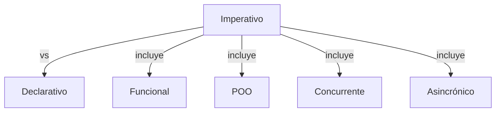
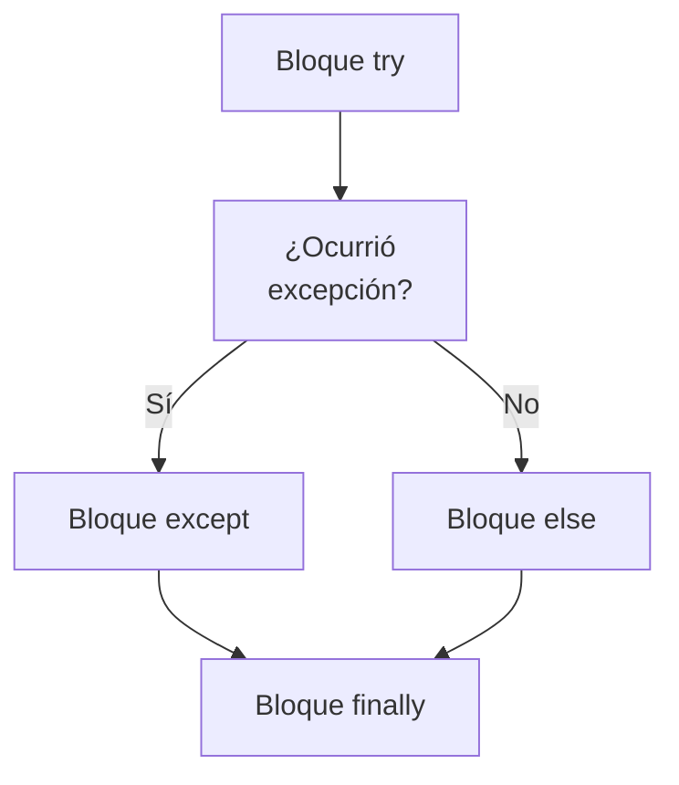

> [!abstract] **Etiquetas:** `POO` `basico` `design-patterns` `excepciones` `funcional` `generalizacion` `refactorizacion`





# Extract Subclass (Extraer Subclase)

## Problema
Una clase tiene características que solo se usan en casos específicos.

## Solución
Crear una subclase y usarla en estos casos.

Extract Subclass - Antes
Extract Subclass - Después

## ¿Por qué refactorizar?
La clase principal tiene métodos y campos para implementar un caso de uso raro para la clase. 
Si bien el caso es poco común, la clase es responsable de él y sería incorrecto mover todos los campos y métodos asociados a una clase completamente separada. 

Pero se podrían mover a una subclase, que es justo lo que haremos con la ayuda de esta técnica de refactorización.

## Beneficios
Crea una subclase rápidamente y de manera fácil.

Puede crear varias subclases separadas si su clase principal está implementando más de un caso especial.

## Desventajas
A pesar de su aparente simplicidad, la herencia puede llevar a un callejón sin salida si tiene que separar varias jerarquías de clases diferentes. 
Si, por ejemplo, tuvieras la clase Perros con diferentes comportamientos según el tamaño y el pelaje de los perros, podrías separar dos jerarquías:

Por tamaño: Grande, Mediano y Pequeño.

Por pelaje: Liso y Lanudo.

Y todo parecería estar bien, excepto que surgirán problemas tan pronto como necesites crear un perro que sea tanto Grande como Liso, ya que solo puedes crear un objeto de una clase. 

Dicho esto, puede evitar este problema usando Composición en lugar de Herencia (ver el patrón Estrategia). 
En otras palabras, la clase Perro tendrá dos campos componentes, tamaño y pelaje. 
Insertará objetos de componente de las clases necesarias en estos campos. 
Entonces, puede crear un Perro que tenga Tamaño Grande y Pelaje Lanudo.

## Cómo refactorizar
Cree una nueva subclase a partir de la clase de interés.

Si necesita datos adicionales para crear objetos a partir de una subclase, cree un constructor y agregue los parámetros necesarios. 
No olvide llamar a la implementación principal del constructor.

Encuentre todas las llamadas al constructor de la clase principal. 
Cuando sea necesario la funcionalidad de una subclase, reemplace el constructor principal con el constructor de la subclase.

Mueva los métodos y campos necesarios de la clase principal a la subclase. 
Haga esto a través de **Push Down Method y Push Down Field**. 
Es más fácil comenzar moviendo primero los métodos. 
De esta manera, los campos siguen siendo accesibles durante todo el proceso: 
desde la clase principal antes del movimiento y desde la subclase misma después de que se completa el movimiento.

Después de que la subclase esté lista, busque todos los campos antiguos que controlaban la elección de la funcionalidad. 
Elimine estos campos usando polimorfismo para reemplazar todos los operadores en los que se habían utilizado los campos. 
Un ejemplo simple: en la clase Car, tenía el campo isElectricCar y, según él, en el método `refuel()` el automóvil se carga con gas o electricidad. 
Después de la refactorización, se elimina el campo `isElectricCar` y las clases `Car y ElectricCar` tendrán sus propias implementaciones del método `refuel()`.


---

```python

"""
Claro, aquí te dejo un ejemplo en Python de cómo se puede aplicar la técnica de 
Extract Subclass para simplificar la estructura de una clase:

Supongamos que tenemos una clase `Empleado` que tiene muchos atributos y métodos 
relacionados con la gestión de empleados, pero necesitamos crear una nueva clase 
`Desarrollador` que comparta algunos de estos atributos y métodos, 
pero también tenga sus propios atributos y métodos específicos para su rol.

Antes de aplicar Extract Subclass, la clase `Empleado` podría verse así:

"""
class Empleado:
    def __init__(self, nombre, salario, fecha_contrato):
        self.nombre = nombre
        self.salario = salario
        self.fecha_contrato = fecha_contrato
        self.porcentaje_aumento = 0.05
        self.departamento = 'Desarrollo'
        self.horas_trabajo = 40

    def obtener_informacion(self):
        return f'Nombre: {self.nombre}, Salario: {self.salario}, Fecha de Contrato: {self.fecha_contrato}'

    def aumentar_salario(self):
        self.salario *= (1 + self.porcentaje_aumento)
```

---

```python

"""
Después de aplicar Extract Subclass, podemos crear una nueva clase `Desarrollador` 
que herede de `Empleado` y sobrescriba los atributos y métodos necesarios para su 
rol específico. De esta manera, podemos simplificar la clase `Empleado` y 
hacer que el código sea más fácil de entender y mantener:
"""


class Empleado:
    def __init__(self, nombre, salario, fecha_contrato):
        self.nombre = nombre
        self.salario = salario
        self.fecha_contrato = fecha_contrato

    def obtener_informacion(self):
        return f'Nombre: {self.nombre}, Salario: {self.salario}, Fecha de Contrato: {self.fecha_contrato}'

    def aumentar_salario(self):
        self.salario *= (1 + self.porcentaje_aumento)

class Desarrollador(Empleado):
    def __init__(self, nombre, salario, fecha_contrato, lenguaje_programacion):
        super().__init__(nombre, salario, fecha_contrato)
        self.lenguaje_programacion = lenguaje_programacion
        self.departamento = 'Desarrollo'
        self.horas_trabajo = 50
        self.porcentaje_aumento = 0.1

    def obtener_informacion(self):
        return f'Nombre: {self.nombre}, Salario: {self.salario}, Fecha de Contrato: {self.fecha_contrato}, Lenguaje de Programación: {self.lenguaje_programacion}'
```

---


##### En este ejemplo, 
la clase `Desarrollador` hereda los atributos y métodos de la clase `Empleado`, pero también tiene sus propios atributos y métodos específicos. 
Al aplicar Extract Subclass, pudimos simplificar la clase `Empleado` y hacer que el código sea más fácil de entender y mantener.


## Contenido relacionado

### POO

- [[01-intro-paradigmas-imperativo-declarativo|Paradigmas en python]]
- [[02-funcional|Paradigma Funcional]]
- [[03-reflexivo|Paradigma reflexivo]]
- [[git|Git]]
- [[github|Conectando los repositorios de GIT y GitHub.]]
- [[librerias-para-python|Librerias para Python]]
- [[sistemas_numericos|Sistemas numéricos]]
- [[como_crear_un_programa_en_linux|Creando un script ejecutable.]]
- [[04-comentarios|Comentarios de triple comilla]]
- [[02-metodos-magicos|Métodos mágicos]]
- [[simplificar-llamadas-a-metodos|Simplificando Llamadas a Métodos]]
- [[colapso-de-jerarquia|Colapso de jerarquia]]
- [[delegacion-con-herencia|Reemplazar Delegación con Herencia]]
- [[extract-superclass|Extract Superclass:]]
- [[extract-interface|Extract interface]]
- [[form-template-method|Form Template Method]]
- [[herencia-con-delegacion|Reemplazar la herencia con delegación]]
- [[pull-up-field|Pull Up Field]]
- [[pull-up-method|Pull Up Method]]
- [[pull-up-constructor-body|Pull Up Constructor Body]]
- [[push-downf-field|Push Down Field:]]
- [[push-down-method|Push Down Method]]
- [[tratar-con-generalización|Tratar con generalización]]
- [[refactorización-code-smells|Codigo limpio]]
- [[01-unique-responsability|1. Principio de responsabilidad única]]
- [[02-open-close|2. Principio abierto-cerrado]]
- [[03-liskov-sustitution|3. Principio de sustitución de Liskov]]
- [[04-interface-segregation|4. Principio de segregación de interfaces]]
- [[05-dependency-inversion|5. Principio de inversión de la dependencia]]
- [[abstract-factory|Ejemplo conceptual]]
- [[builder|Builder en Python]]
- [[factory-method|Método de fábrica en Python]]
- [[prototype|Ejemplos de uso:]]
- [[inteligencia_artificial|Funcion dir() de Python]]

### basico

- [[00-caracteristicas_python|Anotaciones lenguaje Python]]
- [[00-esoterismos-de-python|Esoterismos de python]]
- [[01-intro-paradigmas-imperativo-declarativo|Paradigmas en python]]
- [[02-funcional|Paradigma Funcional]]
- [[03-reflexivo|Paradigma reflexivo]]
- [[git|Git]]
- [[github|Conectando los repositorios de GIT y GitHub.]]
- [[librerias-para-python|Librerias para Python]]
- [[trucos_de_refactorización|Trucos de refactorizacion.]]
- [[sistemas_numericos|Sistemas numéricos]]
- [[como_crear_un_programa_en_linux|Creando un script ejecutable.]]
- [[04-comentarios|Comentarios de triple comilla]]
- [[02-metodos-magicos|Métodos mágicos]]
- [[07-excepciones-try-except|Tipos de error]]
- [[colapso-de-jerarquia|Colapso de jerarquia]]
- [[pull-up-constructor-body|Pull Up Constructor Body]]
- [[refactorización-code-smells|Codigo limpio]]
- [[03-liskov-sustitution|3. Principio de sustitución de Liskov]]
- [[abstract-factory|Ejemplo conceptual]]
- [[builder|Builder en Python]]
- [[factory-method|Método de fábrica en Python]]
- [[prototype|Ejemplos de uso:]]
- [[../../frameworks/pandas/BloodyRoarTierList|Bloody Roar Tier List]]
- [[../../../ejercicios/Ejercicio_1|Ejercicio 1]]
- [[../../../ejercicios/Ejercicio_2|Ejercicio 1]]
- [[../../../prueba-tecnica|prueba-tecnica]]

### design-patterns

- [[git|Git]]
- [[github|Conectando los repositorios de GIT y GitHub.]]
- [[librerias-para-python|Librerias para Python]]
- [[simplificar-llamadas-a-metodos|Simplificando Llamadas a Métodos]]
- [[form-template-method|Form Template Method]]
- [[herencia-con-delegacion|Reemplazar la herencia con delegación]]
- [[push-downf-field|Push Down Field:]]
- [[refactorización-code-smells|Codigo limpio]]
- [[01-unique-responsability|1. Principio de responsabilidad única]]
- [[03-liskov-sustitution|3. Principio de sustitución de Liskov]]
- [[abstract-factory|Ejemplo conceptual]]
- [[builder|Builder en Python]]
- [[factory-method|Método de fábrica en Python]]
- [[prototype|Ejemplos de uso:]]

### excepciones

- [[00-esoterismos-de-python|Esoterismos de python]]
- [[02-funcional|Paradigma Funcional]]
- [[03-reflexivo|Paradigma reflexivo]]
- [[git|Git]]
- [[github|Conectando los repositorios de GIT y GitHub.]]
- [[04-comentarios|Comentarios de triple comilla]]
- [[07-excepciones-try-except|Tipos de error]]
- [[decorador|Decorador]]
- [[simplificar-llamadas-a-metodos|Simplificando Llamadas a Métodos]]
- [[extract-interface|Extract interface]]
- [[form-template-method|Form Template Method]]
- [[pull-up-field|Pull Up Field]]
- [[push-down-method|Push Down Method]]
- [[refactorización-code-smells|Codigo limpio]]
- [[04-interface-segregation|4. Principio de segregación de interfaces]]
- [[abstract-factory|Ejemplo conceptual]]
- [[factory-method|Método de fábrica en Python]]

### funcional

- [[00-esoterismos-de-python|Esoterismos de python]]
- [[01-intro-paradigmas-imperativo-declarativo|Paradigmas en python]]
- [[02-funcional|Paradigma Funcional]]
- [[03-reflexivo|Paradigma reflexivo]]
- [[github|Conectando los repositorios de GIT y GitHub.]]
- [[librerias-para-python|Librerias para Python]]
- [[trucos_de_refactorización|Trucos de refactorizacion.]]
- [[decorador|Decorador]]
- [[extract-superclass|Extract Superclass:]]
- [[push-downf-field|Push Down Field:]]
- [[push-down-method|Push Down Method]]
- [[tratar-con-generalización|Tratar con generalización]]
- [[refactorización-code-smells|Codigo limpio]]
- [[factory-method|Método de fábrica en Python]]
- [[../../../ejercicios/Ejercicio_1|Ejercicio 1]]
- [[../../../ejercicios/Ejercicio_2|Ejercicio 1]]

### generalizacion

- [[colapso-de-jerarquia|Colapso de jerarquia]]
- [[delegacion-con-herencia|Reemplazar Delegación con Herencia]]
- [[extract-superclass|Extract Superclass:]]
- [[extract-interface|Extract interface]]
- [[form-template-method|Form Template Method]]
- [[herencia-con-delegacion|Reemplazar la herencia con delegación]]
- [[pull-up-field|Pull Up Field]]
- [[pull-up-method|Pull Up Method]]
- [[pull-up-constructor-body|Pull Up Constructor Body]]
- [[push-downf-field|Push Down Field:]]
- [[push-down-method|Push Down Method]]
- [[tratar-con-generalización|Tratar con generalización]]
- [[refactorización-code-smells|Codigo limpio]]

### refactorizacion

- [[trucos_de_refactorización|Trucos de refactorizacion.]]
- [[colapso-de-jerarquia|Colapso de jerarquia]]
- [[delegacion-con-herencia|Reemplazar Delegación con Herencia]]
- [[extract-superclass|Extract Superclass:]]
- [[extract-interface|Extract interface]]
- [[form-template-method|Form Template Method]]
- [[herencia-con-delegacion|Reemplazar la herencia con delegación]]
- [[pull-up-field|Pull Up Field]]
- [[pull-up-method|Pull Up Method]]
- [[pull-up-constructor-body|Pull Up Constructor Body]]
- [[push-downf-field|Push Down Field:]]
- [[push-down-method|Push Down Method]]
- [[tratar-con-generalización|Tratar con generalización]]
- [[refactorización-code-smells|Codigo limpio]]
- [[abstract-factory|Ejemplo conceptual]]
