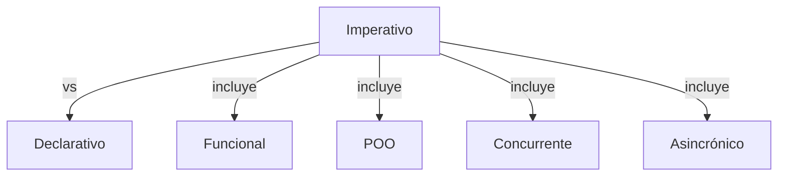

> [!abstract] **Etiquetas:** `POO` `funcional` `generalizacion` `refactorizacion`



```mermaid
classDiagram
    class Patrón_Creacional {
    class Creator {
        +factory_method()
    }
    class Product {
        +operation()
    }
    class ConcreteProduct {
        +operation()
    }
    class ConcreteCreator {
        +factory_method()
    }
    ConcreteProduct ..|> Product
    ConcreteCreator ..|> Creator
    ConcreteCreator ..> ConcreteProduct
```

# Extract Superclass:

# Problema
Tienes dos clases con campos y métodos comunes.

# Solución
Crea una superclase compartida para ellas y mueve todos los campos y métodos idénticos a ella.

# Por qué refactorizar
Un tipo de duplicación de código ocurre cuando dos clases realizan tareas similares de la misma manera, o realizan tareas similares de manera diferente. 
Los objetos ofrecen un mecanismo incorporado para simplificar tales situaciones a través de la herencia. 

Pero a menudo esta similitud pasa desapercibida hasta que se crean las clases, lo que requiere crear una estructura de herencia posteriormente.

## Beneficios
Deduplicación de código. Los campos y métodos comunes ahora "viven" en un solo lugar.

## Cuando no usar
No se puede aplicar esta técnica a clases que ya tienen una superclase.

## Cómo refactorizar
Crea una superclase abstracta.

Utiliza las técnicas **Pull Up Field, Pull Up Method y Pull Up Constructor Body** para mover la funcionalidad común a una superclase. **Comienza con los campos**, ya que además de los campos comunes, deberás mover **los campos que se usan en los métodos comunes**.

Busca lugares en el código cliente donde el uso de las subclases pueda ser reemplazado por tu nueva clase (como en las declaraciones de tipo).


---

```python

"""
Por supuesto, aquí tienes un ejemplo en Python de cómo utilizar la técnica 
Extract Superclass para refactorizar una clase que comparte atributos y 
métodos con otra clase:

Supongamos que tenemos dos clases, `Dog` y `Cat`, que tienen atributos y 
métodos comunes, como `name`, `age`, `eat()`, `sleep()`, y `make_sound()`. 
Aquí está el código original:

"""
class Dog:
    def __init__(self, name, age):
        self.name = name
        self.age = age
        
    def eat(self):
        print(f"{self.name} is eating.")
        
    def sleep(self):
        print(f"{self.name} is sleeping.")
        
    def make_sound(self):
        print("Woof!")
        

class Cat:
    def __init__(self, name, age):
        self.name = name
        self.age = age
        
    def eat(self):
        print(f"{self.name} is eating.")
        
    def sleep(self):
        print(f"{self.name} is sleeping.")
        
    def make_sound(self):
        print("Meow!")
```

---

```python

"""
Podemos ver que estas dos clases tienen atributos y métodos comunes. 
Para evitar la duplicación de código y mejorar la legibilidad del código, 
podemos extraer una superclase llamada `Animal` que contenga los atributos 
y métodos compartidos. Aquí está el código refactorizado:

"""


class Animal:
    def __init__(self, name, age):
        self.name = name
        self.age = age
        
    def eat(self):
        print(f"{self.name} is eating.")
        
    def sleep(self):
        print(f"{self.name} is sleeping.")
        

class Dog(Animal):
    def make_sound(self):
        print("Woof!")
        

class Cat(Animal):
    def make_sound(self):
        print("Meow!")
```

---

```python

"""
En este nuevo código, hemos creado una nueva clase llamada `Animal` que contiene 
los atributos y métodos comunes. 

Luego, hemos modificado las clases `Dog` y `Cat` para heredar de `Animal` 
utilizando la sintaxis `class Subclass(Superclass)`. 

Finalmente, hemos eliminado los atributos y métodos duplicados en `Dog` y `Cat`.

Ahora, si queremos crear una nueva clase `Bird` que tenga los mismos atributos 
y métodos que `Dog` y `Cat`, podemos simplemente heredar de `Animal` y 
definir el método `make_sound()` para que haga el sonido de un pájaro:
"""

class Bird(Animal):
    def make_sound(self):
        print("Chirp!")
```

---

De esta manera, hemos utilizado la técnica Extract Superclass para simplificar nuestro código y hacerlo más legible y fácil de mantener.


## Contenido relacionado

### POO

- [[01-intro-paradigmas-imperativo-declarativo|Paradigmas en python]]
- [[02-funcional|Paradigma Funcional]]
- [[03-reflexivo|Paradigma reflexivo]]
- [[git|Git]]
- [[github|Conectando los repositorios de GIT y GitHub.]]
- [[librerias-para-python|Librerias para Python]]
- [[sistemas_numericos|Sistemas numéricos]]
- [[como_crear_un_programa_en_linux|Creando un script ejecutable.]]
- [[04-comentarios|Comentarios de triple comilla]]
- [[02-metodos-magicos|Métodos mágicos]]
- [[simplificar-llamadas-a-metodos|Simplificando Llamadas a Métodos]]
- [[colapso-de-jerarquia|Colapso de jerarquia]]
- [[delegacion-con-herencia|Reemplazar Delegación con Herencia]]
- [[extract-subclass|Extract Subclass (Extraer Subclase)]]
- [[extract-interface|Extract interface]]
- [[form-template-method|Form Template Method]]
- [[herencia-con-delegacion|Reemplazar la herencia con delegación]]
- [[pull-up-field|Pull Up Field]]
- [[pull-up-method|Pull Up Method]]
- [[pull-up-constructor-body|Pull Up Constructor Body]]
- [[push-downf-field|Push Down Field:]]
- [[push-down-method|Push Down Method]]
- [[tratar-con-generalización|Tratar con generalización]]
- [[refactorización-code-smells|Codigo limpio]]
- [[01-unique-responsability|1. Principio de responsabilidad única]]
- [[02-open-close|2. Principio abierto-cerrado]]
- [[03-liskov-sustitution|3. Principio de sustitución de Liskov]]
- [[04-interface-segregation|4. Principio de segregación de interfaces]]
- [[05-dependency-inversion|5. Principio de inversión de la dependencia]]
- [[abstract-factory|Ejemplo conceptual]]
- [[builder|Builder en Python]]
- [[factory-method|Método de fábrica en Python]]
- [[prototype|Ejemplos de uso:]]
- [[inteligencia_artificial|Funcion dir() de Python]]

### funcional

- [[00-esoterismos-de-python|Esoterismos de python]]
- [[01-intro-paradigmas-imperativo-declarativo|Paradigmas en python]]
- [[02-funcional|Paradigma Funcional]]
- [[03-reflexivo|Paradigma reflexivo]]
- [[github|Conectando los repositorios de GIT y GitHub.]]
- [[librerias-para-python|Librerias para Python]]
- [[trucos_de_refactorización|Trucos de refactorizacion.]]
- [[decorador|Decorador]]
- [[extract-subclass|Extract Subclass (Extraer Subclase)]]
- [[push-downf-field|Push Down Field:]]
- [[push-down-method|Push Down Method]]
- [[tratar-con-generalización|Tratar con generalización]]
- [[refactorización-code-smells|Codigo limpio]]
- [[factory-method|Método de fábrica en Python]]
- [[../../../ejercicios/Ejercicio_1|Ejercicio 1]]
- [[../../../ejercicios/Ejercicio_2|Ejercicio 1]]

### generalizacion

- [[colapso-de-jerarquia|Colapso de jerarquia]]
- [[delegacion-con-herencia|Reemplazar Delegación con Herencia]]
- [[extract-subclass|Extract Subclass (Extraer Subclase)]]
- [[extract-interface|Extract interface]]
- [[form-template-method|Form Template Method]]
- [[herencia-con-delegacion|Reemplazar la herencia con delegación]]
- [[pull-up-field|Pull Up Field]]
- [[pull-up-method|Pull Up Method]]
- [[pull-up-constructor-body|Pull Up Constructor Body]]
- [[push-downf-field|Push Down Field:]]
- [[push-down-method|Push Down Method]]
- [[tratar-con-generalización|Tratar con generalización]]
- [[refactorización-code-smells|Codigo limpio]]

### refactorizacion

- [[trucos_de_refactorización|Trucos de refactorizacion.]]
- [[colapso-de-jerarquia|Colapso de jerarquia]]
- [[delegacion-con-herencia|Reemplazar Delegación con Herencia]]
- [[extract-subclass|Extract Subclass (Extraer Subclase)]]
- [[extract-interface|Extract interface]]
- [[form-template-method|Form Template Method]]
- [[herencia-con-delegacion|Reemplazar la herencia con delegación]]
- [[pull-up-field|Pull Up Field]]
- [[pull-up-method|Pull Up Method]]
- [[pull-up-constructor-body|Pull Up Constructor Body]]
- [[push-downf-field|Push Down Field:]]
- [[push-down-method|Push Down Method]]
- [[tratar-con-generalización|Tratar con generalización]]
- [[refactorización-code-smells|Codigo limpio]]
- [[abstract-factory|Ejemplo conceptual]]
