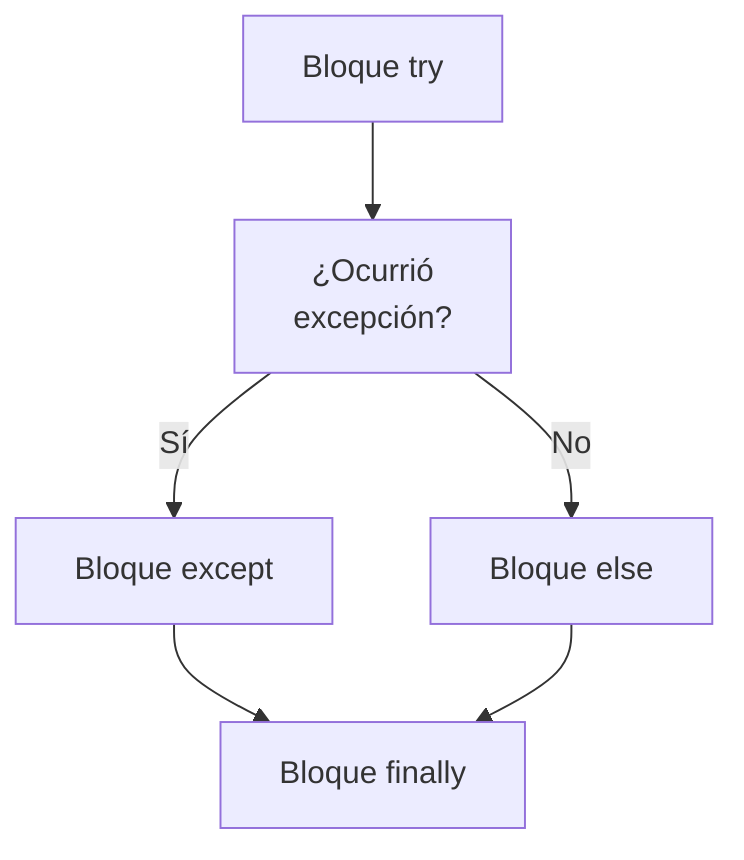

> [!abstract] **Etiquetas:** `POO` `design-patterns` `excepciones` `generalizacion` `refactorizacion` `solid`



```mermaid
classDiagram
    class Patrón_Creacional {
    class Creator {
        +factory_method()
    }
    class Product {
        +operation()
    }
    class ConcreteProduct {
        +operation()
    }
    class ConcreteCreator {
        +factory_method()
    }
    ConcreteProduct ..|> Product
    ConcreteCreator ..|> Creator
    ConcreteCreator ..> ConcreteProduct
```

# Form Template Method

## Problema
Tus subclases implementan algoritmos que contienen pasos similares en el mismo orden.

## Solución
Mueve la estructura del algoritmo y los pasos idénticos a una superclase y deja la implementación de los pasos diferentes en las subclases.

## Por qué refactorizar
Las subclases se desarrollan en paralelo, a veces por diferentes personas, lo que lleva a la duplicación de código, errores y dificultades en el mantenimiento del código, ya que cada cambio debe realizarse en todas las subclases.

## Beneficios
La duplicación de código no siempre se refiere a casos de simple copiar y pegar. 
A menudo, la duplicación ocurre a un nivel superior, como cuando tienes un método para ordenar números y un método para ordenar colecciones de objetos que solo se diferencian por la comparación de elementos. 

Crear un método de plantilla elimina esta duplicación fusionando los pasos de algoritmo compartidos en una superclase y 
dejando solo las diferencias en las subclases.

La formación de un método de plantilla es un ejemplo del principio Abierto/Cerrado en acción. 
Cuando aparece una nueva versión del algoritmo, solo necesitas crear una nueva subclase; 
no se requieren cambios en el código existente.

## Cómo refactorizar
Divide los algoritmos en las subclases en sus partes constituyentes descritas en métodos separados. Extract Method puede ayudar con esto.

Los métodos resultantes que son idénticos para todas las subclases se pueden mover a una superclase a través de Pull Up Method.

A los métodos no similares se les pueden dar nombres consistentes a través de Rename Method.

Mueve las firmas de los métodos no similares a una superclase como métodos abstractos mediante Pull Up Method. Deja sus implementaciones en las subclases.

Y finalmente, mueve el método principal del algoritmo a la superclase. 
Ahora debería funcionar con los pasos del método descritos en la superclase, tanto reales como abstractos.

---

```python

"""
Sí, aquí tienes un ejemplo en Python que ilustra cómo se puede aplicar el 
patrón Form Template Method:

Antes:

"""
class BaseClass:
    def process(self):
        self.step1()
        self.step2()
        self.step3()

class SubClass1(BaseClass):
    def step1(self):
        print("Subclass 1, Step 1")

    def step2(self):
        print("Subclass 1, Step 2")

    def step3(self):
        print("Subclass 1, Step 3")


class SubClass2(BaseClass):
    def step1(self):
        print("Subclass 2, Step 1")

    def step2(self):
        print("Subclass 2, Step 2")

    def step3(self):
        print("Subclass 2, Step 3")
```

---

```python

"""Después:"""

class BaseClass:
    def process(self):
        self.step1()
        self.step2()
        self.step3()

    def step1(self):
        raise NotImplementedError()

    def step2(self):
        raise NotImplementedError()

    def step3(self):
        raise NotImplementedError()


class SubClass1(BaseClass):
    def step1(self):
        print("Subclass 1, Step 1")

    def step2(self):
        print("Subclass 1, Step 2")

    def step3(self):
        print("Subclass 1, Step 3")


class SubClass2(BaseClass):
    def step1(self):
        print("Subclass 2, Step 1")

    def step2(self):
        print("Subclass 2, Step 2")

    def step3(self):
        print("Subclass 2, Step 3")
```

---

- En este ejemplo, la clase BaseClass define el método process, que llama a los métodos step1, step2 y step3. 

- En la implementación original, estas funciones se definen en cada subclase. 

- En la implementación refactorizada, se definen como métodos abstractos en la clase BaseClass. 

- Cada subclase implementa los métodos step1, step2 y step3 según sea necesario. 

- Como resultado, la lógica compartida se ha extraído a la clase BaseClass, lo que reduce la duplicación de código y facilita el mantenimiento del código.

## Contenido relacionado

### POO

- [[01-intro-paradigmas-imperativo-declarativo|Paradigmas en python]]
- [[02-funcional|Paradigma Funcional]]
- [[03-reflexivo|Paradigma reflexivo]]
- [[git|Git]]
- [[github|Conectando los repositorios de GIT y GitHub.]]
- [[librerias-para-python|Librerias para Python]]
- [[sistemas_numericos|Sistemas numéricos]]
- [[como_crear_un_programa_en_linux|Creando un script ejecutable.]]
- [[04-comentarios|Comentarios de triple comilla]]
- [[02-metodos-magicos|Métodos mágicos]]
- [[simplificar-llamadas-a-metodos|Simplificando Llamadas a Métodos]]
- [[colapso-de-jerarquia|Colapso de jerarquia]]
- [[delegacion-con-herencia|Reemplazar Delegación con Herencia]]
- [[extract-subclass|Extract Subclass (Extraer Subclase)]]
- [[extract-superclass|Extract Superclass:]]
- [[extract-interface|Extract interface]]
- [[herencia-con-delegacion|Reemplazar la herencia con delegación]]
- [[pull-up-field|Pull Up Field]]
- [[pull-up-method|Pull Up Method]]
- [[pull-up-constructor-body|Pull Up Constructor Body]]
- [[push-downf-field|Push Down Field:]]
- [[push-down-method|Push Down Method]]
- [[tratar-con-generalización|Tratar con generalización]]
- [[refactorización-code-smells|Codigo limpio]]
- [[01-unique-responsability|1. Principio de responsabilidad única]]
- [[02-open-close|2. Principio abierto-cerrado]]
- [[03-liskov-sustitution|3. Principio de sustitución de Liskov]]
- [[04-interface-segregation|4. Principio de segregación de interfaces]]
- [[05-dependency-inversion|5. Principio de inversión de la dependencia]]
- [[abstract-factory|Ejemplo conceptual]]
- [[builder|Builder en Python]]
- [[factory-method|Método de fábrica en Python]]
- [[prototype|Ejemplos de uso:]]
- [[inteligencia_artificial|Funcion dir() de Python]]

### design-patterns

- [[git|Git]]
- [[github|Conectando los repositorios de GIT y GitHub.]]
- [[librerias-para-python|Librerias para Python]]
- [[simplificar-llamadas-a-metodos|Simplificando Llamadas a Métodos]]
- [[extract-subclass|Extract Subclass (Extraer Subclase)]]
- [[herencia-con-delegacion|Reemplazar la herencia con delegación]]
- [[push-downf-field|Push Down Field:]]
- [[refactorización-code-smells|Codigo limpio]]
- [[01-unique-responsability|1. Principio de responsabilidad única]]
- [[03-liskov-sustitution|3. Principio de sustitución de Liskov]]
- [[abstract-factory|Ejemplo conceptual]]
- [[builder|Builder en Python]]
- [[factory-method|Método de fábrica en Python]]
- [[prototype|Ejemplos de uso:]]

### excepciones

- [[00-esoterismos-de-python|Esoterismos de python]]
- [[02-funcional|Paradigma Funcional]]
- [[03-reflexivo|Paradigma reflexivo]]
- [[git|Git]]
- [[github|Conectando los repositorios de GIT y GitHub.]]
- [[04-comentarios|Comentarios de triple comilla]]
- [[07-excepciones-try-except|Tipos de error]]
- [[decorador|Decorador]]
- [[simplificar-llamadas-a-metodos|Simplificando Llamadas a Métodos]]
- [[extract-subclass|Extract Subclass (Extraer Subclase)]]
- [[extract-interface|Extract interface]]
- [[pull-up-field|Pull Up Field]]
- [[push-down-method|Push Down Method]]
- [[refactorización-code-smells|Codigo limpio]]
- [[04-interface-segregation|4. Principio de segregación de interfaces]]
- [[abstract-factory|Ejemplo conceptual]]
- [[factory-method|Método de fábrica en Python]]

### generalizacion

- [[colapso-de-jerarquia|Colapso de jerarquia]]
- [[delegacion-con-herencia|Reemplazar Delegación con Herencia]]
- [[extract-subclass|Extract Subclass (Extraer Subclase)]]
- [[extract-superclass|Extract Superclass:]]
- [[extract-interface|Extract interface]]
- [[herencia-con-delegacion|Reemplazar la herencia con delegación]]
- [[pull-up-field|Pull Up Field]]
- [[pull-up-method|Pull Up Method]]
- [[pull-up-constructor-body|Pull Up Constructor Body]]
- [[push-downf-field|Push Down Field:]]
- [[push-down-method|Push Down Method]]
- [[tratar-con-generalización|Tratar con generalización]]
- [[refactorización-code-smells|Codigo limpio]]

### refactorizacion

- [[trucos_de_refactorización|Trucos de refactorizacion.]]
- [[colapso-de-jerarquia|Colapso de jerarquia]]
- [[delegacion-con-herencia|Reemplazar Delegación con Herencia]]
- [[extract-subclass|Extract Subclass (Extraer Subclase)]]
- [[extract-superclass|Extract Superclass:]]
- [[extract-interface|Extract interface]]
- [[herencia-con-delegacion|Reemplazar la herencia con delegación]]
- [[pull-up-field|Pull Up Field]]
- [[pull-up-method|Pull Up Method]]
- [[pull-up-constructor-body|Pull Up Constructor Body]]
- [[push-downf-field|Push Down Field:]]
- [[push-down-method|Push Down Method]]
- [[tratar-con-generalización|Tratar con generalización]]
- [[refactorización-code-smells|Codigo limpio]]
- [[abstract-factory|Ejemplo conceptual]]

### solid

- [[00-caracteristicas_python|Anotaciones lenguaje Python]]
- [[00-esoterismos-de-python|Esoterismos de python]]
- [[github|Conectando los repositorios de GIT y GitHub.]]
- [[librerias-para-python|Librerias para Python]]
- [[colapso-de-jerarquia|Colapso de jerarquia]]
- [[delegacion-con-herencia|Reemplazar Delegación con Herencia]]
- [[extract-interface|Extract interface]]
- [[herencia-con-delegacion|Reemplazar la herencia con delegación]]
- [[tratar-con-generalización|Tratar con generalización]]
- [[refactorización-code-smells|Codigo limpio]]
- [[01-unique-responsability|1. Principio de responsabilidad única]]
- [[02-open-close|2. Principio abierto-cerrado]]
- [[03-liskov-sustitution|3. Principio de sustitución de Liskov]]
- [[04-interface-segregation|4. Principio de segregación de interfaces]]
- [[05-dependency-inversion|5. Principio de inversión de la dependencia]]
- [[abstract-factory|Ejemplo conceptual]]
- [[builder|Builder en Python]]
- [[factory-method|Método de fábrica en Python]]
- [[prototype|Ejemplos de uso:]]
