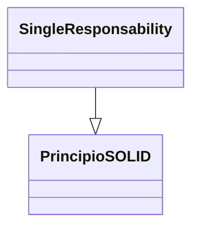

> [!abstract] **Etiquetas:** `POO` `design-patterns` `generalizacion` `refactorizacion` `solid`



# Reemplazar la herencia con delegación

## Problema
Tienes una subclase que utiliza solo una parte de los métodos de su superclase 
(o no es posible heredar datos de la superclase).

## Solución
Crea un campo y pon un objeto de la superclase en él, delega los métodos al objeto de la superclase y elimina la herencia.

Reemplazar la herencia con delegación - Antes
Reemplazar la herencia con delegación - Después

## ¿Por qué refactorizar?
Reemplazar la herencia con composición puede mejorar sustancialmente el diseño de la clase si:

Tu subclase viola el principio de sustitución de Liskov, es decir, si la herencia se implementó solo para combinar código común, 
pero no porque la subclase sea una extensión de la superclase.

La subclase utiliza solo una parte de los métodos de la superclase. 
En este caso, es solo cuestión de tiempo antes de que alguien llame a un método de la superclase que no debería llamar.

En esencia, esta técnica de refactorización divide ambas clases y hace que la superclase sea el ayudante de la subclase, no su padre. 

En lugar de heredar todos los métodos de la superclase, la subclase tendrá solo los métodos necesarios para delegar 
a los métodos del objeto de la superclase.

## Beneficios
Una clase no contiene ningún método no necesario heredado de la superclase.

Se pueden colocar en el campo de delegado varios objetos con varias implementaciones. 
En efecto, se obtiene el patrón de diseño de Estrategia.

## Desventajas
Debes escribir muchos métodos de delegación simples.

## Cómo refactorizar
- Crea un campo en la subclase para contener la superclase. 
- Durante la etapa inicial, coloca el objeto actual en él.
- Cambia los métodos de la subclase para que usen el objeto de la superclase en lugar de esto.
- Para los métodos heredados de la superclase que se llaman en el código del cliente, crea métodos de delegación simples en la subclase.
- Elimina la declaración de herencia de la subclase.
- Cambia el código de inicialización del campo en el que se almacena la antigua superclase mediante la creación de un nuevo objeto.


---

```python

"""
¡Por supuesto! Aquí tienes un ejemplo de cómo reemplazar la herencia con delegación en Python:

Antes:
"""

class Animal:
    def speak(self):
        pass

class Dog(Animal):
    def speak(self):
        print("Woof!")

class Cat(Animal):
    def speak(self):
        print("Meow!")
```

---

```python
"""
Después:
"""
class Animal:
    def __init__(self, speak_method):
        self.speak_method = speak_method

    def speak(self):
        self.speak_method()

def dog_speak():
    print("Woof!")

def cat_speak():
    print("Meow!")

class Dog:
    def __init__(self):
        self.animal = Animal(dog_speak)

    def speak(self):
        self.animal.speak()

class Cat:
    def __init__(self):
        self.animal = Animal(cat_speak)

    def speak(self):
        self.animal.speak()
```

---


**En este ejemplo**: hemos eliminado la herencia de `Dog` y `Cat` desde `Animal` y en su lugar hemos usado delegación. 
Hemos creado la clase `Animal` que toma una función como argumento en su inicialización y luego llama a esa función en su método `speak()`. 

Luego hemos creado dos funciones, `dog_speak()` y `cat_speak()`, que imprimen "Woof!" y "Meow!", respectivamente. 

Finalmente, hemos creado las clases `Dog` y `Cat`, que inicializan una instancia de `Animal` con la función adecuada y luego delegan en ella para llamar al método `speak()`.


## Contenido relacionado

### POO

- [[01-intro-paradigmas-imperativo-declarativo|Paradigmas en python]]
- [[02-funcional|Paradigma Funcional]]
- [[03-reflexivo|Paradigma reflexivo]]
- [[git|Git]]
- [[github|Conectando los repositorios de GIT y GitHub.]]
- [[librerias-para-python|Librerias para Python]]
- [[sistemas_numericos|Sistemas numéricos]]
- [[como_crear_un_programa_en_linux|Creando un script ejecutable.]]
- [[04-comentarios|Comentarios de triple comilla]]
- [[02-metodos-magicos|Métodos mágicos]]
- [[simplificar-llamadas-a-metodos|Simplificando Llamadas a Métodos]]
- [[colapso-de-jerarquia|Colapso de jerarquia]]
- [[delegacion-con-herencia|Reemplazar Delegación con Herencia]]
- [[extract-subclass|Extract Subclass (Extraer Subclase)]]
- [[extract-superclass|Extract Superclass:]]
- [[extract-interface|Extract interface]]
- [[form-template-method|Form Template Method]]
- [[pull-up-field|Pull Up Field]]
- [[pull-up-method|Pull Up Method]]
- [[pull-up-constructor-body|Pull Up Constructor Body]]
- [[push-downf-field|Push Down Field:]]
- [[push-down-method|Push Down Method]]
- [[tratar-con-generalización|Tratar con generalización]]
- [[refactorización-code-smells|Codigo limpio]]
- [[01-unique-responsability|1. Principio de responsabilidad única]]
- [[02-open-close|2. Principio abierto-cerrado]]
- [[03-liskov-sustitution|3. Principio de sustitución de Liskov]]
- [[04-interface-segregation|4. Principio de segregación de interfaces]]
- [[05-dependency-inversion|5. Principio de inversión de la dependencia]]
- [[abstract-factory|Ejemplo conceptual]]
- [[builder|Builder en Python]]
- [[factory-method|Método de fábrica en Python]]
- [[prototype|Ejemplos de uso:]]
- [[inteligencia_artificial|Funcion dir() de Python]]

### design-patterns

- [[git|Git]]
- [[github|Conectando los repositorios de GIT y GitHub.]]
- [[librerias-para-python|Librerias para Python]]
- [[simplificar-llamadas-a-metodos|Simplificando Llamadas a Métodos]]
- [[extract-subclass|Extract Subclass (Extraer Subclase)]]
- [[form-template-method|Form Template Method]]
- [[push-downf-field|Push Down Field:]]
- [[refactorización-code-smells|Codigo limpio]]
- [[01-unique-responsability|1. Principio de responsabilidad única]]
- [[03-liskov-sustitution|3. Principio de sustitución de Liskov]]
- [[abstract-factory|Ejemplo conceptual]]
- [[builder|Builder en Python]]
- [[factory-method|Método de fábrica en Python]]
- [[prototype|Ejemplos de uso:]]

### generalizacion

- [[colapso-de-jerarquia|Colapso de jerarquia]]
- [[delegacion-con-herencia|Reemplazar Delegación con Herencia]]
- [[extract-subclass|Extract Subclass (Extraer Subclase)]]
- [[extract-superclass|Extract Superclass:]]
- [[extract-interface|Extract interface]]
- [[form-template-method|Form Template Method]]
- [[pull-up-field|Pull Up Field]]
- [[pull-up-method|Pull Up Method]]
- [[pull-up-constructor-body|Pull Up Constructor Body]]
- [[push-downf-field|Push Down Field:]]
- [[push-down-method|Push Down Method]]
- [[tratar-con-generalización|Tratar con generalización]]
- [[refactorización-code-smells|Codigo limpio]]

### refactorizacion

- [[trucos_de_refactorización|Trucos de refactorizacion.]]
- [[colapso-de-jerarquia|Colapso de jerarquia]]
- [[delegacion-con-herencia|Reemplazar Delegación con Herencia]]
- [[extract-subclass|Extract Subclass (Extraer Subclase)]]
- [[extract-superclass|Extract Superclass:]]
- [[extract-interface|Extract interface]]
- [[form-template-method|Form Template Method]]
- [[pull-up-field|Pull Up Field]]
- [[pull-up-method|Pull Up Method]]
- [[pull-up-constructor-body|Pull Up Constructor Body]]
- [[push-downf-field|Push Down Field:]]
- [[push-down-method|Push Down Method]]
- [[tratar-con-generalización|Tratar con generalización]]
- [[refactorización-code-smells|Codigo limpio]]
- [[abstract-factory|Ejemplo conceptual]]

### solid

- [[00-caracteristicas_python|Anotaciones lenguaje Python]]
- [[00-esoterismos-de-python|Esoterismos de python]]
- [[github|Conectando los repositorios de GIT y GitHub.]]
- [[librerias-para-python|Librerias para Python]]
- [[colapso-de-jerarquia|Colapso de jerarquia]]
- [[delegacion-con-herencia|Reemplazar Delegación con Herencia]]
- [[extract-interface|Extract interface]]
- [[form-template-method|Form Template Method]]
- [[tratar-con-generalización|Tratar con generalización]]
- [[refactorización-code-smells|Codigo limpio]]
- [[01-unique-responsability|1. Principio de responsabilidad única]]
- [[02-open-close|2. Principio abierto-cerrado]]
- [[03-liskov-sustitution|3. Principio de sustitución de Liskov]]
- [[04-interface-segregation|4. Principio de segregación de interfaces]]
- [[05-dependency-inversion|5. Principio de inversión de la dependencia]]
- [[abstract-factory|Ejemplo conceptual]]
- [[builder|Builder en Python]]
- [[factory-method|Método de fábrica en Python]]
- [[prototype|Ejemplos de uso:]]
