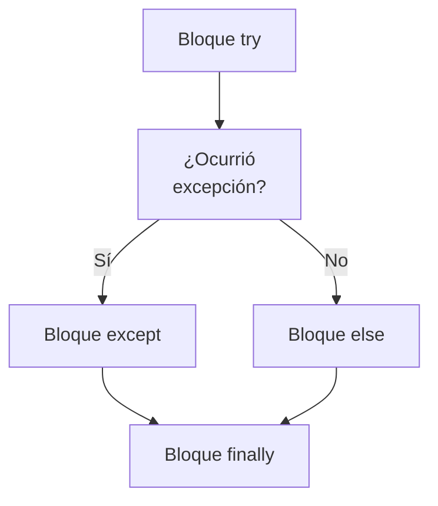

> [!abstract] **Etiquetas:** `POO` `excepciones` `generalizacion` `refactorizacion`



# Pull Up Field

## Problema
Dos clases tienen el mismo campo.

## Solución
Eliminar el campo de las subclases y moverlo a la superclase.

Pull Up Field - Antes
Pull Up Field - Después

## Por qué refactorizar
Las subclases crecieron y se desarrollaron por separado, lo que provocó la aparición de campos y métodos idénticos (o casi idénticos).

## Beneficios
Elimina la duplicación de campos en las subclases.

Facilita la posterior reubicación de métodos duplicados, si existen, de las subclases a una superclase.

## Cómo refactorizar
- Asegúrese de que los campos se utilicen para las mismas necesidades en las subclases.

- Si los campos tienen nombres diferentes, déles el mismo nombre y reemplace todas las referencias a los campos en el código existente.

- Cree un campo con el mismo nombre en la superclase. Tenga en cuenta que si los campos eran privados, el campo de la superclase debería ser protegido.

- Elimine los campos de las subclases.

- Es posible que desee considerar el uso de Encapsular Campo para el nuevo campo, 
para ocultarlo detrás de métodos de acceso.


---

```python

"""
Técnica de refactorización "Pull Up Field":

Antes de la refactorización:
"""
class Vehicle:
    def __init__(self, brand, model, year):
        self.brand = brand
        self.model = model
        self.year = year
        self.fuel_type = None

    def start_engine(self):
        raise NotImplementedError()

class Car(Vehicle):
    def __init__(self, brand, model, year, color):
        super().__init__(brand, model, year)
        self.color = color

    def start_engine(self):
        print("Engine started for car.")

class Truck(Vehicle):
    def __init__(self, brand, model, year, max_load_weight):
        super().__init__(brand, model, year)
        self.max_load_weight = max_load_weight

    def start_engine(self):
        print("Engine started for truck.")
```

---

En este ejemplo, `Car` y `Truck` heredan de `Vehicle` y tienen campos específicos (`color` y `max_load_weight`, respectivamente). Sin embargo, la clase base (`Vehicle`) también tiene un campo `fuel_type`, que no es relevante para los vehículos `Car` y `Truck`.

Después de la refactorización, podemos mover el campo `fuel_type` a una clase base común, como se muestra a continuación:


---

```python
"""
Después de la refactorización:
"""
class Vehicle:
    def __init__(self, brand, model, year, fuel_type):
        self.brand = brand
        self.model = model
        self.year = year
        self.fuel_type = fuel_type

    def start_engine(self):
        raise NotImplementedError()

class Car(Vehicle):
    def __init__(self, brand, model, year, color, fuel_type):
        super().__init__(brand, model, year, fuel_type)
        self.color = color

    def start_engine(self):
        print("Engine started for car.")

class Truck(Vehicle):
    def __init__(self, brand, model, year, max_load_weight, fuel_type):
        super().__init__(brand, model, year, fuel_type)
        self.max_load_weight = max_load_weight

    def start_engine(self):
        print("Engine started for truck.")
```

---


- Ahora `fuel_type` se ha movido de la clase `Vehicle` a una clase base común. 
- Esto hace que las clases `Car` y `Truck` sean más específicas y evita la duplicación de campos irrelevantes.


## Contenido relacionado

### POO

- [[01-intro-paradigmas-imperativo-declarativo|Paradigmas en python]]
- [[02-funcional|Paradigma Funcional]]
- [[03-reflexivo|Paradigma reflexivo]]
- [[git|Git]]
- [[github|Conectando los repositorios de GIT y GitHub.]]
- [[librerias-para-python|Librerias para Python]]
- [[sistemas_numericos|Sistemas numéricos]]
- [[como_crear_un_programa_en_linux|Creando un script ejecutable.]]
- [[04-comentarios|Comentarios de triple comilla]]
- [[02-metodos-magicos|Métodos mágicos]]
- [[simplificar-llamadas-a-metodos|Simplificando Llamadas a Métodos]]
- [[colapso-de-jerarquia|Colapso de jerarquia]]
- [[delegacion-con-herencia|Reemplazar Delegación con Herencia]]
- [[extract-subclass|Extract Subclass (Extraer Subclase)]]
- [[extract-superclass|Extract Superclass:]]
- [[extract-interface|Extract interface]]
- [[form-template-method|Form Template Method]]
- [[herencia-con-delegacion|Reemplazar la herencia con delegación]]
- [[pull-up-method|Pull Up Method]]
- [[pull-up-constructor-body|Pull Up Constructor Body]]
- [[push-downf-field|Push Down Field:]]
- [[push-down-method|Push Down Method]]
- [[tratar-con-generalización|Tratar con generalización]]
- [[refactorización-code-smells|Codigo limpio]]
- [[01-unique-responsability|1. Principio de responsabilidad única]]
- [[02-open-close|2. Principio abierto-cerrado]]
- [[03-liskov-sustitution|3. Principio de sustitución de Liskov]]
- [[04-interface-segregation|4. Principio de segregación de interfaces]]
- [[05-dependency-inversion|5. Principio de inversión de la dependencia]]
- [[abstract-factory|Ejemplo conceptual]]
- [[builder|Builder en Python]]
- [[factory-method|Método de fábrica en Python]]
- [[prototype|Ejemplos de uso:]]
- [[inteligencia_artificial|Funcion dir() de Python]]

### excepciones

- [[00-esoterismos-de-python|Esoterismos de python]]
- [[02-funcional|Paradigma Funcional]]
- [[03-reflexivo|Paradigma reflexivo]]
- [[git|Git]]
- [[github|Conectando los repositorios de GIT y GitHub.]]
- [[04-comentarios|Comentarios de triple comilla]]
- [[07-excepciones-try-except|Tipos de error]]
- [[decorador|Decorador]]
- [[simplificar-llamadas-a-metodos|Simplificando Llamadas a Métodos]]
- [[extract-subclass|Extract Subclass (Extraer Subclase)]]
- [[extract-interface|Extract interface]]
- [[form-template-method|Form Template Method]]
- [[push-down-method|Push Down Method]]
- [[refactorización-code-smells|Codigo limpio]]
- [[04-interface-segregation|4. Principio de segregación de interfaces]]
- [[abstract-factory|Ejemplo conceptual]]
- [[factory-method|Método de fábrica en Python]]

### generalizacion

- [[colapso-de-jerarquia|Colapso de jerarquia]]
- [[delegacion-con-herencia|Reemplazar Delegación con Herencia]]
- [[extract-subclass|Extract Subclass (Extraer Subclase)]]
- [[extract-superclass|Extract Superclass:]]
- [[extract-interface|Extract interface]]
- [[form-template-method|Form Template Method]]
- [[herencia-con-delegacion|Reemplazar la herencia con delegación]]
- [[pull-up-method|Pull Up Method]]
- [[pull-up-constructor-body|Pull Up Constructor Body]]
- [[push-downf-field|Push Down Field:]]
- [[push-down-method|Push Down Method]]
- [[tratar-con-generalización|Tratar con generalización]]
- [[refactorización-code-smells|Codigo limpio]]

### refactorizacion

- [[trucos_de_refactorización|Trucos de refactorizacion.]]
- [[colapso-de-jerarquia|Colapso de jerarquia]]
- [[delegacion-con-herencia|Reemplazar Delegación con Herencia]]
- [[extract-subclass|Extract Subclass (Extraer Subclase)]]
- [[extract-superclass|Extract Superclass:]]
- [[extract-interface|Extract interface]]
- [[form-template-method|Form Template Method]]
- [[herencia-con-delegacion|Reemplazar la herencia con delegación]]
- [[pull-up-method|Pull Up Method]]
- [[pull-up-constructor-body|Pull Up Constructor Body]]
- [[push-downf-field|Push Down Field:]]
- [[push-down-method|Push Down Method]]
- [[tratar-con-generalización|Tratar con generalización]]
- [[refactorización-code-smells|Codigo limpio]]
- [[abstract-factory|Ejemplo conceptual]]
