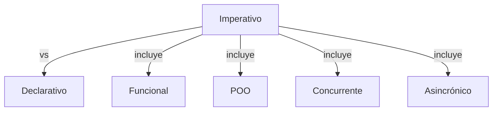
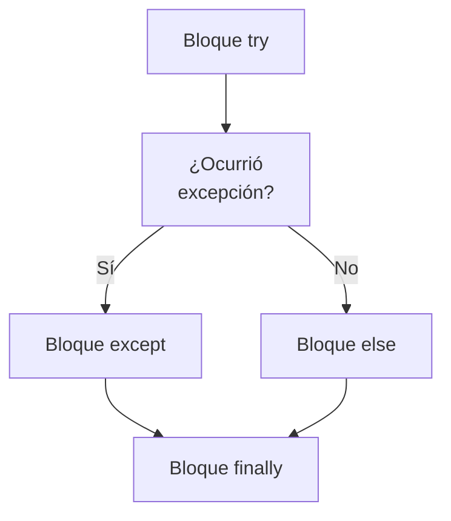

> [!abstract] **Etiquetas:** `POO` `excepciones` `funcional` `generalizacion` `refactorizacion`





# Push Down Method

## Problema
¿Se implementa un comportamiento en una superclase que es utilizado solo por una (o pocas) subclases?

## Solución
Mueva este comportamiento a las subclases.

Push Down Method - Antes
Push Down Method - Después

## Por qué refactorizar
Al principio, se pretendía que cierto método fuera universal para todas las clases, pero en realidad solo se utiliza en una subclase. 
Esta situación puede ocurrir cuando las funciones planificadas no se materializan.

Estas situaciones también pueden ocurrir después de la extracción parcial (o eliminación) de funcionalidades de una jerarquía de clases, 
dejando un método que solo se usa en una subclase.

Si ve que un método es necesario para más de una subclase, pero no todas, puede ser útil crear una subclase intermedia y mover el método a ella. 
Esto permite evitar la duplicación de código que resultaría de empujar un método hacia todas las subclases.

## Beneficios
Mejora la coherencia de la clase. Un método se encuentra donde se espera verlo.

## Cómo refactorizar
- Declare el método en una subclase y copie su código de la superclase.

- Elimine el método de la superclase.

- Encuentre todos los lugares donde se utiliza el método y verifique que se llame desde la subclase necesaria.


---

```python
"""
¡Claro! Aquí tienes un ejemplo en Python de Push Down Method:

Supongamos que tienes una clase `Vehicle` que tiene dos subclases `Car` y `Truck`. Ambas subclases tienen un método `drive`, pero el método `drive` es diferente para cada subclase. En este caso, el método `drive` debe ser empujado hacia abajo a las subclases, ya que no se usa en la superclase `Vehicle`.

Antes de refactorizar:

"""
class Vehicle:
    def start_engine(self):
        pass
    
class Car(Vehicle):
    def drive(self):
        print("Driving car...")
        
class Truck(Vehicle):
    def drive(self):
        print("Driving truck...")
```

---

```python

"""
Después de aplicar Push Down Method, la clase `Vehicle` ya no tendrá el método `drive`, 
y este método será movido a cada subclase correspondiente:
"""


class Vehicle:
    def start_engine(self):
        pass
    
class Car(Vehicle):
    def drive(self):
        print("Driving car...")
        
class Truck(Vehicle):
    def drive(self):
        print("Driving truck...")
```

---

Es importante asegurarse de que no se estén utilizando los métodos en la clase base antes de aplicar Push Down Method, ya que podría conducir a errores.

## Contenido relacionado

### POO

- [[01-intro-paradigmas-imperativo-declarativo|Paradigmas en python]]
- [[02-funcional|Paradigma Funcional]]
- [[03-reflexivo|Paradigma reflexivo]]
- [[git|Git]]
- [[github|Conectando los repositorios de GIT y GitHub.]]
- [[librerias-para-python|Librerias para Python]]
- [[sistemas_numericos|Sistemas numéricos]]
- [[como_crear_un_programa_en_linux|Creando un script ejecutable.]]
- [[04-comentarios|Comentarios de triple comilla]]
- [[02-metodos-magicos|Métodos mágicos]]
- [[simplificar-llamadas-a-metodos|Simplificando Llamadas a Métodos]]
- [[colapso-de-jerarquia|Colapso de jerarquia]]
- [[delegacion-con-herencia|Reemplazar Delegación con Herencia]]
- [[extract-subclass|Extract Subclass (Extraer Subclase)]]
- [[extract-superclass|Extract Superclass:]]
- [[extract-interface|Extract interface]]
- [[form-template-method|Form Template Method]]
- [[herencia-con-delegacion|Reemplazar la herencia con delegación]]
- [[pull-up-field|Pull Up Field]]
- [[pull-up-method|Pull Up Method]]
- [[pull-up-constructor-body|Pull Up Constructor Body]]
- [[push-downf-field|Push Down Field:]]
- [[tratar-con-generalización|Tratar con generalización]]
- [[refactorización-code-smells|Codigo limpio]]
- [[01-unique-responsability|1. Principio de responsabilidad única]]
- [[02-open-close|2. Principio abierto-cerrado]]
- [[03-liskov-sustitution|3. Principio de sustitución de Liskov]]
- [[04-interface-segregation|4. Principio de segregación de interfaces]]
- [[05-dependency-inversion|5. Principio de inversión de la dependencia]]
- [[abstract-factory|Ejemplo conceptual]]
- [[builder|Builder en Python]]
- [[factory-method|Método de fábrica en Python]]
- [[prototype|Ejemplos de uso:]]
- [[inteligencia_artificial|Funcion dir() de Python]]

### excepciones

- [[00-esoterismos-de-python|Esoterismos de python]]
- [[02-funcional|Paradigma Funcional]]
- [[03-reflexivo|Paradigma reflexivo]]
- [[git|Git]]
- [[github|Conectando los repositorios de GIT y GitHub.]]
- [[04-comentarios|Comentarios de triple comilla]]
- [[07-excepciones-try-except|Tipos de error]]
- [[decorador|Decorador]]
- [[simplificar-llamadas-a-metodos|Simplificando Llamadas a Métodos]]
- [[extract-subclass|Extract Subclass (Extraer Subclase)]]
- [[extract-interface|Extract interface]]
- [[form-template-method|Form Template Method]]
- [[pull-up-field|Pull Up Field]]
- [[refactorización-code-smells|Codigo limpio]]
- [[04-interface-segregation|4. Principio de segregación de interfaces]]
- [[abstract-factory|Ejemplo conceptual]]
- [[factory-method|Método de fábrica en Python]]

### funcional

- [[00-esoterismos-de-python|Esoterismos de python]]
- [[01-intro-paradigmas-imperativo-declarativo|Paradigmas en python]]
- [[02-funcional|Paradigma Funcional]]
- [[03-reflexivo|Paradigma reflexivo]]
- [[github|Conectando los repositorios de GIT y GitHub.]]
- [[librerias-para-python|Librerias para Python]]
- [[trucos_de_refactorización|Trucos de refactorizacion.]]
- [[decorador|Decorador]]
- [[extract-subclass|Extract Subclass (Extraer Subclase)]]
- [[extract-superclass|Extract Superclass:]]
- [[push-downf-field|Push Down Field:]]
- [[tratar-con-generalización|Tratar con generalización]]
- [[refactorización-code-smells|Codigo limpio]]
- [[factory-method|Método de fábrica en Python]]
- [[../../../ejercicios/Ejercicio_1|Ejercicio 1]]
- [[../../../ejercicios/Ejercicio_2|Ejercicio 1]]

### generalizacion

- [[colapso-de-jerarquia|Colapso de jerarquia]]
- [[delegacion-con-herencia|Reemplazar Delegación con Herencia]]
- [[extract-subclass|Extract Subclass (Extraer Subclase)]]
- [[extract-superclass|Extract Superclass:]]
- [[extract-interface|Extract interface]]
- [[form-template-method|Form Template Method]]
- [[herencia-con-delegacion|Reemplazar la herencia con delegación]]
- [[pull-up-field|Pull Up Field]]
- [[pull-up-method|Pull Up Method]]
- [[pull-up-constructor-body|Pull Up Constructor Body]]
- [[push-downf-field|Push Down Field:]]
- [[tratar-con-generalización|Tratar con generalización]]
- [[refactorización-code-smells|Codigo limpio]]

### refactorizacion

- [[trucos_de_refactorización|Trucos de refactorizacion.]]
- [[colapso-de-jerarquia|Colapso de jerarquia]]
- [[delegacion-con-herencia|Reemplazar Delegación con Herencia]]
- [[extract-subclass|Extract Subclass (Extraer Subclase)]]
- [[extract-superclass|Extract Superclass:]]
- [[extract-interface|Extract interface]]
- [[form-template-method|Form Template Method]]
- [[herencia-con-delegacion|Reemplazar la herencia con delegación]]
- [[pull-up-field|Pull Up Field]]
- [[pull-up-method|Pull Up Method]]
- [[pull-up-constructor-body|Pull Up Constructor Body]]
- [[push-downf-field|Push Down Field:]]
- [[tratar-con-generalización|Tratar con generalización]]
- [[refactorización-code-smells|Codigo limpio]]
- [[abstract-factory|Ejemplo conceptual]]
