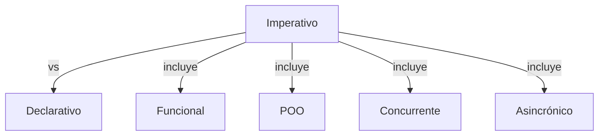

> [!abstract] **Etiquetas:** `POO` `design-patterns` `funcional` `generalizacion` `refactorizacion`



# Push Down Field:

## Problema
¿Se utiliza un campo solo en algunas subclases?

## Solución
Mueve el campo a esas subclases.

Push Down Field - Antes
Push Down Field - Después

## ¿Por qué refactorizar?
Aunque se planeó utilizar un campo de manera universal para todas las clases, en realidad se utiliza solo en algunas subclases. Esta situación puede ocurrir cuando las características planificadas no se concretan, por ejemplo.

Esto también puede ocurrir debido a la extracción (o eliminación) de parte de la funcionalidad de las jerarquías de clases.

## Beneficios
Mejora la coherencia interna de la clase. Un campo se encuentra donde realmente se utiliza.

Al mover a varias subclases simultáneamente, se pueden desarrollar los campos de forma independiente. Esto crea duplicación de código, por lo que se deben empujar los campos solo cuando realmente se pretende utilizar los campos de diferentes formas.

## Cómo refactorizar
- Declara un campo en todas las subclases necesarias.

- Elimina el campo de la superclase.


---

```python

"""
Claro, aquí te muestro un ejemplo en Python de cómo aplicar la técnica de Push Down Field:

Supongamos que tenemos una clase llamada `Animal` que tiene dos subclases llamadas `Gato` 
y `Perro`. La clase `Animal` tiene un atributo llamado `especie` que es común a todas 
las subclases, pero la subclase `Perro` también tiene un atributo adicional llamado `raza`. 
Queremos aplicar la técnica de Push Down Field para mover el atributo `raza` de 
la subclase `Perro` a la clase `Animal`.

Aquí está el código inicial:

"""
class Animal:
    def __init__(self, especie):
        self.especie = especie

class Gato(Animal):
    def __init__(self, especie, nombre):
        super().__init__(especie)
        self.nombre = nombre

class Perro(Animal):
    def __init__(self, especie, nombre, raza):
        super().__init__(especie)
        self.nombre = nombre
        self.raza = raza
```

---


Para aplicar la técnica de Push Down Field, seguimos estos pasos:

1. Creamos un atributo `raza` en la clase `Animal` y eliminamos el atributo 
correspondiente en la subclase `Perro`.

2. Actualizamos el constructor de la subclase `Perro` para que utilice el 
constructor de la superclase y elimine la inicialización del atributo `raza`.

3. Actualizamos el constructor de la subclase `Gato` para que utilice el 
constructor de la superclase sin cambios.


---

```python
"""
Aquí está el código actualizado con la técnica de Push Down Field aplicada:
"""

class Animal:
    def __init__(self, especie, raza=None):
        self.especie = especie
        self.raza = raza

class Gato(Animal):
    def __init__(self, especie, nombre):
        super().__init__(especie)

class Perro(Animal):
    def __init__(self, especie, nombre):
        super().__init__(especie)
        self.nombre = nombre
```

---


Ahora el atributo `raza` se ha movido de la subclase `Perro` a la superclase `Animal`, lo que simplifica el diseño y reduce la duplicación de código.


## Contenido relacionado

### POO

- [[01-intro-paradigmas-imperativo-declarativo|Paradigmas en python]]
- [[02-funcional|Paradigma Funcional]]
- [[03-reflexivo|Paradigma reflexivo]]
- [[git|Git]]
- [[github|Conectando los repositorios de GIT y GitHub.]]
- [[librerias-para-python|Librerias para Python]]
- [[sistemas_numericos|Sistemas numéricos]]
- [[como_crear_un_programa_en_linux|Creando un script ejecutable.]]
- [[04-comentarios|Comentarios de triple comilla]]
- [[02-metodos-magicos|Métodos mágicos]]
- [[simplificar-llamadas-a-metodos|Simplificando Llamadas a Métodos]]
- [[colapso-de-jerarquia|Colapso de jerarquia]]
- [[delegacion-con-herencia|Reemplazar Delegación con Herencia]]
- [[extract-subclass|Extract Subclass (Extraer Subclase)]]
- [[extract-superclass|Extract Superclass:]]
- [[extract-interface|Extract interface]]
- [[form-template-method|Form Template Method]]
- [[herencia-con-delegacion|Reemplazar la herencia con delegación]]
- [[pull-up-field|Pull Up Field]]
- [[pull-up-method|Pull Up Method]]
- [[pull-up-constructor-body|Pull Up Constructor Body]]
- [[push-down-method|Push Down Method]]
- [[tratar-con-generalización|Tratar con generalización]]
- [[refactorización-code-smells|Codigo limpio]]
- [[01-unique-responsability|1. Principio de responsabilidad única]]
- [[02-open-close|2. Principio abierto-cerrado]]
- [[03-liskov-sustitution|3. Principio de sustitución de Liskov]]
- [[04-interface-segregation|4. Principio de segregación de interfaces]]
- [[05-dependency-inversion|5. Principio de inversión de la dependencia]]
- [[abstract-factory|Ejemplo conceptual]]
- [[builder|Builder en Python]]
- [[factory-method|Método de fábrica en Python]]
- [[prototype|Ejemplos de uso:]]
- [[inteligencia_artificial|Funcion dir() de Python]]

### design-patterns

- [[git|Git]]
- [[github|Conectando los repositorios de GIT y GitHub.]]
- [[librerias-para-python|Librerias para Python]]
- [[simplificar-llamadas-a-metodos|Simplificando Llamadas a Métodos]]
- [[extract-subclass|Extract Subclass (Extraer Subclase)]]
- [[form-template-method|Form Template Method]]
- [[herencia-con-delegacion|Reemplazar la herencia con delegación]]
- [[refactorización-code-smells|Codigo limpio]]
- [[01-unique-responsability|1. Principio de responsabilidad única]]
- [[03-liskov-sustitution|3. Principio de sustitución de Liskov]]
- [[abstract-factory|Ejemplo conceptual]]
- [[builder|Builder en Python]]
- [[factory-method|Método de fábrica en Python]]
- [[prototype|Ejemplos de uso:]]

### funcional

- [[00-esoterismos-de-python|Esoterismos de python]]
- [[01-intro-paradigmas-imperativo-declarativo|Paradigmas en python]]
- [[02-funcional|Paradigma Funcional]]
- [[03-reflexivo|Paradigma reflexivo]]
- [[github|Conectando los repositorios de GIT y GitHub.]]
- [[librerias-para-python|Librerias para Python]]
- [[trucos_de_refactorización|Trucos de refactorizacion.]]
- [[decorador|Decorador]]
- [[extract-subclass|Extract Subclass (Extraer Subclase)]]
- [[extract-superclass|Extract Superclass:]]
- [[push-down-method|Push Down Method]]
- [[tratar-con-generalización|Tratar con generalización]]
- [[refactorización-code-smells|Codigo limpio]]
- [[factory-method|Método de fábrica en Python]]
- [[../../../ejercicios/Ejercicio_1|Ejercicio 1]]
- [[../../../ejercicios/Ejercicio_2|Ejercicio 1]]

### generalizacion

- [[colapso-de-jerarquia|Colapso de jerarquia]]
- [[delegacion-con-herencia|Reemplazar Delegación con Herencia]]
- [[extract-subclass|Extract Subclass (Extraer Subclase)]]
- [[extract-superclass|Extract Superclass:]]
- [[extract-interface|Extract interface]]
- [[form-template-method|Form Template Method]]
- [[herencia-con-delegacion|Reemplazar la herencia con delegación]]
- [[pull-up-field|Pull Up Field]]
- [[pull-up-method|Pull Up Method]]
- [[pull-up-constructor-body|Pull Up Constructor Body]]
- [[push-down-method|Push Down Method]]
- [[tratar-con-generalización|Tratar con generalización]]
- [[refactorización-code-smells|Codigo limpio]]

### refactorizacion

- [[trucos_de_refactorización|Trucos de refactorizacion.]]
- [[colapso-de-jerarquia|Colapso de jerarquia]]
- [[delegacion-con-herencia|Reemplazar Delegación con Herencia]]
- [[extract-subclass|Extract Subclass (Extraer Subclase)]]
- [[extract-superclass|Extract Superclass:]]
- [[extract-interface|Extract interface]]
- [[form-template-method|Form Template Method]]
- [[herencia-con-delegacion|Reemplazar la herencia con delegación]]
- [[pull-up-field|Pull Up Field]]
- [[pull-up-method|Pull Up Method]]
- [[pull-up-constructor-body|Pull Up Constructor Body]]
- [[push-down-method|Push Down Method]]
- [[tratar-con-generalización|Tratar con generalización]]
- [[refactorización-code-smells|Codigo limpio]]
- [[abstract-factory|Ejemplo conceptual]]
