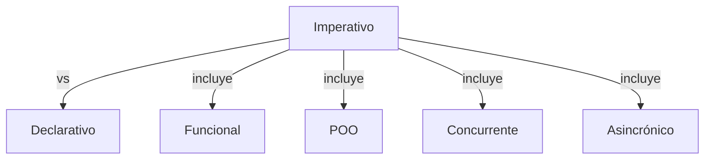

> [!abstract] **Etiquetas:** `POO` `funcional` `generalizacion` `refactorizacion` `solid`

# Tratar con generalización

**La abstracción** tiene su propio grupo de técnicas de refactorización, 
principalmente asociadas con mover la funcionalidad a lo largo de la jerarquía 
de herencia de clases, crear nuevas clases e interfaces, 
y reemplazar la herencia con delegación y viceversa.

- [[tratar-con-generalizacion/pull-up-field|Subir Campo (Pull Up Field)]]
- [[tratar-con-generalizacion/pull-up-method|Subir Método (Pull Up Method)]]
- [[tratar-con-generalizacion/pull-up-constructor-body|Subir el cuerpo del constructor (Pull Up Constructor Body)]]
- [[tratar-con-generalizacion/push-down-method|Empujar Método hacia Abajo (Push Down Method)]]
- [[tratar-con-generalizacion/push-downf-field|Empujar Campo hacia Abajo (Push Down Field)]]
- [[tratar-con-generalizacion/extract-subclass|Extraer Subclase (Extract Subclass)]]
- [[tratar-con-generalizacion/extract-superclass|Extraer Superclase (Extract Superclass)]]
- [[tratar-con-generalizacion/extract-interface|Extraer Interfaz (Extract Interface)]]
- [[tratar-con-generalizacion/colapso-de-jerarquia|Colapsar Jerarquía (Collapse Hierarchy)]]
- [[tratar-con-generalizacion/form-template-method|Formar Método de Plantilla (Form Template Method)]]
- [[tratar-con-generalizacion/herencia-con-delegacion|Reemplazar Herencia con Delegación]]
- [[tratar-con-generalizacion/delegacion-con-herencia|Reemplazar Delegación con Herencia]]

## Contenido relacionado

### POO

- [[01-intro-paradigmas-imperativo-declarativo|Paradigmas en python]]
- [[02-funcional|Paradigma Funcional]]
- [[03-reflexivo|Paradigma reflexivo]]
- [[git|Git]]
- [[github|Conectando los repositorios de GIT y GitHub.]]
- [[librerias-para-python|Librerias para Python]]
- [[sistemas_numericos|Sistemas numéricos]]
- [[como_crear_un_programa_en_linux|Creando un script ejecutable.]]
- [[04-comentarios|Comentarios de triple comilla]]
- [[02-metodos-magicos|Métodos mágicos]]
- [[simplificar-llamadas-a-metodos|Simplificando Llamadas a Métodos]]
- [[refactorización-code-smells|Codigo limpio]]
- [[01-unique-responsability|1. Principio de responsabilidad única]]
- [[02-open-close|2. Principio abierto-cerrado]]
- [[03-liskov-sustitution|3. Principio de sustitución de Liskov]]
- [[04-interface-segregation|4. Principio de segregación de interfaces]]
- [[05-dependency-inversion|5. Principio de inversión de la dependencia]]
- [[abstract-factory|Ejemplo conceptual]]
- [[builder|Builder en Python]]
- [[factory-method|Método de fábrica en Python]]
- [[prototype|Ejemplos de uso:]]
- [[inteligencia_artificial|Funcion dir() de Python]]
