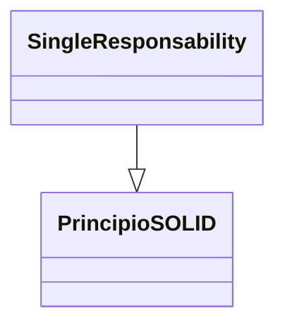
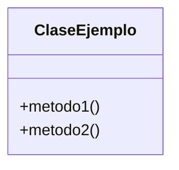

> [!abstract] **Etiquetas:** `POO` `design-patterns` `solid`





# 1. Principio de responsabilidad única

El principio de responsabilidad única requiere que una clase solo tenga un trabajo. Entonces, si una clase tiene más de una responsabilidad, se acopla. Un cambio en una responsabilidad da como resultado la modificación de la otra responsabilidad.

## Mal ejemplo

---

```python
# Esto es solo para rellenar el faltante del código

class User:
    def __init__(self, name: str):
        self.name = name
```

---

Tenemos una clase de usuario que es responsable tanto de las propiedades del usuario como de la gestión de la base de datos de usuarios. Si la aplicación cambia de manera que afecte las funciones de administración de la base de datos. Las clases que hacen uso de las propiedades del usuario deberán tocarse y recompilarse para compensar los nuevos cambios. Es como un efecto dominó, toca una carta y afecta a todas las demás cartas de la línea.


---

```python
#Below is Given a class which has two responsibilities 
class  User:
    def __init__(self, name: str):
        self.name = name
    
    def get_name(self) -> str:
        pass

    def save(self, user: User):
        pass
```

---

## Solución

Entonces simplemente dividimos la clase, creamos otra clase que manejará la única responsabilidad de almacenar un usuario en una base de datos:

---

```python
class User:
    def __init__(self, name: str):
            self.name = name
    
    def get_name(self):
        pass


class UserDB:
    def get_user(self, id) -> User:
        pass

    def save(self, user: User):
        pass
```

---


Una solución común a este dilema es aplicar el patrón Façade . Para una introducción al patrón de fachada, puede leer más . La clase de usuario será la Fachada para la gestión de la base de datos de usuarios y la gestión de propiedades de los usuarios.

## Contenido relacionado

- [[02-open-close]] #siguiente 
- [[00-SOLID-principles.canvas]] #parent 