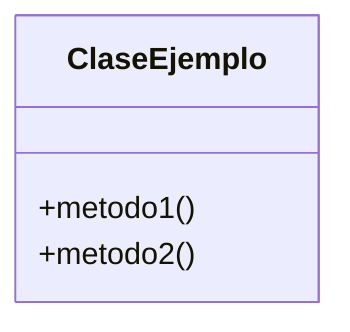

> [!abstract] **Etiquetas:** `POO` `solid`



# 2. Principio abierto-cerrado

Las entidades de software (clases, módulos, funciones) deben estar abiertas para extensión, no modificación.

Imaginemos que tienes una tienda y le das un descuento del 20% a tus clientes favoritos usando esta clase: Cuando decides ofrecer el doble del 20% de descuento a los clientes VIP. Puede modificar la clase de esta manera:

---

```python
class Discount:
  def __init__(self, customer, price):
      self.customer = customer
      self.price = price
  def give_discount(self):
      if self.customer == 'fav':
          return self.price * 0.2
      if self.customer == 'vip':
          return self.price * 0.4
```

---

No, esto no cumple con el principio OCP. OCP lo prohíbe. Si queremos dar un nuevo porcentaje de descuento tal vez, a un tipo diferente de clientes, verá que se agregará una nueva lógica. Para que siga el principio de OCP, agregaremos una nueva clase que extenderá el descuento. En esta nueva clase, implementaríamos su nuevo comportamiento:

---

```python
class Discount:
    def __init__(self, customer, price):
      self.customer = customer
      self.price = price
    def get_discount(self):
      return self.price * 0.2
class VIPDiscount(Discount):
    def get_discount(self):
      return super().get_discount() * 2
```

---

Si decide un 80% de descuento para clientes super VIP, debería ser así:

Ampliación sin modificación

---

```python
class SuperVIPDiscount(VIPDiscount):
    def get_discount(self):
      return super().get_discount() * 2
```

## Contenido relacionado

- [[01-unique-responsability]] #anterior 
- [[03-liskov-sustitution]] #siguiente 
- [[00-SOLID-principles.canvas]] #parent 