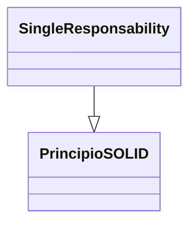
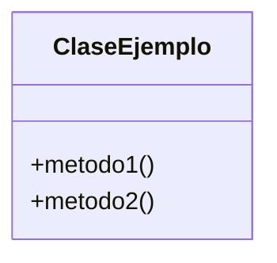

> [!abstract] **Etiquetas:** `POO` `basico` `design-patterns` `solid`





# 3. Principio de sustitución de Liskov

La idea principal detrás del principio de subtitulación de Liskov es que, para cualquier clase, un cliente debería poder usar cualquiera de sus subtipos de manera indistinguible, sin siquiera darse cuenta y, por lo tanto, sin comprometer el comportamiento esperado en tiempo de ejecución. 

Esto significa que los clientes están completamente aislados y desconocen los cambios en la jerarquía de clases.

## Más formalmente:
Sea q (x) una propiedad demostrable sobre objetos de x de tipo T.Entonces q (y) debería ser demostrable para objetos y de tipo S donde S es un subtipo de T.

En términos más simples, significa que una subclase, hijo o especialización de un objeto o clase debe ser adecuada para su padre o superclase.

---

```python
class Piece():
    def move(self, position:int):
        pass

class ChessBoard():
    pass

class User():
    def __init__(self, color, board):
        self.color = color
        self.board = board
        self.pieces = ['rook', 'knight', 'bishop', 'queen', 'king', 'bishop', 'knight', 'rook']

    def move(self, piece:Piece, position:int = 0):
        pass

    def create_pieces(self):
        pass
    
class Helper():
    def __init__(self):
        pass
    
    def getHorse(self, user:User, position:int):
        pass

helper = Helper()
```

---

```python
class User():
  def __init__(self, color, board):
    self.create_pieces()
    self.color = color
    self.board = board

  def move(self, piece:Piece, position:int = 0):
      piece.move(position)
      self.chessmate_check()

  def chessmate_check(self):
      pass
  
  def create_pieces(self):
      pass

  board = ChessBoard()
  user_white = User("white", board)
  user_black = User("black", board)
  pieces = user_white.pieces
  horse = helper.getHorse(user_white, 1)
  
  user_white.move(horse)
	
```

---

Comentarios sobre el LSP El LSP es fundamental para un buen diseño de software orientado a objetos porque enfatiza uno de sus rasgos centrales: el polimorfismo. Se trata de crear jerarquías correctas para que las clases derivadas de una base sean polimórficas a lo largo de la principal, con respecto a los métodos en su interfaz. 

También es interesante notar cómo este principio se relaciona con el anterior: si intentamos extender una clase con una nueva que es incompatible, fallará, el contrato con el cliente se romperá y, como resultado, dicha extensión. no será posible (o, para hacerlo posible, tendríamos que romper el otro extremo del principio y modificar el código en el cliente que debería estar cerrado para su modificación, lo cual es completamente indeseable e inaceptable).

Pensar cuidadosamente en las nuevas clases de la forma que sugiere LSP nos ayuda a extender la jerarquía correctamente. Entonces podríamos decir que LSP contribuye al OCP.


https://ichi.pro/es/principios-solid-explicados-en-python-con-ejemplos-56291217871103
"""


## Contenido relacionado

- [[02-open-close]] #anterior 
- [[04-interface-segregation]] #siguiente 
- [[00-SOLID-principles.canvas]] #parent 