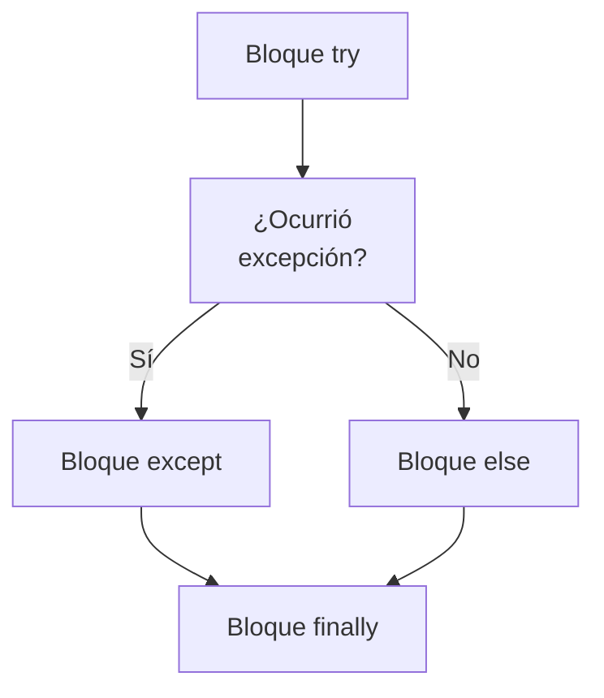
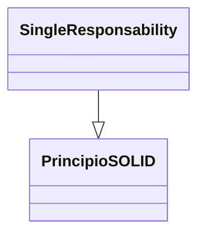
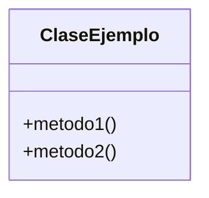

> [!abstract] **Etiquetas:** `POO` `excepciones` `solid`







# 4. Principio de segregación de interfaces

Cree interfaces de grano fino que sean específicas del cliente. Los clientes no deberían verse obligados a depender de interfaces que no utilicen. Este principio se ocupa de las desventajas de implementar grandes interfaces.

Para ilustrar esto completamente, iremos con un ejemplo clásico porque es muy significativo y fácilmente comprensible. El ejemplo clásico

---

```python

# =====================================	#
#				Classic example			#
# =====================================	#

class IShape:
	""" Class doc """
	
	def draw (self):
		""" Class initialiser """
		raise NotImplementedError
		
class Circle (IShape):
		""" Function doc """
		def draw (self):
			""" Function doc """
			pass
	
class Square(IShape):
	""" Class doc """
	
	def draw (self):
		""" Class initialiser """
		pass
		
class Rectangle(IShape):
	""" Class doc """
	
	def draw (self):
		""" Class initialiser """
		pass
		
```

---

Otro buen truco es que en nuestra lógica empresarial, una sola clase puede implementar varias interfaces si es necesario. Por lo tanto, podemos proporcionar una implementación única para todos los métodos comunes entre las interfaces. 

Las interfaces segregadas también nos obligarán a pensar en nuestro código más desde el punto de vista del cliente, lo que a su vez conducirá a un acoplamiento flojo y pruebas fáciles. Por lo tanto, no solo hemos mejorado nuestro código para nuestros clientes, también lo hemos hecho más fácil de entender, probar e implementar.

## Contenido relacionado

- [[03-liskov-sustitution]] #anterior 
- [[05-dependency-inversion]] #siguiente 
- [[00-SOLID-principles.canvas]] #parent 