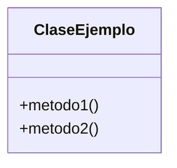

> [!abstract] **Etiquetas:** `POO` `git-github` `solid`



# 5. Principio de inversión de la dependencia

La dependencia debe estar en abstracciones, no en concreciones. Los módulos de alto nivel no deben depender de módulos de bajo nivel. 

Tanto las clases de nivel bajo como las de alto nivel deberían depender de las mismas abstracciones. 

Las abstracciones no deberían depender de los detalles. Los detalles deben depender de abstracciones.


---

```python

class Connector():
	def connect (self):
		""" Function doc """
		pass

class AuthenticationForUser():
	def __init__ (self, connector: Connector):
		""" Function doc """
		self.connection = connector.connect()
		
	def authenticate (self, credentials):
		""" Function doc """
		pass
		
	def is_authenticated (self):
		""" Function doc """
		pass
	
	def last_login (self):
		""" Function doc """
		pass
		
class AnonymousAuth(AuthenticationForUser):
	pass
		
class GithubAuth(AuthenticationForUser):
	""" Class doc """
	
	def last_login (self):
		""" Class initialiser """
		pass
		
class FacebookAuth(AuthenticationForUser):
	""" Class doc """
	pass
	
class Permissions():
	def __init__(self, auth: AuthenticationForUser):
		self.auth = auth
		
	def has_permissions (_):
		""" Function doc """
		pass
	
class IsLoggedInPermissions (Permissions):
	""" Class doc """
	
	def last_login ():
		""" Class initialiser """
		pass
	
```

---

## ¿Cuando usar?

Llega un punto en el desarrollo de software en el que nuestras aplicaciones están compuestas en gran parte por módulos.

Cuando esto sucede, debemos aclarar las cosas usando la inyección de dependencia.

Componentes de alto nivel dependiendo de los componentes de bajo nivel a trabajar.
Para crear un comportamiento específico, se pueden utilizar técnicas de herencia o interfaz.

## Contenido relacionado

### POO

- [[../01-intro/03-paradigmas-en-python/01-intro-paradigmas-imperativo-declarativo|Paradigmas en python]]
- [[../01-intro/03-paradigmas-en-python/02-funcional|Paradigma Funcional]]
- [[../01-intro/03-paradigmas-en-python/03-reflexivo|Paradigma reflexivo]]
- [[../01-intro/git|Git]]
- [[../01-intro/github|Conectando los repositorios de GIT y GitHub.]]
- [[../01-intro/librerias-para-python|Librerias para Python]]
- [[../02-basic/02-variables-numericas/sistemas_numericos|Sistemas numéricos]]
- [[../02-basic/03-command-line-tutorial/como_crear_un_programa_en_linux|Creando un script ejecutable.]]
- [[../02-basic/04-comentarios|Comentarios de triple comilla]]
- [[../03-medium/01-metodos/02-metodos-magicos|Métodos mágicos]]
- [[simplificar-llamadas-a-metodos|Simplificando Llamadas a Métodos]]
- [[colapso-de-jerarquia|Colapso de jerarquia]]
- [[delegacion-con-herencia|Reemplazar Delegación con Herencia]]
- [[extract-subclass|Extract Subclass (Extraer Subclase)]]
- [[extract-superclass|Extract Superclass:]]
- [[extract-interface|Extract interface]]
- [[form-template-method|Form Template Method]]
- [[herencia-con-delegacion|Reemplazar la herencia con delegación]]
- [[pull-up-field|Pull Up Field]]
- [[pull-up-method|Pull Up Method]]
- [[pull-up-constructor-body|Pull Up Constructor Body]]
- [[push-downf-field|Push Down Field:]]
- [[push-down-method|Push Down Method]]
- [[tratar-con-generalización|Tratar con generalización]]
- [[refactorización-code-smells|Codigo limpio]]
- [[01-unique-responsability|1. Principio de responsabilidad única]]
- [[02-open-close|2. Principio abierto-cerrado]]
- [[03-liskov-sustitution|3. Principio de sustitución de Liskov]]
- [[04-interface-segregation|4. Principio de segregación de interfaces]]
- [[abstract-factory|Ejemplo conceptual]]
- [[builder|Builder en Python]]
- [[factory-method|Método de fábrica en Python]]
- [[prototype|Ejemplos de uso:]]
- [[../inteligencia_artificial|Funcion dir() de Python]]

### git-github

- [[../01-intro/git|Git]]
- [[../01-intro/github|Conectando los repositorios de GIT y GitHub.]]
- [[../02-basic/02-variables-numericas/sistemas_numericos|Sistemas numéricos]]
- [[delegacion-con-herencia|Reemplazar Delegación con Herencia]]
- [[refactorización-code-smells|Codigo limpio]]
- [[../frameworks/pandas/configurar|configurar]]
- [[../inteligencia_artificial|Funcion dir() de Python]]
- [[../../ejercicios/Ejercicio_2|Ejercicio 1]]

### solid

- [[../01-intro/00-caracteristicas_python|Anotaciones lenguaje Python]]
- [[../01-intro/00-esoterismos-de-python|Esoterismos de python]]
- [[../01-intro/github|Conectando los repositorios de GIT y GitHub.]]
- [[../01-intro/librerias-para-python|Librerias para Python]]
- [[colapso-de-jerarquia|Colapso de jerarquia]]
- [[delegacion-con-herencia|Reemplazar Delegación con Herencia]]
- [[extract-interface|Extract interface]]
- [[form-template-method|Form Template Method]]
- [[herencia-con-delegacion|Reemplazar la herencia con delegación]]
- [[tratar-con-generalización|Tratar con generalización]]
- [[refactorización-code-smells|Codigo limpio]]
- [[01-unique-responsability|1. Principio de responsabilidad única]]
- [[02-open-close|2. Principio abierto-cerrado]]
- [[03-liskov-sustitution|3. Principio de sustitución de Liskov]]
- [[04-interface-segregation|4. Principio de segregación de interfaces]]
- [[abstract-factory|Ejemplo conceptual]]
- [[builder|Builder en Python]]
- [[factory-method|Método de fábrica en Python]]
- [[prototype|Ejemplos de uso:]]
