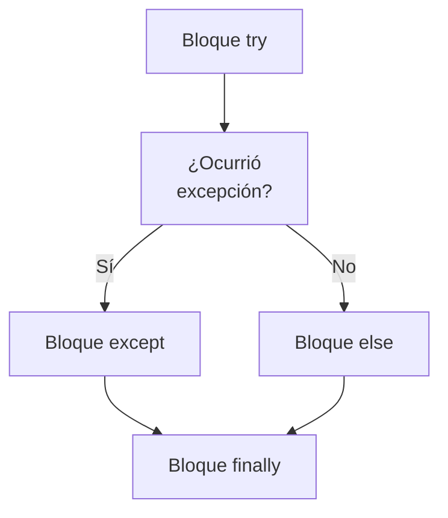
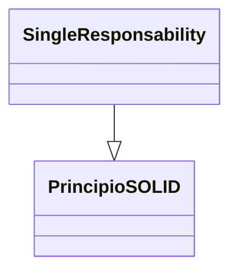
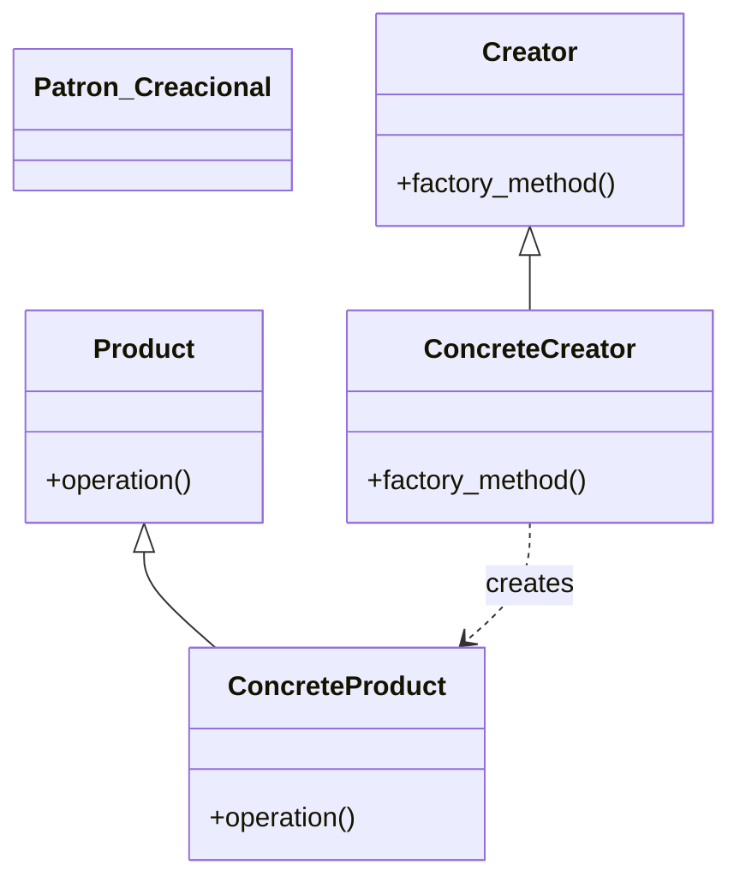

> [!abstract] **Etiquetas:** `POO` `basico` `design-patterns` `excepciones` `refactorizacion` `solid`









---


- Abstract Factory es un patrón de diseño creacional que resuelve el **problema de crear familias completas de productos sin especificar sus clases concretas**.
- Abstract Factory define una interfaz para crear todos los productos distintos, pero deja la creación real de los productos a las clases de fábrica concretas. 
- Cada tipo de fábrica corresponde a una cierta variedad de productos.
- El código del cliente llama a los métodos de creación de un objeto de fábrica  en lugar de crear productos directamente con una llamada al constructor (operador new).
- Dado que una fábrica corresponde a una sola variante de producto, todos sus productos serán compatibles.
- El código del cliente trabaja solo con interfaces abstractas de fábricas y productos. 
- Esto permite al código del cliente trabajar con cualquier variante de producto creada por el objeto de fábrica. 
- Simplemente se crea una nueva clase de fábrica concreta y se pasa al código del cliente.

**Complejidad:** **-

**Popularidad:** ***

**Ejemplos de uso:** El patrón Abstract Factory es bastante común en el código de Python. 
Muchos frameworks y bibliotecas lo utilizan para proporcionar una forma de extender y personalizar sus componentes estándar.

**Identificación:** El patrón es fácil de reconocer por los métodos que devuelven un 
objeto de fábrica. 
Luego, la fábrica se utiliza para crear subcomponentes específicos.


---


## Ejemplo conceptual

Este ejemplo ilustra la estructura del patrón de diseño Abstract Factory. Se centra en responder a estas preguntas:

¿De qué clases se compone?
¿Qué roles desempeñan estas clases?
¿De qué manera están relacionados los elementos del patrón?


---

```python

from __future__ import annotations
from abc import ABC, abstractmethod


class AbstractFactory(ABC):
    """
    The Abstract Factory interface declares a set of methods that return
    different abstract products. These products are called a family and are
    related by a high-level theme or concept. Products of one family are usually
    able to collaborate among themselves. A family of products may have several
    variants, but the products of one variant are incompatible with products of
    another.
    """
    @abstractmethod
    def create_product_a(self) -> AbstractProductA:
        pass

    @abstractmethod
    def create_product_b(self) -> AbstractProductB:
        pass


class ConcreteFactory1(AbstractFactory):
    """
    Concrete Factories produce a family of products that belong to a single
    variant. The factory guarantees that resulting products are compatible. Note
    that signatures of the Concrete Factory's methods return an abstract
    product, while inside the method a concrete product is instantiated.
    """

    def create_product_a(self) -> AbstractProductA:
        return ConcreteProductA1()

    def create_product_b(self) -> AbstractProductB:
        return ConcreteProductB1()


class ConcreteFactory2(AbstractFactory):
    """
    Each Concrete Factory has a corresponding product variant.
    """

    def create_product_a(self) -> AbstractProductA:
        return ConcreteProductA2()

    def create_product_b(self) -> AbstractProductB:
        return ConcreteProductB2()


class AbstractProductA(ABC):
    """
    Each distinct product of a product family should have a base interface. All
    variants of the product must implement this interface.
    """

    @abstractmethod
    def useful_function_a(self) -> str:
        pass


"""
Concrete Products are created by corresponding Concrete Factories.
"""


class ConcreteProductA1(AbstractProductA):
    def useful_function_a(self) -> str:
        return "The result of the product A1."


class ConcreteProductA2(AbstractProductA):
    def useful_function_a(self) -> str:
        return "The result of the product A2."


class AbstractProductB(ABC):
    """
    Here's the the base interface of another product. All products can interact
    with each other, but proper interaction is possible only between products of
    the same concrete variant.
    """
    @abstractmethod
    def useful_function_b(self) -> None:
        """
        Product B is able to do its own thing...
        """
        pass

    @abstractmethod
    def another_useful_function_b(self, collaborator: AbstractProductA) -> None:
        """
        ...but it also can collaborate with the ProductA.

        The Abstract Factory makes sure that all products it creates are of the
        same variant and thus, compatible.
        """
        pass


"""
Concrete Products are created by corresponding Concrete Factories.
"""


class ConcreteProductB1(AbstractProductB):
    def useful_function_b(self) -> str:
        return "The result of the product B1."

    """
    The variant, Product B1, is only able to work correctly with the variant,
    Product A1. Nevertheless, it accepts any instance of AbstractProductA as an
    argument.
    """

    def another_useful_function_b(self, collaborator: AbstractProductA) -> str:
        result = collaborator.useful_function_a()
        return f"The result of the B1 collaborating with the ({result})"


class ConcreteProductB2(AbstractProductB):
    def useful_function_b(self) -> str:
        return "The result of the product B2."

    def another_useful_function_b(self, collaborator: AbstractProductA):
        """
        The variant, Product B2, is only able to work correctly with the
        variant, Product A2. Nevertheless, it accepts any instance of
        AbstractProductA as an argument.
        """
        result = collaborator.useful_function_a()
        return f"The result of the B2 collaborating with the ({result})"


def client_code(factory: AbstractFactory) -> None:
    """
    The client code works with factories and products only through abstract
    types: AbstractFactory and AbstractProduct. This lets you pass any factory
    or product subclass to the client code without breaking it.
    """
    product_a = factory.create_product_a()
    product_b = factory.create_product_b()

    print(f"{product_b.useful_function_b()}")
    print(f"{product_b.another_useful_function_b(product_a)}", end="")


if __name__ == "__main__":
    """
    The client code can work with any concrete factory class.
    """
    print("Client: Testing client code with the first factory type:")
    client_code(ConcreteFactory1())

    print("\n")

    print("Client: Testing the same client code with the second factory type:")
    client_code(ConcreteFactory2())

    """ Salida ---
    Client: Testing client code with the first factory type:
    The result of the product B1.
    The result of the B1 collaborating with the (The result of the product A1.)

    Client: Testing the same client code with the second factory type:
    The result of the product B2.
    The result of the B2 collaborating with the (The result of the product A2.)
    """
```

---


Abstract Factory es un patrón de diseño creacional que te permite producir familias de objetos relacionados sin especificar sus clases concretas.

### Problema

Imagina que estás creando un simulador de tienda de muebles. 
Tu código consiste en clases que representan:

Una familia de productos relacionados, digamos: Silla + Sofá + MesaDeCafé.

Varias variantes de esta familia. 
Por ejemplo, los productos Silla + Sofá + MesaDeCafé están disponibles en estas variantes: 
Moderno, Victoriano, ArtDeco.

Necesitas una manera de crear objetos de muebles individuales para que coincidan con otros objetos de la misma familia. 
Los clientes se enfadan mucho cuando reciben muebles que no combinan.

Además, no deseas cambiar el código existente al agregar nuevos productos o familias de productos al programa. 
Los proveedores de muebles actualizan sus catálogos con frecuencia y no querrías cambiar el código principal cada vez que esto suceda.

### La solución 

que sugiere el patrón Abstract Factory es declarar explícitamente interfaces para cada producto distinto de la familia de productos (por ejemplo, silla, sofá o mesa de café). 
Luego puedes hacer que todas las variantes de productos sigan esas interfaces. 

Por ejemplo, todas las variantes de sillas pueden implementar la interfaz Chair; todas las variantes de mesas de café pueden implementar la interfaz CoffeeTable, y así sucesivamente.

El siguiente paso es declarar la Fábrica Abstracta, que es una interfaz con una lista de métodos de creación para todos los productos que forman parte de la familia de productos (por ejemplo, crearSilla, crearSofá y crearMesaDeCafé). 

Estos métodos deben devolver tipos de productos abstractos representados por las interfaces que extrajimos anteriormente: Silla, Sofá, MesaDeCafé, etc.

¿Y qué hay de las variantes de productos? Para cada variante de una familia de productos, creamos una clase de fábrica separada basada en la interfaz AbstractFactory. 

Una fábrica es una clase que devuelve productos de un tipo particular. 
Por ejemplo, la ModernFurnitureFactory solo puede crear objetos ModernChair, ModernSofa y ModernCoffeeTable.

El código del cliente tiene que trabajar con fábricas y productos a través de sus respectivas interfaces abstractas. 

Esto le permite cambiar el tipo de fábrica que pasa al código del cliente, así como la variante de producto que recibe el código del cliente, sin romper el código real del cliente.


---


# Estructura:

Los Productos Abstractos declaran interfaces para un conjunto de productos distintos pero relacionados que conforman una familia de productos.

Los Productos Concretos son varias implementaciones de productos abstractos, agrupados por variantes. Cada producto abstracto (silla/sofá) debe ser implementado en todas las variantes dadas (Victoriano/Moderno).

La interfaz de la Fábrica Abstracta declara un conjunto de métodos para crear cada uno de los productos abstractos.

Las Fábricas Concretas implementan los métodos de creación de la fábrica abstracta. 
Cada fábrica concreta corresponde a una variante específica de productos y crea solo esas variantes de productos.

Aunque las fábricas concretas instancian productos concretos, las firmas de sus métodos de creación deben devolver productos abstractos correspondientes. 
De esta manera, el código del cliente que utiliza una fábrica no está acoplado a la variante específica del producto que se obtiene de una fábrica. 

El cliente puede trabajar con cualquier fábrica/producto concreto, siempre y cuando se comunique con sus objetos a través de interfaces abstractas.


---

## Pseudo codigo

Este ejemplo ilustra cómo el patrón de diseño Abstract Factory puede utilizarse para crear elementos de interfaz de usuario multiplataforma sin acoplar el código cliente a clases de interfaz de usuario concretas, manteniendo al mismo tiempo todos los elementos creados coherentes con el sistema operativo seleccionado.

Los mismos elementos de la interfaz de usuario en una aplicación multiplataforma se esperan que se comporten de manera similar, pero que se vean un poco diferentes en diferentes sistemas operativos. 

Además, es su trabajo asegurarse de que los elementos de la interfaz de usuario coincidan con el estilo del sistema operativo actual. 
No querría que su programa represente controles de macOS cuando se ejecuta en Windows.

La interfaz Abstract Factory declara un conjunto de métodos de creación que el código cliente puede usar para producir diferentes tipos de elementos de la interfaz de usuario. 

Las fábricas concretas corresponden a sistemas operativos específicos y crean los elementos de la interfaz de usuario que coinciden con ese sistema operativo particular.

Funciona así: cuando se inicia una aplicación, verifica el tipo del sistema operativo actual. 
La aplicación utiliza esta información para crear un objeto de fábrica a partir de una clase que coincide con el sistema operativo. 
El resto del código utiliza esta fábrica para crear elementos de la interfaz de usuario. 
Esto evita que se creen los elementos equivocados.

Con este enfoque, el código cliente no depende de las clases concretas de fábricas y elementos de la interfaz de usuario, siempre y cuando funcione con estos objetos a través de sus interfaces abstractas. 
Esto también permite que el código cliente admita otras fábricas o elementos de la interfaz de usuario que pueda agregar en el futuro.

Como resultado, no necesita modificar el código cliente cada vez que agregue una nueva variación de elementos de la interfaz de usuario a su aplicación. 
Solo tiene que crear una nueva clase de fábrica que produzca estos elementos y modificar ligeramente el código de inicialización de la aplicación para que seleccione esa clase cuando sea apropiado.

```cpp
// The abstract factory interface declares a set of methods that
// return different abstract products. These products are called
// a family and are related by a high-level theme or concept.
// Products of one family are usually able to collaborate among
// themselves. A family of products may have several variants,
// but the products of one variant are incompatible with the
// products of another variant.
interface GUIFactory is
    method createButton():Button
    method createCheckbox():Checkbox


// Concrete factories produce a family of products that belong
// to a single variant. The factory guarantees that the
// resulting products are compatible. Signatures of the concrete
// factory's methods return an abstract product, while inside
// the method a concrete product is instantiated.
class WinFactory implements GUIFactory is
    method createButton():Button is
        return new WinButton()
    method createCheckbox():Checkbox is
        return new WinCheckbox()

// Each concrete factory has a corresponding product variant.
class MacFactory implements GUIFactory is
    method createButton():Button is
        return new MacButton()
    method createCheckbox():Checkbox is
        return new MacCheckbox()


// Each distinct product of a product family should have a base
// interface. All variants of the product must implement this
// interface.
interface Button is
    method paint()

// Concrete products are created by corresponding concrete
// factories.
class WinButton implements Button is
    method paint() is
        // Render a button in Windows style.

class MacButton implements Button is
    method paint() is
        // Render a button in macOS style.

// Here's the base interface of another product. All products
// can interact with each other, but proper interaction is
// possible only between products of the same concrete variant.
interface Checkbox is
    method paint()

class WinCheckbox implements Checkbox is
    method paint() is
        // Render a checkbox in Windows style.

class MacCheckbox implements Checkbox is
    method paint() is
        // Render a checkbox in macOS style.


// The client code works with factories and products only
// through abstract types: GUIFactory, Button and Checkbox. This
// lets you pass any factory or product subclass to the client
// code without breaking it.
class Application is
    private field factory: GUIFactory
    private field button: Button
    constructor Application(factory: GUIFactory) is
        this.factory = factory
    method createUI() is
        this.button = factory.createButton()
    method paint() is
        button.paint()


// The application picks the factory type depending on the
// current configuration or environment settings and creates it
// at runtime (usually at the initialization stage).
class ApplicationConfigurator is
    method main() is
        config = readApplicationConfigFile()

        if (config.OS == "Windows") then
            factory = new WinFactory()
        else if (config.OS == "Mac") then
            factory = new MacFactory()
        else
            throw new Exception("Error! Unknown operating system.")

        Application app = new Application(factory)
```

---


## Aplicabilidad:

Usa el Patrón de Diseño Abstract Factory cuando tu código necesite trabajar con varias 
familias de productos relacionados, 
pero no quieras que dependa de las clases concretas de esos productos; 
estos pueden ser desconocidos de antemano o simplemente quieres permitir 
la extensibilidad futura.

El Patrón de Diseño Abstract Factory te proporciona una interfaz para crear 
objetos de cada clase de la familia de productos. 
Mientras tu código cree objetos a través de esta interfaz, 
no tendrás que preocuparte por crear una variante incorrecta de un producto 
que no coincida con los productos ya creados por tu aplicación.

Considera implementar el patrón Abstract Factory cuando tienes una clase 
con un conjunto de Factory Methods que difuminan su responsabilidad principal.

En un programa bien diseñado, cada clase es responsable solo de una cosa. 
Cuando una clase maneja múltiples tipos de productos, 
puede ser conveniente extraer sus métodos de fábrica en una clase de fábrica 
independiente o en una implementación completa del patrón Abstract Factory.


---


## Como implementarlo:

Mapea una matriz de tipos de productos distintos versus variantes de estos productos.

Declara interfaces de producto abstractas para todos los tipos de producto. 
Luego, haz que todas las clases de productos concretos implementen estas interfaces.

Declara la interfaz de la fábrica abstracta con un conjunto de métodos de creación 
para todos los productos abstractos.

Implementa un conjunto de clases de fábrica concretas, una para cada variante de producto.

Crea código de inicialización de fábrica en algún lugar de la aplicación. 
Debería instanciar una de las clases de fábrica concretas, 
dependiendo de la configuración de la aplicación o del entorno actual. 
Pasa este objeto de fábrica a todas las clases que construyen productos.

Busca en el código todas las llamadas directas a constructores de productos. 
Reemplázalas con llamadas al método de creación apropiado en el objeto de fábrica.


---

## Pros y contras:

Puede estar seguro de que los productos que obtiene de una fábrica son compatibles 
entre sí.

Evita el acoplamiento estrecho entre productos concretos y el código del cliente.

Principio de responsabilidad única. 
Puede extraer el código de creación de productos en un solo lugar, 
lo que hace que el código sea más fácil de mantener.

Principio Abierto/Cerrado. 
Puede introducir nuevas variantes de productos sin romper el código del cliente existente.
El código puede volverse más complicado de lo necesario, 
ya que se introducen muchas interfaces y clases nuevas junto con el patrón.


---

## Relaciones con otros patrones de diseño:

Muchos diseños comienzan utilizando el patrón Factory Method 
(menos complicado y más personalizable a través de subclases) 
y evolucionan hacia Abstract Factory, Prototype o Builder 
(más flexibles, pero más complicados).

- Builder se enfoca en construir objetos complejos paso a paso. 
Abstract Factory se especializa en crear familias de objetos relacionados. 
Abstract Factory devuelve el producto de inmediato, 
mientras que Builder permite ejecutar algunos pasos de construcción adicionales 
antes de obtener el producto.

- Las clases de Abstract Factory se basan a menudo en un conjunto de Factory Methods, 
pero también se puede usar Prototype para componer los métodos en estas clases.

- Abstract Factory puede servir como alternativa a Facade cuando solo se desea 
ocultar la forma en que se crean los objetos del subsistema del código cliente.

- Se puede usar Abstract Factory junto con Bridge. 
Esta combinación es útil cuando algunas abstracciones definidas por Bridge 
solo pueden funcionar con implementaciones específicas. 

En este caso, Abstract Factory puede encapsular estas relaciones 
y ocultar la complejidad del código cliente.


## Contenido relacionado

### POO

- [[../../01-intro/03-paradigmas-en-python/01-intro-paradigmas-imperativo-declarativo|Paradigmas en python]]
- [[../../01-intro/03-paradigmas-en-python/02-funcional|Paradigma Funcional]]
- [[../../01-intro/03-paradigmas-en-python/03-reflexivo|Paradigma reflexivo]]
- [[../../01-intro/git|Git]]
- [[../../01-intro/github|Conectando los repositorios de GIT y GitHub.]]
- [[../../01-intro/librerias-para-python|Librerias para Python]]
- [[../../02-basic/02-variables-numericas/sistemas_numericos|Sistemas numéricos]]
- [[../../02-basic/03-command-line-tutorial/como_crear_un_programa_en_linux|Creando un script ejecutable.]]
- [[../../02-basic/04-comentarios|Comentarios de triple comilla]]
- [[../../03-medium/01-metodos/02-metodos-magicos|Métodos mágicos]]
- [[simplificar-llamadas-a-metodos|Simplificando Llamadas a Métodos]]
- [[colapso-de-jerarquia|Colapso de jerarquia]]
- [[delegacion-con-herencia|Reemplazar Delegación con Herencia]]
- [[extract-subclass|Extract Subclass (Extraer Subclase)]]
- [[extract-superclass|Extract Superclass:]]
- [[extract-interface|Extract interface]]
- [[form-template-method|Form Template Method]]
- [[herencia-con-delegacion|Reemplazar la herencia con delegación]]
- [[pull-up-field|Pull Up Field]]
- [[pull-up-method|Pull Up Method]]
- [[pull-up-constructor-body|Pull Up Constructor Body]]
- [[push-downf-field|Push Down Field:]]
- [[push-down-method|Push Down Method]]
- [[tratar-con-generalización|Tratar con generalización]]
- [[refactorización-code-smells|Codigo limpio]]
- [[01-unique-responsability|1. Principio de responsabilidad única]]
- [[02-open-close|2. Principio abierto-cerrado]]
- [[03-liskov-sustitution|3. Principio de sustitución de Liskov]]
- [[04-interface-segregation|4. Principio de segregación de interfaces]]
- [[05-dependency-inversion|5. Principio de inversión de la dependencia]]
- [[builder|Builder en Python]]
- [[factory-method|Método de fábrica en Python]]
- [[prototype|Ejemplos de uso:]]
- [[../../inteligencia_artificial|Funcion dir() de Python]]

### basico

- [[../../01-intro/00-caracteristicas_python|Anotaciones lenguaje Python]]
- [[../../01-intro/00-esoterismos-de-python|Esoterismos de python]]
- [[../../01-intro/03-paradigmas-en-python/01-intro-paradigmas-imperativo-declarativo|Paradigmas en python]]
- [[../../01-intro/03-paradigmas-en-python/02-funcional|Paradigma Funcional]]
- [[../../01-intro/03-paradigmas-en-python/03-reflexivo|Paradigma reflexivo]]
- [[../../01-intro/git|Git]]
- [[../../01-intro/github|Conectando los repositorios de GIT y GitHub.]]
- [[../../01-intro/librerias-para-python|Librerias para Python]]
- [[../../01-intro/trucos_de_refactorización|Trucos de refactorizacion.]]
- [[../../02-basic/02-variables-numericas/sistemas_numericos|Sistemas numéricos]]
- [[../../02-basic/03-command-line-tutorial/como_crear_un_programa_en_linux|Creando un script ejecutable.]]
- [[../../02-basic/04-comentarios|Comentarios de triple comilla]]
- [[../../03-medium/01-metodos/02-metodos-magicos|Métodos mágicos]]
- [[../../03-medium/07-excepciones-try-except|Tipos de error]]
- [[colapso-de-jerarquia|Colapso de jerarquia]]
- [[extract-subclass|Extract Subclass (Extraer Subclase)]]
- [[pull-up-constructor-body|Pull Up Constructor Body]]
- [[refactorización-code-smells|Codigo limpio]]
- [[03-liskov-sustitution|3. Principio de sustitución de Liskov]]
- [[builder|Builder en Python]]
- [[factory-method|Método de fábrica en Python]]
- [[prototype|Ejemplos de uso:]]
- [[../../frameworks/pandas/BloodyRoarTierList|Bloody Roar Tier List]]
- [[../../../ejercicios/Ejercicio_1|Ejercicio 1]]
- [[../../../ejercicios/Ejercicio_2|Ejercicio 1]]
- [[../../../prueba-tecnica|prueba-tecnica]]

### design-patterns

- [[../../01-intro/git|Git]]
- [[../../01-intro/github|Conectando los repositorios de GIT y GitHub.]]
- [[../../01-intro/librerias-para-python|Librerias para Python]]
- [[simplificar-llamadas-a-metodos|Simplificando Llamadas a Métodos]]
- [[extract-subclass|Extract Subclass (Extraer Subclase)]]
- [[form-template-method|Form Template Method]]
- [[herencia-con-delegacion|Reemplazar la herencia con delegación]]
- [[push-downf-field|Push Down Field:]]
- [[refactorización-code-smells|Codigo limpio]]
- [[01-unique-responsability|1. Principio de responsabilidad única]]
- [[03-liskov-sustitution|3. Principio de sustitución de Liskov]]
- [[builder|Builder en Python]]
- [[factory-method|Método de fábrica en Python]]
- [[prototype|Ejemplos de uso:]]

### excepciones

- [[../../01-intro/00-esoterismos-de-python|Esoterismos de python]]
- [[../../01-intro/03-paradigmas-en-python/02-funcional|Paradigma Funcional]]
- [[../../01-intro/03-paradigmas-en-python/03-reflexivo|Paradigma reflexivo]]
- [[../../01-intro/git|Git]]
- [[../../01-intro/github|Conectando los repositorios de GIT y GitHub.]]
- [[../../02-basic/04-comentarios|Comentarios de triple comilla]]
- [[../../03-medium/07-excepciones-try-except|Tipos de error]]
- [[../../03-medium/decorador|Decorador]]
- [[simplificar-llamadas-a-metodos|Simplificando Llamadas a Métodos]]
- [[extract-subclass|Extract Subclass (Extraer Subclase)]]
- [[extract-interface|Extract interface]]
- [[form-template-method|Form Template Method]]
- [[pull-up-field|Pull Up Field]]
- [[push-down-method|Push Down Method]]
- [[refactorización-code-smells|Codigo limpio]]
- [[04-interface-segregation|4. Principio de segregación de interfaces]]
- [[factory-method|Método de fábrica en Python]]

### refactorizacion

- [[../../01-intro/trucos_de_refactorización|Trucos de refactorizacion.]]
- [[colapso-de-jerarquia|Colapso de jerarquia]]
- [[delegacion-con-herencia|Reemplazar Delegación con Herencia]]
- [[extract-subclass|Extract Subclass (Extraer Subclase)]]
- [[extract-superclass|Extract Superclass:]]
- [[extract-interface|Extract interface]]
- [[form-template-method|Form Template Method]]
- [[herencia-con-delegacion|Reemplazar la herencia con delegación]]
- [[pull-up-field|Pull Up Field]]
- [[pull-up-method|Pull Up Method]]
- [[pull-up-constructor-body|Pull Up Constructor Body]]
- [[push-downf-field|Push Down Field:]]
- [[push-down-method|Push Down Method]]
- [[tratar-con-generalización|Tratar con generalización]]
- [[refactorización-code-smells|Codigo limpio]]

### solid

- [[../../01-intro/00-caracteristicas_python|Anotaciones lenguaje Python]]
- [[../../01-intro/00-esoterismos-de-python|Esoterismos de python]]
- [[../../01-intro/github|Conectando los repositorios de GIT y GitHub.]]
- [[../../01-intro/librerias-para-python|Librerias para Python]]
- [[colapso-de-jerarquia|Colapso de jerarquia]]
- [[delegacion-con-herencia|Reemplazar Delegación con Herencia]]
- [[extract-interface|Extract interface]]
- [[form-template-method|Form Template Method]]
- [[herencia-con-delegacion|Reemplazar la herencia con delegación]]
- [[tratar-con-generalización|Tratar con generalización]]
- [[refactorización-code-smells|Codigo limpio]]
- [[01-unique-responsability|1. Principio de responsabilidad única]]
- [[02-open-close|2. Principio abierto-cerrado]]
- [[03-liskov-sustitution|3. Principio de sustitución de Liskov]]
- [[04-interface-segregation|4. Principio de segregación de interfaces]]
- [[05-dependency-inversion|5. Principio de inversión de la dependencia]]
- [[builder|Builder en Python]]
- [[factory-method|Método de fábrica en Python]]
- [[prototype|Ejemplos de uso:]]
