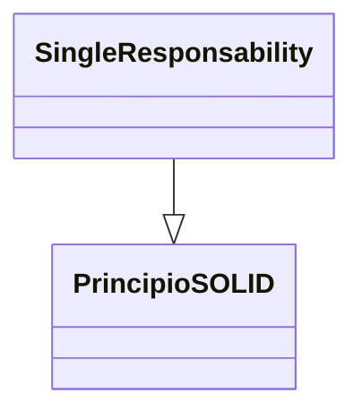
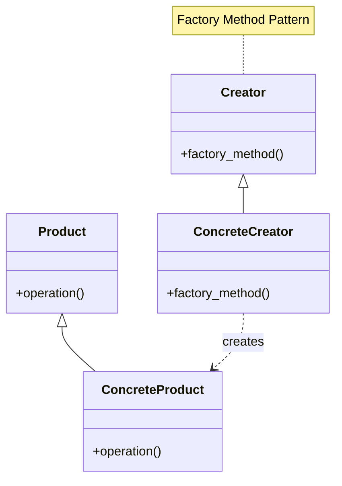

> [!abstract] **Etiquetas:** `POO` `basico` `design-patterns` `solid`






---


# Builder en Python

Builder es un patrón de diseño creacional que permite construir objetos complejos paso a paso.

Al contrario que otros patrones creacionales, Builder no necesita que los productos tengan una interfaz común. Esto hace posible crear distintos productos utilizando el mismo proceso de construcción.

- Complejidad: 
- Popularidad: 

Ejemplos de uso: El patrón Builder es muy conocido en el mundo Python. Resulta especialmente útil cuando debes crear un objeto con muchas opciones posibles de configuración.

Identificación: El patrón Builder se puede reconocer por la clase, que tiene un único método de creación y varios métodos para configurar el objeto resultante. A menudo, los métodos del Builder soportan el encadenamiento (por ejemplo, algúnBuilder.establecerValorA(1).establecerValorB(2).crear()).

## Ejemplo conceptual

Este ejemplo ilustra la estructura del patrón de diseño Builder. Se centra en responder las siguientes preguntas:

¿De qué clases se compone?
¿Qué papeles juegan esas clases?
¿De qué forma se relacionan los elementos del patrón?


---

```python

from __future__ import annotations
from abc import ABC, abstractmethod
from typing import Any


class Builder(ABC):
    """
    The Builder interface specifies methods for creating the different parts of
    the Product objects.
    """

    @property
    @abstractmethod
    def product(self) -> None:
        pass

    @abstractmethod
    def produce_part_a(self) -> None:
        pass

    @abstractmethod
    def produce_part_b(self) -> None:
        pass

    @abstractmethod
    def produce_part_c(self) -> None:
        pass


class ConcreteBuilder1(Builder):
    """
    The Concrete Builder classes follow the Builder interface and provide
    specific implementations of the building steps. Your program may have
    several variations of Builders, implemented differently.
    """

    def __init__(self) -> None:
        """
        A fresh builder instance should contain a blank product object, which is
        used in further assembly.
        """
        self.reset()

    def reset(self) -> None:
        self._product = Product1()

    @property
    def product(self) -> Product1:
        """
        Concrete Builders are supposed to provide their own methods for
        retrieving results. That's because various types of builders may create
        entirely different products that don't follow the same interface.
        Therefore, such methods cannot be declared in the base Builder interface
        (at least in a statically typed programming language).

        Usually, after returning the end result to the client, a builder
        instance is expected to be ready to start producing another product.
        That's why it's a usual practice to call the reset method at the end of
        the `getProduct` method body. However, this behavior is not mandatory,
        and you can make your builders wait for an explicit reset call from the
        client code before disposing of the previous result.
        """
        product = self._product
        self.reset()
        return product

    def produce_part_a(self) -> None:
        self._product.add("PartA1")

    def produce_part_b(self) -> None:
        self._product.add("PartB1")

    def produce_part_c(self) -> None:
        self._product.add("PartC1")


class Product1():
    """
    It makes sense to use the Builder pattern only when your products are quite
    complex and require extensive configuration.

    Unlike in other creational patterns, different concrete builders can produce
    unrelated products. In other words, results of various builders may not
    always follow the same interface.
    """

    def __init__(self) -> None:
        self.parts = []

    def add(self, part: Any) -> None:
        self.parts.append(part)

    def list_parts(self) -> None:
        print(f"Product parts: {', '.join(self.parts)}", end="")


class Director:
    """
    The Director is only responsible for executing the building steps in a
    particular sequence. It is helpful when producing products according to a
    specific order or configuration. Strictly speaking, the Director class is
    optional, since the client can control builders directly.
    """

    def __init__(self) -> None:
        self._builder = None

    @property
    def builder(self) -> Builder:
        return self._builder

    @builder.setter
    def builder(self, builder: Builder) -> None:
        """
        The Director works with any builder instance that the client code passes
        to it. This way, the client code may alter the final type of the newly
        assembled product.
        """
        self._builder = builder

    """
    The Director can construct several product variations using the same
    building steps.
    """

    def build_minimal_viable_product(self) -> None:
        self.builder.produce_part_a()

    def build_full_featured_product(self) -> None:
        self.builder.produce_part_a()
        self.builder.produce_part_b()
        self.builder.produce_part_c()


if __name__ == "__main__":
    """
    The client code creates a builder object, passes it to the director and then
    initiates the construction process. The end result is retrieved from the
    builder object.
    """

    director = Director()
    builder = ConcreteBuilder1()
    director.builder = builder

    print("Standard basic product: ")
    director.build_minimal_viable_product()
    builder.product.list_parts()

    print("\n")

    print("Standard full featured product: ")
    director.build_full_featured_product()
    builder.product.list_parts()

    print("\n")

    # Remember, the Builder pattern can be used without a Director class.
    print("Custom product: ")
    builder.produce_part_a()
    builder.produce_part_b()
    builder.product.list_parts()

    """
    Standard basic product: 
    Product parts: PartA1

    Standard full featured product: 
    Product parts: PartA1, PartB1, PartC1

    Custom product: 
    Product parts: PartA1, PartB1
    """
```

**Salida:**
```
Standard basic product: 
Product parts: PartA1

Standard full featured product: 
Product parts: PartA1, PartB1, PartC1

Custom product: 
Product parts: PartA1, PartB1
```

---

# Builder
También llamado: Constructor
 Propósito
Builder es un patrón de diseño creacional que nos permite construir objetos 
complejos paso a paso. El patrón nos permite producir distintos tipos y representaciones 
de un objeto empleando el mismo código de construcción.

## Patrón de diseño Builder


---

## Problema

Imagina un objeto complejo que requiere una inicialización laboriosa, paso a paso, 
de muchos campos y objetos anidados. 

Normalmente, este código de inicialización está sepultado dentro de un monstruoso 
constructor con una gran cantidad de parámetros. O, peor aún: 
disperso por todo el código cliente.

Una gran cantidad de subclases genera otro problema
Crear una subclase por cada configuración posible de un objeto puede complicar 
demasiado el programa.

Por ejemplo, pensemos en cómo crear un objeto Casa. Para construir una casa sencilla, 
debemos construir cuatro paredes y un piso, así como instalar una puerta, 
colocar un par de ventanas y ponerle un tejado. 

Pero ¿qué pasa si quieres una casa más grande y luminosa, con un jardín y otros extras 
(como sistema de calefacción, instalación de fontanería y cableado eléctrico)?

La solución más sencilla es extender la clase base Casa y crear un grupo de subclases 
que cubran todas las combinaciones posibles de los parámetros. 

Pero, en cualquier caso, acabarás con una cantidad considerable de subclases. 
Cualquier parámetro nuevo, como el estilo del porche, 
exigirá que incrementes esta jerarquía aún más.

Existe otra posibilidad que no implica generar subclases. 

Puedes crear un enorme constructor dentro de la clase base Casa con todos los 
parámetros posibles para controlar el objeto casa. 

Aunque es cierto que esta solución elimina la necesidad de las subclases, 
genera otro problema.


---


El constructor telescópico
---
Un constructor con un montón de parámetros tiene su inconveniente: 
no todos los parámetros son necesarios todo el tiempo.

En la mayoría de los casos, gran parte de los parámetros no se utilizará, 
lo que provocará que las llamadas al constructor sean bastante feas. 

Por ejemplo, solo una pequeña parte de las casas tiene piscina, 
por lo que los parámetros relacionados con piscinas serán inútiles en nueve de cada 
diez casos.


---

## Solución

El patrón Builder sugiere que saques el código de construcción del objeto de su 
propia clase y lo coloques dentro de objetos independientes llamados constructores.

Aplicación del patrón Builder
El patrón Builder te permite construir objetos complejos paso a paso. 
El patrón Builder no permite a otros objetos acceder al producto mientras se construye.

El patrón organiza la construcción de objetos en una serie de pasos 
(construirParedes, construirPuerta, etc.). 

Para crear un objeto, se ejecuta una serie de estos pasos en un objeto constructor. 
Lo importante es que no necesitas invocar todos los pasos. Puedes invocar sólo aquellos 
que sean necesarios para producir una configuración particular de un objeto.

Puede ser que algunos pasos de la construcción necesiten una implementación diferente 
cuando tengamos que construir distintas representaciones del producto. 

Por ejemplo, las paredes de una cabaña pueden ser de madera, 
pero las paredes de un castillo tienen que ser de piedra.

En este caso, podemos crear varias clases constructoras distintas que implementen 
la misma serie de pasos de construcción, pero de forma diferente. 

Entonces podemos utilizar estos constructores en el proceso de construcción 
(por ejemplo, una serie ordenada de llamadas a los pasos de construcción) 
para producir distintos tipos de objetos.


Los distintos constructores ejecutan la misma tarea de formas distintas.

Por ejemplo, imagina un constructor que construye todo de madera y vidrio, 
otro que construye todo con piedra y hierro y un tercero que utiliza oro y diamantes. 

Al invocar la misma serie de pasos, obtenemos una casa normal del primer constructor, 
un pequeño castillo del segundo y un palacio del tercero. 

Sin embargo, esto sólo funcionaría si el código cliente que invoca los pasos 
de construcción es capaz de interactuar con los constructores mediante una interfaz común.


---


Clase directora
---
Puedes ir más lejos y extraer una serie de llamadas a los pasos del constructor 
que utilizas para construir un producto y ponerlas en una clase independiente 
llamada directora. 

La clase directora define el orden en el que se deben ejecutar los pasos de construcción, 
mientras que el constructor proporciona la implementación de dichos pasos.


La clase directora sabe qué pasos de construcción ejecutar para lograr un producto 
que funcione.

No es estrictamente necesario tener una clase directora en el programa, 
ya que se pueden invocar los pasos de construcción en un orden específico 
directamente desde el código cliente. 

No obstante, la clase directora puede ser un buen lugar donde colocar distintas 
rutinas de construcción para poder reutilizarlas a lo largo del programa.

Además, la clase directora esconde por completo los detalles de la construcción 
del producto al código cliente. 

El cliente sólo necesita asociar un objeto constructor con una clase directora, 
utilizarla para iniciar la construcción, y obtener el resultado del objeto constructor.


---

## Estructura

Estructura del patrón de diseño Builder

La interfaz Constructora declara pasos de construcción de producto que todos 
los tipos de objetos constructores tienen en común.

Los Constructores Concretos ofrecen distintas implementaciones de los pasos 
de construcción. 

Los constructores concretos pueden crear productos que no siguen la interfaz común.

Los Productos son los objetos resultantes. 

Los productos construidos por distintos objetos constructores no tienen 
que pertenecer a la misma jerarquía de clases o interfaz.

La clase Directora define el orden en el que se invocarán los pasos de construcción, 
por lo que puedes crear y reutilizar configuraciones específicas de los productos.

El Cliente debe asociar uno de los objetos constructores con la clase directora. 
Normalmente, se hace una sola vez mediante los parámetros del constructor de la clase 
directora, que utiliza el objeto constructor para el resto de la construcción. 

No obstante, existe una solución alternativa para cuando el cliente pasa el 
objeto constructor al método de producción de la clase directora. 

En este caso, puedes utilizar un constructor diferente cada vez que produzcas 
algo con la clase directora.


---

## Pseudocódigo

Este ejemplo del patrón Builder ilustra cómo se puede reutilizar el mismo código 
de construcción de objetos a la hora de construir distintos tipos de productos, 
como automóviles, y crear los correspondientes manuales para esos automóviles.

Ejemplo de la estructura del patrón Builder

Ejemplo de una construcción paso a paso de automóviles y de los manuales de 
usuario para esos modelos de automóvil.

Un automóvil es un objeto complejo que puede construirse de mil maneras diferentes. 
En lugar de saturar la clase Automóvil con un constructor enorme, 
extrajimos el código de ensamblaje del automóvil y lo pusimos en una clase constructora 
de automóviles independiente. 

Esta clase tiene un grupo de métodos para configurar las distintas partes de un automóvil.

Si el código cliente necesita ensamblar un modelo de automóvil con ajustes especiales, 
puede trabajar directamente con el objeto constructor. 

Por otro lado, el cliente puede delegar el ensamblaje a la clase directora, 
que sabe cómo utilizar un objeto constructor para construir varios de los modelos 
más populares de automóviles.

Puede que te sorprenda, pero todo automóvil necesita un manual 
(en serio, ¿quién se los lee?). 

El manual explica cada característica del automóvil, 
de modo que los detalles del manual varían de un modelo a otro. 
Por eso tiene lógica reutilizar un proceso de construcción existente para automóviles 
reales y sus respectivos manuales. 

Por supuesto, elaborar un manual no es lo mismo que fabricar un automóvil, 
por lo que debemos incluir otra clase constructora especializada en elaborar manuales. 

Esta clase implementa los mismos métodos de construcción que su hermana constructora 
de automóviles , pero, en lugar de fabricar piezas del automóvil, las describe. 

Al pasar estos constructores al mismo objeto director, 
podemos construir tanto un automóvil como un manual.

La última parte consiste en buscar el objeto resultante. 

Un automóvil de metal y un manual de papel, aunque estén relacionados, 
son objetos muy diferentes. 

No podemos colocar un método para buscar resultados en la clase directora sin acoplarla 
a clases de productos concretos. 

Por lo tanto, obtenemos el resultado de la construcción del constructor que 
realizó el trabajo.
```
// El uso del patrón Builder sólo tiene sentido cuando tus
// productos son bastante complejos y requieren una
// configuración extensiva. Los dos siguientes productos están
// relacionados, aunque no tienen una interfaz común.
class Car is
    // Un coche puede tener un GPS, una computadora de
    // navegación y cierto número de asientos. Los distintos
    // modelos de coches (deportivo, SUV, descapotable) pueden
    // tener distintas características instaladas o habilitadas.

class Manual is
    // Cada coche debe contar con un manual de usuario que se
    // corresponda con la configuración del coche y explique
    // todas sus características.


// La interfaz constructora especifica métodos para crear las
// distintas partes de los objetos del producto.
interface Builder is
    method reset()
    method setSeats(...)
    method setEngine(...)
    method setTripComputer(...)
    method setGPS(...)

// Las clases constructoras concretas siguen la interfaz
// constructora y proporcionan implementaciones específicas de
// los pasos de construcción. Tu programa puede tener multitud
// de variaciones de objetos constructores, cada una de ellas
// implementada de forma diferente.
class CarBuilder implements Builder is
    private field car:Car

    // Una nueva instancia de la clase constructora debe
    // contener un objeto de producto en blanco que utiliza en
    // el montaje posterior.
    constructor CarBuilder() is
        this.reset()

    // El método reset despeja el objeto en construcción.
    method reset() is
        this.car = new Car()

    // Todos los pasos de producción funcionan con la misma
    // instancia de producto.
    method setSeats(...) is
        // Establece la cantidad de asientos del coche.

    method setEngine(...) is
        // Instala un motor específico.

    method setTripComputer(...) is
        // Instala una computadora de navegación.

    method setGPS(...) is
        // Instala un GPS.

    // Los constructores concretos deben proporcionar sus
    // propios métodos para obtener resultados. Esto se debe a
    // que varios tipos de objetos constructores pueden crear
    // productos completamente diferentes de los cuales no todos
    // siguen la misma interfaz. Por lo tanto, dichos métodos no
    // pueden declararse en la interfaz constructora (al menos
    // no en un lenguaje de programación de tipado estático).
    //
    // Normalmente, tras devolver el resultado final al cliente,
    // una instancia constructora debe estar lista para empezar
    // a generar otro producto. Ese es el motivo por el que es
    // práctica común invocar el método reset al final del
    // cuerpo del método `getProduct`. Sin embargo, este
    // comportamiento no es obligatorio y puedes hacer que tu
    // objeto constructor espere una llamada reset explícita del
    // código cliente antes de desechar el resultado anterior.
    method getProduct():Car is
        product = this.car
        this.reset()
        return product

// Al contrario que otros patrones creacionales, Builder te
// permite construir productos que no siguen una interfaz común.
class CarManualBuilder implements Builder is
    private field manual:Manual

    constructor CarManualBuilder() is
        this.reset()

    method reset() is
        this.manual = new Manual()

    method setSeats(...) is
        // Documenta las características del asiento del coche.

    method setEngine(...) is
        // Añade instrucciones del motor.

    method setTripComputer(...) is
        // Añade instrucciones de la computadora de navegación.

    method setGPS(...) is
        // Añade instrucciones del GPS.

    method getProduct():Manual is
        // Devuelve el manual y rearma el constructor.


// El director sólo es responsable de ejecutar los pasos de
// construcción en una secuencia particular. Resulta útil cuando
// se crean productos de acuerdo con un orden o configuración
// específicos. En sentido estricto, la clase directora es
// opcional, ya que el cliente puede controlar directamente los
// objetos constructores.
class Director is
    // El director funciona con cualquier instancia de
    // constructor que le pase el código cliente. De esta forma,
    // el código cliente puede alterar el tipo final del
    // producto recién montado. El director puede construir
    // multitud de variaciones de producto utilizando los mismos
    // pasos de construcción.
    method constructSportsCar(builder: Builder) is
        builder.reset()
        builder.setSeats(2)
        builder.setEngine(new SportEngine())
        builder.setTripComputer(true)
        builder.setGPS(true)

    method constructSUV(builder: Builder) is
        // ...


// El código cliente crea un objeto constructor, lo pasa al
// director y después inicia el proceso de construcción. El
// resultado final se extrae del objeto constructor.
class Application is

    method makeCar() is
        director = new Director()

        CarBuilder builder = new CarBuilder()
        director.constructSportsCar(builder)
        Car car = builder.getProduct()

        CarManualBuilder builder = new CarManualBuilder()
        director.constructSportsCar(builder)

        // El producto final a menudo se extrae de un objeto
        // constructor, ya que el director no conoce y no
        // depende de constructores y productos concretos.
        Manual manual = builder.getProduct()
```


---


## Aplicabilidad
 Utiliza el patrón Builder para evitar un “constructor telescópico”.

 Digamos que tenemos un constructor con diez parámetros opcionales. Invocar a semejante bestia es poco práctico, por lo que sobrecargamos el constructor y creamos varias versiones más cortas con menos parámetros. Estos constructores siguen recurriendo al principal, pasando algunos valores por defecto a cualquier parámetro omitido.
```
class Pizza {
    Pizza(int size) { ... }
    Pizza(int size, boolean cheese) { ... }
    Pizza(int size, boolean cheese, boolean pepperoni) { ... }
    // ...
```

Crear un monstruo semejante sólo es posible en lenguajes que soportan la sobrecarga 
de métodos, como C# o Java.

El patrón Builder permite construir objetos paso a paso, utilizando tan solo aquellos 
pasos que realmente necesitamos. 
Una vez implementado el patrón, ya no hará falta apiñar decenas de parámetros 
dentro de los constructores.

Utiliza el patrón Builder cuando quieras que el código sea capaz de crear distintas 
representaciones de ciertos productos (por ejemplo, casas de piedra y madera).

El patrón Builder se puede aplicar cuando la construcción de varias representaciones 
de un producto requiera de pasos similares que sólo varían en los detalles.

La interfaz constructora base define todos los pasos de construcción posibles, 
mientras que los constructores concretos implementan estos pasos para construir 
representaciones particulares del producto. 

Entre tanto, la clase directora guía el orden de la construcción.

Utiliza el patrón Builder para construir árboles con el patrón Composite u 
otros objetos complejos.

El patrón Builder te permite construir productos paso a paso. 

Podrás aplazar la ejecución de ciertos pasos sin descomponer el producto final. 

Puedes incluso invocar pasos de forma recursiva, 
lo cual resulta útil cuando necesitas construir un árbol de objetos.

Un constructor no expone el producto incompleto mientras ejecuta los pasos de construcción. 
Esto evita que el código cliente extraiga un resultado incompleto.


---

## Cómo implementarlo

Asegúrate de poder definir claramente los pasos comunes de construcción para todas 
las representaciones disponibles del producto. 

De lo contrario, no podrás proceder a implementar el patrón.

Declara estos pasos en la interfaz constructora base.

Crea una clase constructora concreta para cada una de las representaciones de 
producto e implementa sus pasos de construcción.

No olvides implementar un método para extraer el resultado de la construcción. 

La razón por la que este método no se puede declarar dentro de la interfaz 
constructora es que varios constructores pueden construir 
productos sin una interfaz común. 

Por lo tanto, no sabemos cuál será el tipo de retorno para un método como éste. 
No obstante, si trabajas con productos de una única jerarquía, 
el método de extracción puede añadirse sin problemas a la interfaz base.

Piensa en crear una clase directora. 

Puede encapsular varias formas de construir un producto utilizando el mismo 
objeto constructor.

El código cliente crea tanto el objeto constructor como el director. 
Antes de que empiece la construcción, 
el cliente debe pasar un objeto constructor al director. 

Normalmente, el cliente hace esto sólo una vez, 
mediante los parámetros del constructor del director. 

El director utiliza el objeto constructor para el resto de la construcción. 
Existe una manera alternativa, en la que el objeto constructor se 
pasa directamente al método de construcción del director.

El resultado de la construcción tan solo se puede obtener directamente 
del director si todos los productos siguen la misma interfaz. 

De lo contrario, el cliente deberá extraer el resultado del constructor.


---


## Pros y contras

Puedes construir objetos paso a paso, aplazar pasos de la construcción o 
ejecutar pasos de forma recursiva.

Puedes reutilizar el mismo código de construcción al construir varias 
representaciones de productos.

Principio de responsabilidad única. 

Puedes aislar un código de construcción complejo de la lógica de negocio del producto.

La complejidad general del código aumenta, ya que el patrón exige la 
creación de varias clases nuevas.

Relaciones con otros patrones

Muchos diseños empiezan utilizando el Factory Method 
(menos complicado y más personalizable mediante las subclases) 
y evolucionan hacia Abstract Factory, Prototype, o Builder 
(más flexibles, pero más complicados).

Builder se enfoca en construir objetos complejos, paso a paso. 

Abstract Factory se especializa en crear familias de objetos relacionados. 

Abstract Factory devuelve el producto inmediatamente, 

mientras que Builder te permite ejecutar algunos pasos adicionales de 
construcción antes de extraer el producto.

Puedes utilizar Builder al crear árboles Composite complejos porque puedes 
programar sus pasos de construcción para que funcionen de forma recursiva.

Puedes combinar Builder con Bridge: 
la clase directora juega el papel de la abstracción, mientras que diferentes 
constructoras actúan como implementaciones.

Los patrones Abstract Factory, Builder y Prototype pueden todos ellos 
implementarse como Singletons.


## Contenido relacionado

### POO

- [[../../01-intro/03-paradigmas-en-python/01-intro-paradigmas-imperativo-declarativo|Paradigmas en python]]
- [[../../01-intro/03-paradigmas-en-python/02-funcional|Paradigma Funcional]]
- [[../../01-intro/03-paradigmas-en-python/03-reflexivo|Paradigma reflexivo]]
- [[../../01-intro/git|Git]]
- [[../../01-intro/github|Conectando los repositorios de GIT y GitHub.]]
- [[../../01-intro/librerias-para-python|Librerias para Python]]
- [[../../02-basic/02-variables-numericas/sistemas_numericos|Sistemas numéricos]]
- [[../../02-basic/03-command-line-tutorial/como_crear_un_programa_en_linux|Creando un script ejecutable.]]
- [[../../02-basic/04-comentarios|Comentarios de triple comilla]]
- [[../../03-medium/01-metodos/02-metodos-magicos|Métodos mágicos]]
- [[simplificar-llamadas-a-metodos|Simplificando Llamadas a Métodos]]
- [[colapso-de-jerarquia|Colapso de jerarquia]]
- [[delegacion-con-herencia|Reemplazar Delegación con Herencia]]
- [[extract-subclass|Extract Subclass (Extraer Subclase)]]
- [[extract-superclass|Extract Superclass:]]
- [[extract-interface|Extract interface]]
- [[form-template-method|Form Template Method]]
- [[herencia-con-delegacion|Reemplazar la herencia con delegación]]
- [[pull-up-field|Pull Up Field]]
- [[pull-up-method|Pull Up Method]]
- [[pull-up-constructor-body|Pull Up Constructor Body]]
- [[push-downf-field|Push Down Field:]]
- [[push-down-method|Push Down Method]]
- [[tratar-con-generalización|Tratar con generalización]]
- [[refactorización-code-smells|Codigo limpio]]
- [[01-unique-responsability|1. Principio de responsabilidad única]]
- [[02-open-close|2. Principio abierto-cerrado]]
- [[03-liskov-sustitution|3. Principio de sustitución de Liskov]]
- [[04-interface-segregation|4. Principio de segregación de interfaces]]
- [[05-dependency-inversion|5. Principio de inversión de la dependencia]]
- [[abstract-factory|Ejemplo conceptual]]
- [[factory-method|Método de fábrica en Python]]
- [[prototype|Ejemplos de uso:]]
- [[../../inteligencia_artificial|Funcion dir() de Python]]

### basico

- [[../../01-intro/00-caracteristicas_python|Anotaciones lenguaje Python]]
- [[../../01-intro/00-esoterismos-de-python|Esoterismos de python]]
- [[../../01-intro/03-paradigmas-en-python/01-intro-paradigmas-imperativo-declarativo|Paradigmas en python]]
- [[../../01-intro/03-paradigmas-en-python/02-funcional|Paradigma Funcional]]
- [[../../01-intro/03-paradigmas-en-python/03-reflexivo|Paradigma reflexivo]]
- [[../../01-intro/git|Git]]
- [[../../01-intro/github|Conectando los repositorios de GIT y GitHub.]]
- [[../../01-intro/librerias-para-python|Librerias para Python]]
- [[../../01-intro/trucos_de_refactorización|Trucos de refactorizacion.]]
- [[../../02-basic/02-variables-numericas/sistemas_numericos|Sistemas numéricos]]
- [[../../02-basic/03-command-line-tutorial/como_crear_un_programa_en_linux|Creando un script ejecutable.]]
- [[../../02-basic/04-comentarios|Comentarios de triple comilla]]
- [[../../03-medium/01-metodos/02-metodos-magicos|Métodos mágicos]]
- [[../../03-medium/07-excepciones-try-except|Tipos de error]]
- [[colapso-de-jerarquia|Colapso de jerarquia]]
- [[extract-subclass|Extract Subclass (Extraer Subclase)]]
- [[pull-up-constructor-body|Pull Up Constructor Body]]
- [[refactorización-code-smells|Codigo limpio]]
- [[03-liskov-sustitution|3. Principio de sustitución de Liskov]]
- [[abstract-factory|Ejemplo conceptual]]
- [[factory-method|Método de fábrica en Python]]
- [[prototype|Ejemplos de uso:]]
- [[../../frameworks/pandas/BloodyRoarTierList|Bloody Roar Tier List]]
- [[../../../ejercicios/Ejercicio_1|Ejercicio 1]]
- [[../../../ejercicios/Ejercicio_2|Ejercicio 1]]
- [[../../../prueba-tecnica|prueba-tecnica]]

### design-patterns

- [[../../01-intro/git|Git]]
- [[../../01-intro/github|Conectando los repositorios de GIT y GitHub.]]
- [[../../01-intro/librerias-para-python|Librerias para Python]]
- [[simplificar-llamadas-a-metodos|Simplificando Llamadas a Métodos]]
- [[extract-subclass|Extract Subclass (Extraer Subclase)]]
- [[form-template-method|Form Template Method]]
- [[herencia-con-delegacion|Reemplazar la herencia con delegación]]
- [[push-downf-field|Push Down Field:]]
- [[refactorización-code-smells|Codigo limpio]]
- [[01-unique-responsability|1. Principio de responsabilidad única]]
- [[03-liskov-sustitution|3. Principio de sustitución de Liskov]]
- [[abstract-factory|Ejemplo conceptual]]
- [[factory-method|Método de fábrica en Python]]
- [[prototype|Ejemplos de uso:]]

### solid

- [[../../01-intro/00-caracteristicas_python|Anotaciones lenguaje Python]]
- [[../../01-intro/00-esoterismos-de-python|Esoterismos de python]]
- [[../../01-intro/github|Conectando los repositorios de GIT y GitHub.]]
- [[../../01-intro/librerias-para-python|Librerias para Python]]
- [[colapso-de-jerarquia|Colapso de jerarquia]]
- [[delegacion-con-herencia|Reemplazar Delegación con Herencia]]
- [[extract-interface|Extract interface]]
- [[form-template-method|Form Template Method]]
- [[herencia-con-delegacion|Reemplazar la herencia con delegación]]
- [[tratar-con-generalización|Tratar con generalización]]
- [[refactorización-code-smells|Codigo limpio]]
- [[01-unique-responsability|1. Principio de responsabilidad única]]
- [[02-open-close|2. Principio abierto-cerrado]]
- [[03-liskov-sustitution|3. Principio de sustitución de Liskov]]
- [[04-interface-segregation|4. Principio de segregación de interfaces]]
- [[05-dependency-inversion|5. Principio de inversión de la dependencia]]
- [[abstract-factory|Ejemplo conceptual]]
- [[factory-method|Método de fábrica en Python]]
- [[prototype|Ejemplos de uso:]]
