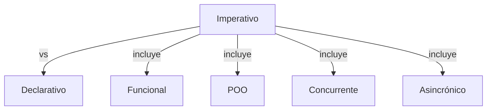
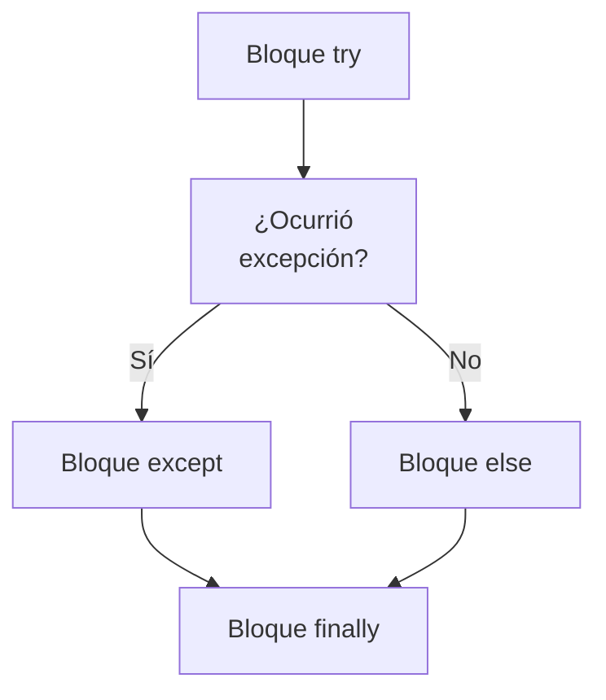
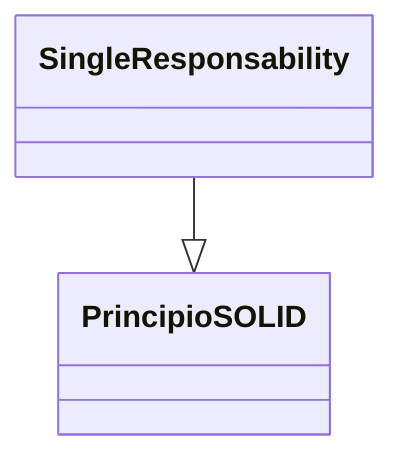
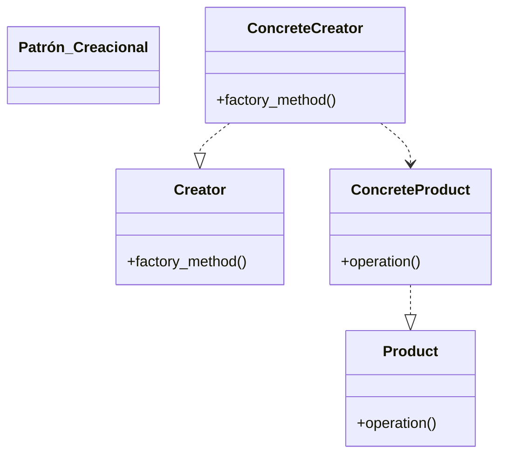

> [!abstract] **Etiquetas:** `POO` `basico` `design-patterns` `excepciones` `funcional` `solid`










---


# Método de fábrica en Python

El método de fábrica es un patrón de diseño creacional que resuelve el problema 
de crear objetos de productos sin especificar sus clases concretas.

El Método de Fábrica define un método que debe ser utilizado para crear objetos 
en lugar de usar una llamada directa al constructor (operador new). 

Las subclases pueden anular este método para cambiar la clase de los objetos 
que se crearán.


- Complejidad: *--
- Popularidad: ***

Ejemplos de uso: El patrón Factory Method es ampliamente utilizado en el código de Python. 
Es muy útil cuando se necesita proporcionar un alto nivel de flexibilidad para el código.


Identificación: Los métodos de fábrica se pueden reconocer por los métodos de creación 
que construyen objetos a partir de clases concretas. 

Mientras se utilizan clases concretas durante la creación de objetos, 
el tipo de retorno de los métodos de fábrica generalmente se declara como una 
clase abstracta o una interfaz.

Ejemplo conceptual:
Este ejemplo ilustra la estructura del patrón de diseño Factory Method. 
Se centra en responder estas preguntas:

¿De qué clases se compone?
¿Qué roles desempeñan estas clases?
¿De qué manera están relacionados los elementos del patrón?


---

```python


from __future__ import annotations
from abc import ABC, abstractmethod


class Creator(ABC):
    """
    The Creator class declares the factory method that is supposed to return an
    object of a Product class. The Creator's subclasses usually provide the
    implementation of this method.
    """

    @abstractmethod
    def factory_method(self):
        """
        Note that the Creator may also provide some default implementation of
        the factory method.
        """
        pass

    def some_operation(self) -> str:
        """
        Also note that, despite its name, the Creator's primary responsibility
        is not creating products. Usually, it contains some core business logic
        that relies on Product objects, returned by the factory method.
        Subclasses can indirectly change that business logic by overriding the
        factory method and returning a different type of product from it.
        """

        # Call the factory method to create a Product object.
        product = self.factory_method()

        # Now, use the product.
        result = f"Creator: The same creator's code has just worked with {product.operation()}"

        return result


"""
Concrete Creators override the factory method in order to change the resulting
product's type.
"""


class ConcreteCreator1(Creator):
    """
    Note that the signature of the method still uses the abstract product type,
    even though the concrete product is actually returned from the method. This
    way the Creator can stay independent of concrete product classes.
    """

    def factory_method(self) -> Product:
        return ConcreteProduct1()


class ConcreteCreator2(Creator):
    def factory_method(self) -> Product:
        return ConcreteProduct2()


class Product(ABC):
    """
    The Product interface declares the operations that all concrete products
    must implement.
    """

    @abstractmethod
    def operation(self) -> str:
        pass


"""
Concrete Products provide various implementations of the Product interface.
"""


class ConcreteProduct1(Product):
    def operation(self) -> str:
        return "{Result of the ConcreteProduct1}"


class ConcreteProduct2(Product):
    def operation(self) -> str:
        return "{Result of the ConcreteProduct2}"


def client_code(creator: Creator) -> None:
    """
    The client code works with an instance of a concrete creator, albeit through
    its base interface. As long as the client keeps working with the creator via
    the base interface, you can pass it any creator's subclass.
    """

    print(f"Client: I'm not aware of the creator's class, but it still works.\n"
          f"{creator.some_operation()}", end="")


if __name__ == "__main__":
    print("App: Launched with the ConcreteCreator1.")
    client_code(ConcreteCreator1())
    print("\n")

    print("App: Launched with the ConcreteCreator2.")
    client_code(ConcreteCreator2())
```

**Salida:**
```
App: Launched with the ConcreteCreator1.
Client: I'm not aware of the creator's class, but it still works.
Creator: The same creator's code has just worked with {Result of the ConcreteProduct1}

App: Launched with the ConcreteCreator2.
Client: I'm not aware of the creator's class, but it still works.
Creator: The same creator's code has just worked with {Result of the ConcreteProduct2}
```

---

# Factory Method
Also known as: Virtual Constructor

Intento
---
Factory Method es un patrón de diseño creacional que proporciona una interfaz 
para la creación de objetos en una superclase, pero permite a las subclases 
alterar el tipo de objetos que se crearán.


---

## Problema

Imagina que estás creando una aplicación de gestión logística. 
La primera versión de tu aplicación solo puede manejar el transporte por camiones, 
por lo que la mayor parte de tu código se encuentra dentro de la clase Truck.

Después de un tiempo, tu aplicación se vuelve bastante popular. 
Cada día recibes docenas de solicitudes de compañías de transporte marítimo 
para incorporar la logística marítima en la aplicación.

¿No es genial? Pero, ¿qué pasa con el código? En la actualidad, 
la mayor parte de su código está acoplado a la clase Truck. 

Agregar Ships a la aplicación requeriría realizar cambios en todo el código. 

Además, si posteriormente decide agregar otro tipo de transporte a la aplicación, 
probablemente tendrá que volver a realizar todos estos cambios.

Como resultado, terminará con un código bastante desagradable, 
lleno de condicionales que cambian el comportamiento de la aplicación 
según la clase de los objetos de transporte.


---

## Solución:

El patrón Factory Method sugiere que reemplace las llamadas directas de 
construcción de objetos (usando el operador new) con llamadas a un método 
de fábrica especial. 

No se preocupe: los objetos todavía se crean a través del operador new, 
pero se llama desde dentro del método de fábrica. 
Los objetos devueltos por un método de fábrica a menudo se denominan productos.

A primera vista, este cambio puede parecer sin sentido: 
simplemente movimos la llamada del constructor de una parte del programa a otra. 
Sin embargo, considera esto: 
ahora puedes sobrescribir el método de fábrica en una subclase y 
cambiar la clase de productos que se crean mediante el método.

Hay una ligera limitación, sin embargo: 
las subclases pueden devolver diferentes tipos de productos solo si estos productos 
tienen una clase base común o una interfaz. 

Además, el método de fábrica en la clase base debe tener su tipo de retorno declarado 
como esta interfaz.

Por ejemplo, tanto la clase Truck como la clase Ship deben implementar la interfaz Transport, 
que declara un método llamado deliver. 

Cada clase implementa este método de manera diferente: 
los camiones entregan la carga por tierra, los barcos entregan la carga por mar. 
El método de fábrica en la clase RoadLogistics devuelve objetos de camión, 
mientras que el método de fábrica en la clase SeaLogistics devuelve barcos.

El código que usa el factory method (a menudo llamado el código del cliente) 
no ve ninguna diferencia entre los productos reales devueltos por varias subclases. 

- El cliente trata todos los productos como un Transporte abstracto. 
- El cliente sabe que todos los objetos de transporte deben tener el método deliver, 
pero cómo funciona exactamente no es importante para el cliente.


---

## Estructura

1. En el patrón de diseño Factory Method, el Product es una clase abstracta o 
una interfaz que define la estructura común de los objetos que se pueden crear mediante 
el Creator y sus subclases. 

El Product también puede contener la implementación predeterminada de algunas de sus 
operaciones.

2. Los Productos Concretos son clases que implementan la interfaz del Producto 
y proporcionan implementaciones específicas de los métodos declarados en la interfaz. 
En el contexto del patrón Factory Method, cada Producto Concreto corresponde a un 
tipo específico de objeto que el Factory Method puede crear.

3. La clase Creator declara el método de fábrica que devuelve nuevos objetos de producto. 
Es importante que el tipo de retorno de este método coincida con la interfaz del producto.

Puede declarar el método de fábrica como abstracto para obligar a todas las subclases 
a implementar sus propias versiones del método. 
Como alternativa, el método de fábrica base puede devolver algún tipo 
de producto predeterminado.

Tenga en cuenta que, a pesar de su nombre, 
la creación de productos no es la responsabilidad principal del creador. 
Por lo general, la clase creadora ya tiene cierta lógica empresarial central 
relacionada con los productos. 
El método de fábrica ayuda a desacoplar esta lógica de las clases de productos concretos. 
Aquí hay una analogía: 

una gran empresa de desarrollo de software puede tener un departamento de capacitación 
para programadores. Sin embargo, la función principal de la empresa en su conjunto sigue 
siendo escribir código, no producir programadores.

4. Los Creadores Concretos anulan el método de fábrica base para que devuelva un 
tipo diferente de producto.

Ten en cuenta que el método de fábrica no tiene que crear nuevas instancias todo el tiempo. 
También puede devolver objetos existentes desde una caché, 
un pool de objetos o cualquier otra fuente.


---

## Pseudo codigo

Este ejemplo ilustra cómo se puede utilizar el método de fábrica para crear elementos 
de interfaz de usuario multiplataforma sin acoplar el código del cliente a clases 
de interfaz de usuario concretas.

La clase base Dialog utiliza diferentes elementos de interfaz de usuario para renderizar 
su ventana. 

En varios sistemas operativos, estos elementos pueden verse un poco diferentes, 
pero aún así deberían comportarse de manera consistente. 
Un botón en Windows sigue siendo un botón en Linux.

Cuando entra en juego el método de fábrica, 
no es necesario reescribir la lógica de la clase Dialog para cada sistema operativo. 
Si declaramos un método de fábrica que produce botones dentro de la clase base Dialog, 
más tarde podemos crear una subclase que devuelva botones con estilo de Windows 
desde el método de fábrica. 

La subclase hereda la mayor parte del código de la clase base, pero, 
gracias al método de fábrica, puede renderizar botones con aspecto de Windows 
en la pantalla.


---

## pseudo codigo:
```
// The creator class declares the factory method that must
// return an object of a product class. The creator's subclasses
// usually provide the implementation of this method.
class Dialog is
    // The creator may also provide some default implementation
    // of the factory method.
    abstract method createButton():Button

    // Note that, despite its name, the creator's primary
    // responsibility isn't creating products. It usually
    // contains some core business logic that relies on product
    // objects returned by the factory method. Subclasses can
    // indirectly change that business logic by overriding the
    // factory method and returning a different type of product
    // from it.
    method render() is
        // Call the factory method to create a product object.
        Button okButton = createButton()
        // Now use the product.
        okButton.onClick(closeDialog)
        okButton.render()
```
```
// Concrete creators override the factory method to change the
// resulting product's type.
class WindowsDialog extends Dialog is
    method createButton():Button is
        return new WindowsButton()

class WebDialog extends Dialog is
    method createButton():Button is
        return new HTMLButton()


// The product interface declares the operations that all
// concrete products must implement.
interface Button is
    method render()
    method onClick(f)

// Concrete products provide various implementations of the
// product interface.
class WindowsButton implements Button is
    method render(a, b) is
        // Render a button in Windows style.
    method onClick(f) is
        // Bind a native OS click event.

class HTMLButton implements Button is
    method render(a, b) is
        // Return an HTML representation of a button.
    method onClick(f) is
        // Bind a web browser click event.
```
```
class Application is
    field dialog: Dialog

    // The application picks a creator's type depending on the
    // current configuration or environment settings.
    method initialize() is
        config = readApplicationConfigFile()

        if (config.OS == "Windows") then
            dialog = new WindowsDialog()
        else if (config.OS == "Web") then
            dialog = new WebDialog()
        else
            throw new Exception("Error! Unknown operating system.")

    // The client code works with an instance of a concrete
    // creator, albeit through its base interface. As long as
    // the client keeps working with the creator via the base
    // interface, you can pass it any creator's subclass.
    method main() is
        this.initialize()
        dialog.render()
```


Para que este patrón funcione, la clase base Dialog debe trabajar con botones abstractos: 
una clase base o una interfaz que todos los botones concretos sigan. 
De esta manera, el código dentro de Dialog sigue siendo funcional, 
independientemente del tipo de botones con los que trabaja.

Por supuesto, también se puede aplicar este enfoque a otros elementos de la interfaz 
de usuario. Sin embargo, con cada nuevo método de fábrica que se agrega a Dialog, 
se está más cerca del patrón Abstract Factory. 

No te preocupes, hablaremos de este patrón más adelante.


---

## Aplicabilidad

- Usa el método Factory cuando no conoces de antemano los tipos exactos y 
las dependencias de los objetos con los que tu código debe trabajar.

- El método Factory separa el código de construcción de productos del código 
que realmente utiliza el producto. 
Por lo tanto, es más fácil extender el código de construcción del producto de 
forma independiente al resto del código.

Por ejemplo, para agregar un nuevo tipo de producto a la aplicación, 
solo necesitarás crear una nueva subclase de creador y anular el método de fábrica en ella.


---


----------------------------------------------------------------------------
Usa el Método de Fábrica cuando quieras proporcionar a los usuarios de tu biblioteca o 
framework una forma de extender sus componentes internos.

La herencia es probablemente la forma más fácil de extender el comportamiento predeterminado 
de una biblioteca o framework. 
¿Pero cómo reconocería el framework que se debe usar tu subclase 
en lugar de un componente estándar?

La solución es reducir el código que construye los componentes a lo largo del framework 
en un solo método de fábrica y permitir que cualquiera anule este método además 
de extender el componente en sí.

Veamos cómo funcionaría. Imagina que escribes una aplicación usando un framework de 
interfaz de usuario de código abierto. 
Tu aplicación debería tener botones redondos, pero el framework solo proporciona cuadrados. 

Extiendes la clase de botón estándar con una gloriosa subclase RoundButton. 

Pero ahora debes decirle a la clase principal del framework de interfaz de usuario 
que use la nueva subclase de botón en lugar de la predeterminada.


Para lograr esto, creas una subclase UIWithRoundButtons de una clase base del framework 
y anulas su método createButton. 

Mientras que este método devuelve objetos Button en la clase base, 
haces que tu subclase devuelva objetos RoundButton. 

Ahora usa la clase UIWithRoundButtons en lugar de UIFramework. ¡Y eso es todo!


---


------------------------------------------------------------------------------
Usa el Método de Fábrica cuando deseas ahorrar recursos del sistema 
reutilizando objetos existentes en lugar de reconstruirlos cada vez.

A menudo se tiene esta necesidad al tratar con objetos grandes y de alta exigencia 
en recursos como conexiones de bases de datos, sistemas de archivos y recursos de red.

Pensemos en lo que se debe hacer para reutilizar un objeto existente:

Primero, se necesita crear algún almacenamiento para hacer un seguimiento de todos 
los objetos creados.

Cuando alguien solicita un objeto, el programa debe buscar un objeto libre dentro 
de ese grupo.
... y luego devolverlo al código del cliente.

Si no hay objetos libres, el programa debe crear uno nuevo (y agregarlo al grupo).
¡Eso es mucho código! Y todo debe colocarse en un solo lugar para que no se contamine 
el programa con código duplicado.

Probablemente, el lugar más obvio y conveniente donde se podría colocar este código 
es el constructor de la clase cuyos objetos estamos intentando reutilizar. 

Sin embargo, un constructor siempre debe devolver objetos nuevos por definición. 

No puede devolver instancias existentes.

Por lo tanto, se necesita un método regular capaz de crear nuevos objetos 
y reutilizar los existentes. Eso suena mucho como un método de fábrica.


---

# Cómo Implementar

Haz que todos los productos sigan la misma interfaz. 
Esta interfaz debe declarar métodos que tengan sentido en cada producto.

Agrega un método de fábrica vacío dentro de la clase creadora. 
El tipo de retorno del método debe coincidir con la interfaz común del producto.

En el código del creador, busca todas las referencias a los constructores del producto. 
Uno por uno, reemplázalos con llamadas al método de fábrica, 
mientras extraes el código de creación del producto en el método de fábrica.

Es posible que necesites agregar un parámetro temporal al método de fábrica para 
controlar el tipo de producto devuelto.

En este punto, el código del método de fábrica puede parecer bastante feo. 
Puede tener una gran instrucción switch que elige qué clase de producto instanciar. 
Pero no te preocupes, lo arreglaremos pronto.

Ahora, crea un conjunto de subclases de creador para cada tipo de producto listado 
en el método de fábrica. 

Sobrescribe el método de fábrica en las subclases y extrae las partes apropiadas 
del código de construcción del método base.

Si hay demasiados tipos de producto y no tiene sentido crear subclases para todos ellos, 
puedes reutilizar el parámetro de control de la clase base en las subclases.

Por ejemplo, imagina que tienes la siguiente jerarquía de clases: 
la clase base Mail con un par de subclases: AirMail y GroundMail; 
las clases de transporte son Plane, Truck y Train. 
Mientras que la clase AirMail solo usa objetos de tipo Plane, 
GroundMail puede trabajar con objetos tanto de Truck como de Train. 

Puedes crear una nueva subclase (digamos TrainMail) para manejar ambos casos, 
pero hay otra opción. 

El código del cliente puede pasar un argumento al método de fábrica de la 
clase GroundMail para controlar qué producto quiere recibir.

Si, después de todas las extracciones, el método de fábrica base se ha vuelto vacío, 
puedes hacer que sea abstracto. 

Si queda algo, puedes hacerlo un comportamiento predeterminado del método.


---

### Ventajas y Desventajas

Evitas un acoplamiento fuerte entre el creador y los productos concretos.

Principio de Responsabilidad Única. 
Puedes mover el código de creación de productos a un solo lugar en el programa, 
lo que hace que el código sea más fácil de mantener.

Principio Abierto/Cerrado. 
Puedes introducir nuevos tipos de productos en el programa sin romper 
el código existente del cliente.

El código puede volverse más complicado ya que debes introducir muchas 
nuevas subclases para implementar el patrón. 
El mejor caso es cuando introduces el patrón en una jerarquía existente 
de clases creadoras.


---

### Relaciones con otros patrones

Muchos diseños comienzan utilizando Factory Method (menos complicado y más 
personalizable a través de subclases) y evolucionan hacia Abstract Factory, 
Prototype o Builder (más flexibles, pero más complicados).

Las clases Abstract Factory a menudo se basan en un conjunto de Factory Methods, 
pero también se puede utilizar Prototype para componer los métodos en estas clases.

Puede usar Factory Method junto con Iterator para permitir que las subclases 
de colecciones devuelvan diferentes tipos de iteradores que sean compatibles 
con las colecciones.

Prototype no se basa en la herencia, por lo que no tiene sus desventajas. 
Por otro lado, Prototype requiere una inicialización complicada del objeto clonado. 
Factory Method se basa en la herencia pero no requiere un paso de inicialización.

Factory Method es una especialización de Template Method. Al mismo tiempo, 
un Factory Method puede servir como un paso en un gran Template Method.

## Contenido relacionado

### POO

- [[../../01-intro/03-paradigmas-en-python/01-intro-paradigmas-imperativo-declarativo|Paradigmas en python]]
- [[../../01-intro/03-paradigmas-en-python/02-funcional|Paradigma Funcional]]
- [[../../01-intro/03-paradigmas-en-python/03-reflexivo|Paradigma reflexivo]]
- [[../../01-intro/git|Git]]
- [[../../01-intro/github|Conectando los repositorios de GIT y GitHub.]]
- [[../../01-intro/librerias-para-python|Librerias para Python]]
- [[../../02-basic/02-variables-numericas/sistemas_numericos|Sistemas numéricos]]
- [[../../02-basic/03-command-line-tutorial/como_crear_un_programa_en_linux|Creando un script ejecutable.]]
- [[../../02-basic/04-comentarios|Comentarios de triple comilla]]
- [[../../03-medium/01-metodos/02-metodos-magicos|Métodos mágicos]]
- [[simplificar-llamadas-a-metodos|Simplificando Llamadas a Métodos]]
- [[colapso-de-jerarquia|Colapso de jerarquia]]
- [[delegacion-con-herencia|Reemplazar Delegación con Herencia]]
- [[extract-subclass|Extract Subclass (Extraer Subclase)]]
- [[extract-superclass|Extract Superclass:]]
- [[extract-interface|Extract interface]]
- [[form-template-method|Form Template Method]]
- [[herencia-con-delegacion|Reemplazar la herencia con delegación]]
- [[pull-up-field|Pull Up Field]]
- [[pull-up-method|Pull Up Method]]
- [[pull-up-constructor-body|Pull Up Constructor Body]]
- [[push-downf-field|Push Down Field:]]
- [[push-down-method|Push Down Method]]
- [[tratar-con-generalización|Tratar con generalización]]
- [[refactorización-code-smells|Codigo limpio]]
- [[01-unique-responsability|1. Principio de responsabilidad única]]
- [[02-open-close|2. Principio abierto-cerrado]]
- [[03-liskov-sustitution|3. Principio de sustitución de Liskov]]
- [[04-interface-segregation|4. Principio de segregación de interfaces]]
- [[05-dependency-inversion|5. Principio de inversión de la dependencia]]
- [[abstract-factory|Ejemplo conceptual]]
- [[builder|Builder en Python]]
- [[prototype|Ejemplos de uso:]]
- [[../../inteligencia_artificial|Funcion dir() de Python]]

### basico

- [[../../01-intro/00-caracteristicas_python|Anotaciones lenguaje Python]]
- [[../../01-intro/00-esoterismos-de-python|Esoterismos de python]]
- [[../../01-intro/03-paradigmas-en-python/01-intro-paradigmas-imperativo-declarativo|Paradigmas en python]]
- [[../../01-intro/03-paradigmas-en-python/02-funcional|Paradigma Funcional]]
- [[../../01-intro/03-paradigmas-en-python/03-reflexivo|Paradigma reflexivo]]
- [[../../01-intro/git|Git]]
- [[../../01-intro/github|Conectando los repositorios de GIT y GitHub.]]
- [[../../01-intro/librerias-para-python|Librerias para Python]]
- [[../../01-intro/trucos_de_refactorización|Trucos de refactorizacion.]]
- [[../../02-basic/02-variables-numericas/sistemas_numericos|Sistemas numéricos]]
- [[../../02-basic/03-command-line-tutorial/como_crear_un_programa_en_linux|Creando un script ejecutable.]]
- [[../../02-basic/04-comentarios|Comentarios de triple comilla]]
- [[../../03-medium/01-metodos/02-metodos-magicos|Métodos mágicos]]
- [[../../03-medium/07-excepciones-try-except|Tipos de error]]
- [[colapso-de-jerarquia|Colapso de jerarquia]]
- [[extract-subclass|Extract Subclass (Extraer Subclase)]]
- [[pull-up-constructor-body|Pull Up Constructor Body]]
- [[refactorización-code-smells|Codigo limpio]]
- [[03-liskov-sustitution|3. Principio de sustitución de Liskov]]
- [[abstract-factory|Ejemplo conceptual]]
- [[builder|Builder en Python]]
- [[prototype|Ejemplos de uso:]]
- [[../../frameworks/pandas/BloodyRoarTierList|Bloody Roar Tier List]]
- [[../../../ejercicios/Ejercicio_1|Ejercicio 1]]
- [[../../../ejercicios/Ejercicio_2|Ejercicio 1]]
- [[../../../prueba-tecnica|prueba-tecnica]]

### design-patterns

- [[../../01-intro/git|Git]]
- [[../../01-intro/github|Conectando los repositorios de GIT y GitHub.]]
- [[../../01-intro/librerias-para-python|Librerias para Python]]
- [[simplificar-llamadas-a-metodos|Simplificando Llamadas a Métodos]]
- [[extract-subclass|Extract Subclass (Extraer Subclase)]]
- [[form-template-method|Form Template Method]]
- [[herencia-con-delegacion|Reemplazar la herencia con delegación]]
- [[push-downf-field|Push Down Field:]]
- [[refactorización-code-smells|Codigo limpio]]
- [[01-unique-responsability|1. Principio de responsabilidad única]]
- [[03-liskov-sustitution|3. Principio de sustitución de Liskov]]
- [[abstract-factory|Ejemplo conceptual]]
- [[builder|Builder en Python]]
- [[prototype|Ejemplos de uso:]]

### excepciones

- [[../../01-intro/00-esoterismos-de-python|Esoterismos de python]]
- [[../../01-intro/03-paradigmas-en-python/02-funcional|Paradigma Funcional]]
- [[../../01-intro/03-paradigmas-en-python/03-reflexivo|Paradigma reflexivo]]
- [[../../01-intro/git|Git]]
- [[../../01-intro/github|Conectando los repositorios de GIT y GitHub.]]
- [[../../02-basic/04-comentarios|Comentarios de triple comilla]]
- [[../../03-medium/07-excepciones-try-except|Tipos de error]]
- [[../../03-medium/decorador|Decorador]]
- [[simplificar-llamadas-a-metodos|Simplificando Llamadas a Métodos]]
- [[extract-subclass|Extract Subclass (Extraer Subclase)]]
- [[extract-interface|Extract interface]]
- [[form-template-method|Form Template Method]]
- [[pull-up-field|Pull Up Field]]
- [[push-down-method|Push Down Method]]
- [[refactorización-code-smells|Codigo limpio]]
- [[04-interface-segregation|4. Principio de segregación de interfaces]]
- [[abstract-factory|Ejemplo conceptual]]

### funcional

- [[../../01-intro/00-esoterismos-de-python|Esoterismos de python]]
- [[../../01-intro/03-paradigmas-en-python/01-intro-paradigmas-imperativo-declarativo|Paradigmas en python]]
- [[../../01-intro/03-paradigmas-en-python/02-funcional|Paradigma Funcional]]
- [[../../01-intro/03-paradigmas-en-python/03-reflexivo|Paradigma reflexivo]]
- [[../../01-intro/github|Conectando los repositorios de GIT y GitHub.]]
- [[../../01-intro/librerias-para-python|Librerias para Python]]
- [[../../01-intro/trucos_de_refactorización|Trucos de refactorizacion.]]
- [[../../03-medium/decorador|Decorador]]
- [[extract-subclass|Extract Subclass (Extraer Subclase)]]
- [[extract-superclass|Extract Superclass:]]
- [[push-downf-field|Push Down Field:]]
- [[push-down-method|Push Down Method]]
- [[tratar-con-generalización|Tratar con generalización]]
- [[refactorización-code-smells|Codigo limpio]]
- [[../../../ejercicios/Ejercicio_1|Ejercicio 1]]
- [[../../../ejercicios/Ejercicio_2|Ejercicio 1]]

### solid

- [[../../01-intro/00-caracteristicas_python|Anotaciones lenguaje Python]]
- [[../../01-intro/00-esoterismos-de-python|Esoterismos de python]]
- [[../../01-intro/github|Conectando los repositorios de GIT y GitHub.]]
- [[../../01-intro/librerias-para-python|Librerias para Python]]
- [[colapso-de-jerarquia|Colapso de jerarquia]]
- [[delegacion-con-herencia|Reemplazar Delegación con Herencia]]
- [[extract-interface|Extract interface]]
- [[form-template-method|Form Template Method]]
- [[herencia-con-delegacion|Reemplazar la herencia con delegación]]
- [[tratar-con-generalización|Tratar con generalización]]
- [[refactorización-code-smells|Codigo limpio]]
- [[01-unique-responsability|1. Principio de responsabilidad única]]
- [[02-open-close|2. Principio abierto-cerrado]]
- [[03-liskov-sustitution|3. Principio de sustitución de Liskov]]
- [[04-interface-segregation|4. Principio de segregación de interfaces]]
- [[05-dependency-inversion|5. Principio de inversión de la dependencia]]
- [[abstract-factory|Ejemplo conceptual]]
- [[builder|Builder en Python]]
- [[prototype|Ejemplos de uso:]]
