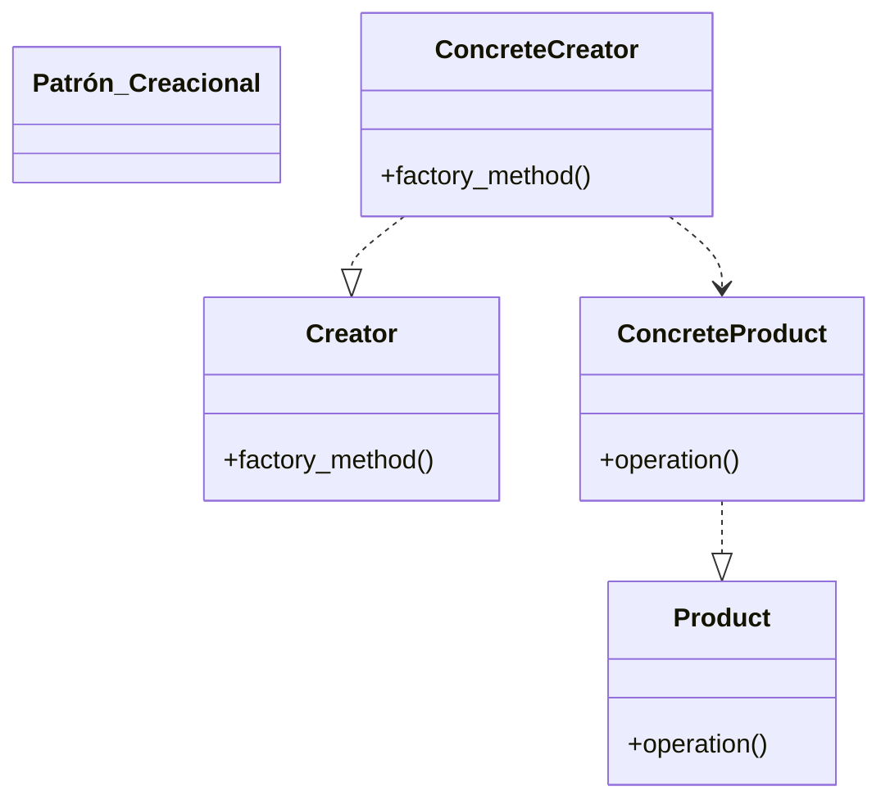

> [!abstract] **Etiquetas:** `POO` `basico` `decoradores` `design-patterns` `solid`



Prototype es un patrón de diseño creacional que permite la clonación de objetos, 
incluso los complejos, sin acoplarse a sus clases especificas.

Todas las clases prototipo deben tener una interfaz común que haga posible copiar 
objetos incluso si sus clases concretas son desconocidas. 
Los objetos prototipo pueden producir copias completas, ya que los objetos de la misma clase pueden acceder a los campos privados de los demás.

Complejidad: *--

Popularidad: **-

## Ejemplos de uso: 

El patrón Prototype esta disponible en Python listo para usarse con una modulo copy.

## Identificacion: 
El prototipo puede reconocerse fácilmente por un método clone o copy, etc.

## Ejemplo conceptual
Este ejemplo ilustra la estructura del patrón de diseño Prototype. 
Se centra en responder las siguientes preguntas:

- De que clases se compone?
- que papeles juegan esas clases?
- De que forma se relacionan los elementos del patrón?


---

```python
import copy


class SelfReferencingEntity:
    def __init__(self):
        self.parent = None

    def set_parent(self, parent):
        self.parent = parent


class SomeComponent:
    """
    Python provides its own interface of Prototype via `copy.copy` and
    `copy.deepcopy` functions. And any class that wants to implement custom
    implementations have to override `__copy__` and `__deepcopy__` member
    functions.
    """

    def __init__(self, some_int, some_list_of_objects, some_circular_ref):
        self.some_int = some_int
        self.some_list_of_objects = some_list_of_objects
        self.some_circular_ref = some_circular_ref

    def __copy__(self):
        """
        Create a shallow copy. This method will be called whenever someone calls
        `copy.copy` with this object and the returned value is returned as the
        new shallow copy.
        """

        # First, let's create copies of the nested objects.
        some_list_of_objects = copy.copy(self.some_list_of_objects)
        some_circular_ref = copy.copy(self.some_circular_ref)

        # Then, let's clone the object itself, using the prepared clones of the
        # nested objects.
        new = self.__class__(
            self.some_int, some_list_of_objects, some_circular_ref
        )
        new.__dict__.update(self.__dict__)

        return new

    def __deepcopy__(self, memo=None):
        """
        Create a deep copy. This method will be called whenever someone calls
        `copy.deepcopy` with this object and the returned value is returned as
        the new deep copy.

        What is the use of the argument `memo`? Memo is the dictionary that is
        used by the `deepcopy` library to prevent infinite recursive copies in
        instances of circular references. Pass it to all the `deepcopy` calls
        you make in the `__deepcopy__` implementation to prevent infinite
        recursions.
        """
        if memo is None:
            memo = {}

        # First, let's create copies of the nested objects.
        some_list_of_objects = copy.deepcopy(self.some_list_of_objects, memo)
        some_circular_ref = copy.deepcopy(self.some_circular_ref, memo)

        # Then, let's clone the object itself, using the prepared clones of the
        # nested objects.
        new = self.__class__(
            self.some_int, some_list_of_objects, some_circular_ref
        )
        new.__dict__ = copy.deepcopy(self.__dict__, memo)

        return new


if __name__ == "__main__":

    list_of_objects = [1, {1, 2, 3}, [1, 2, 3]]
    circular_ref = SelfReferencingEntity()
    component = SomeComponent(23, list_of_objects, circular_ref)
    circular_ref.set_parent(component)

    shallow_copied_component = copy.copy(component)

    # Let's change the list in shallow_copied_component and see if it changes in
    # component.
    shallow_copied_component.some_list_of_objects.append("another object")
    if component.some_list_of_objects[-1] == "another object":
        print(
            "Adding elements to `shallow_copied_component`'s "
            "some_list_of_objects adds it to `component`'s "
            "some_list_of_objects."
        )
    else:
        print(
            "Adding elements to `shallow_copied_component`'s "
            "some_list_of_objects doesn't add it to `component`'s "
            "some_list_of_objects."
        )

    # Let's change the set in the list of objects.
    component.some_list_of_objects[1].add(4)
    if 4 in shallow_copied_component.some_list_of_objects[1]:
        print(
            "Changing objects in the `component`'s some_list_of_objects "
            "changes that object in `shallow_copied_component`'s "
            "some_list_of_objects."
        )
    else:
        print(
            "Changing objects in the `component`'s some_list_of_objects "
            "doesn't change that object in `shallow_copied_component`'s "
            "some_list_of_objects."
        )

    deep_copied_component = copy.deepcopy(component)

    # Let's change the list in deep_copied_component and see if it changes in
    # component.
    deep_copied_component.some_list_of_objects.append("one more object")
    if component.some_list_of_objects[-1] == "one more object":
        print(
            "Adding elements to `deep_copied_component`'s "
            "some_list_of_objects adds it to `component`'s "
            "some_list_of_objects."
        )
    else:
        print(
            "Adding elements to `deep_copied_component`'s "
            "some_list_of_objects doesn't add it to `component`'s "
            "some_list_of_objects."
        )

    # Let's change the set in the list of objects.
    component.some_list_of_objects[1].add(10)
    if 10 in deep_copied_component.some_list_of_objects[1]:
        print(
            "Changing objects in the `component`'s some_list_of_objects "
            "changes that object in `deep_copied_component`'s "
            "some_list_of_objects."
        )
    else:
        print(
            "Changing objects in the `component`'s some_list_of_objects "
            "doesn't change that object in `deep_copied_component`'s "
            "some_list_of_objects."
        )

    print(
        f"id(deep_copied_component.some_circular_ref.parent): "
        f"{id(deep_copied_component.some_circular_ref.parent)}"
    )
    print(
        f"id(deep_copied_component.some_circular_ref.parent.some_circular_ref.parent): "
        f"{id(deep_copied_component.some_circular_ref.parent.some_circular_ref.parent)}"
    )
    print(
        "^^ This shows that deepcopied objects contain same reference, they "
        "are not cloned repeatedly."
    )

    """Output
    Adding elements to `shallow_copied_component`'s some_list_of_objects adds it to `component`'s some_list_of_objects.
    Changing objects in the `component`'s some_list_of_objects changes that object in `shallow_copied_component`'s some_list_of_objects.
    Adding elements to `deep_copied_component`'s some_list_of_objects doesn't add it to `component`'s some_list_of_objects.
    Changing objects in the `component`'s some_list_of_objects doesn't change that object in `deep_copied_component`'s some_list_of_objects.
    id(deep_copied_component.some_circular_ref.parent): 4429472784
    id(deep_copied_component.some_circular_ref.parent.some_circular_ref.parent): 4429472784
    ^^ This shows that deepcopied objects contain same reference, they are not cloned repeatedly.
    """
```

**Salida:**
```
Adding elements to `shallow_copied_component`'s some_list_of_objects adds it to `component`'s some_list_of_objects.
Changing objects in the `component`'s some_list_of_objects changes that object in `shallow_copied_component`'s some_list_of_objects.
Adding elements to `deep_copied_component`'s some_list_of_objects doesn't add it to `component`'s some_list_of_objects.
Changing objects in the `component`'s some_list_of_objects doesn't change that object in `deep_copied_component`'s some_list_of_objects.
id(deep_copied_component.some_circular_ref.parent): 139622139597824
id(deep_copied_component.some_circular_ref.parent.some_circular_ref.parent): 139622139597824
^^ This shows that deepcopied objects contain same reference, they are not cloned repeatedly.
```

---

## Proposito

Prototype es un patron de diseño creacional que nos permite copiar objetos 
existentes sin que el codigo dependa de sus clases.

## Problema

Digamos que tienes un objeto y quieres crear una copia exacta de el. 
¿Como lo harías? En primer lugar, debes crear un nuevo objeto de la misma clase. 
Después debes recorrer todos los campos del objeto original y copiar sus valores 
en el nuevo objeto.

¡Bien! Pero hay una trampa. No todos los objetos se pueden copiar de este modo, 
porque algunos de los campos del objeto pueden ser privados e invisibles desde 
fuera del propio objeto.

Hay otro problema con el enfoque directo. Dado que debes conocer la clase del 
objeto para crear un duplicado, el código se vuelve dependiente de esa clase. 
Si esta dependencia adicional no te da miedo, todavía hay otra trampa. 

En ocasiones tan solo conocemos la interfaz que sigue el objeto, pero no su clase concreta, cuando, por ejemplo, un parámetro de un método acepta cualquier objeto que siga cierta interfaz.


---

# Solución

El patrón Prototype delega el proceso de clonación a los propios objetos que 
están siendo clonados. El patrón declara una interfaz común para todos los 
objetos que soportan la clonación. Esta interfaz nos permite clonar un objeto 
sin acoplar el código a la clase de ese objeto. Normalmente, dicha interfaz contiene un único método clonar.

La implementación del método clonar es muy parecida en todas las clases. 
El método crea un objeto a partir de la clase actual y lleva todos los valores 
de campo del viejo objeto, al nuevo. Se puede incluso copiar campos privados, 
porque la mayoría de los lenguajes de programación permite a los objetos acceder 
a campos privados de otros objetos que pertenecen a la misma clase.

Un objeto que soporta la clonación se denomina prototipo. 
Cuando tus objetos tienen decenas de campos y miles de configuraciones posibles, 
la clonacion puede servir como alternativa a la creacion de subclases.

## Prototipos prefabricados

Los prototipos prefabricados pueden ser una alternativa a las subclases.

### Funciona asi: se crea un grupo de objetos configurados de maneras diferentes. 

Cuando necesites un objeto como el que has configurado, clonas un prototipo en lugar de construir un nuevo objeto desde cero.

### Analogía del mundo real

En la vida real, los prototipos se utilizan para realizar pruebas de todo tipo antes de comenzar con la producción en masa de un producto. Sin embargo, en este caso, los prototipos no forman parte de una producción real, sino que juegan un papel pasivo.

- La división de una célula
- La división de una célula.

Ya que los prototipos industriales en realidad no se copian a si mismos, 
una analogía mas precisa del patrón es el proceso de la división mitotica 
de una célula (biología, recuerdas?). Tras la división mitotica, se forma un 
par de células idénticas. 

La célula original actúa como prototipo y asume un papel activo 
en la creación de la copia.


---

## Estructura

1. La interfaz Prototipo declara los métodos de clonación. 
En la mayoría de los casos, se trata de un único método clonar.

2. La clase Prototipo Concreto implementa el método de clonación. 
Ademas de copiar la información del objeto original al clon, este método también puede gestionar algunos casos extremos del proceso de clonación, como, por ejemplo, clonar objetos vinculados, deshacer dependencias recursivas, etc.

3. El Cliente puede producir una copia de cualquier objeto que siga la 
interfaz del prototipo.

---

## Implementación del registro de prototipos

### El registro de prototipos

El Registro de Prototipos ofrece una forma sencilla de acceder a prototipos 
de uso frecuente. Almacena un grupo de objetos prefabricados listos para ser copiados. 

El registro de prototipos mas sencillo es una tabla hash con los pares name → prototype. 
No obstante, si necesitas un criterio de búsqueda mas preciso que un simple nombre, 
puedes crear una versión mucho mas robusta del registro.


---

## Pseudo código

En este ejemplo, el patrón Prototype nos permite producir copias exactas 
de objetos geométricos sin acoplar el código a sus clases.

Clonación de un grupo de objetos que pertenece a una jerarquía de clase.

Todas las clases de forma siguen la misma interfaz, que proporciona un 
método de clonación. Una subclase puede invocar el método de clonación padre 
antes de copiar sus propios valores de campo al objeto resultante.

```
// Prototipo base.
abstract class Shape is
    field X: int
    field Y: int
    field color: string

    // Un constructor normal.
    constructor Shape() is
        // ...

    // El constructor prototipo. Un nuevo objeto se inicializa
    // con valores del objeto existente.
    constructor Shape(source: Shape) is
        this()
        this.X = source.X
        this.Y = source.Y
        this.color = source.color

    // La operacion clonar devuelve una de las subclases de
    // Shape (Forma).
    abstract method clone():Shape
```
```
// Prototipo concreto. El metodo de clonacion crea un nuevo
// objeto y lo pasa al constructor. Hasta que el constructor
// termina, tiene una referencia a un nuevo clon. De este modo
// nadie tiene acceso a un clon a medio terminar. Esto garantiza
// la consistencia del resultado de la clonacion.
class Rectangle extends Shape is
    field width: int
    field height: int

    constructor Rectangle(source: Rectangle) is
        // Para copiar campos privados definidos en la clase
        // padre es necesaria una llamada a un constructor
        // padre.
        super(source)
        this.width = source.width
        this.height = source.height

    method clone():Shape is
        return new Rectangle(this)


class Circle extends Shape is
    field radius: int

    constructor Circle(source: Circle) is
        super(source)
        this.radius = source.radius

    method clone():Shape is
        return new Circle(this)
```
```
// En alguna parte del codigo cliente.
class Application is
    field shapes: array of Shape

    constructor Application() is
        Circle circle = new Circle()
        circle.X = 10
        circle.Y = 10
        circle.radius = 20
        shapes.add(circle)

        Circle anotherCircle = circle.clone()
        shapes.add(anotherCircle)
        // La variable `anotherCircle` (otroCirculo) contiene
        // una copia exacta del objeto `circle`.

        Rectangle rectangle = new Rectangle()
        rectangle.width = 10
        rectangle.height = 20
        shapes.add(rectangle)

    method businessLogic() is
        // Prototype es genial porque te permite producir una
        // copia de un objeto sin conocer nada de su tipo.
        Array shapesCopy = new Array of Shapes.

        // Por ejemplo, no conocemos los elementos exactos de la
        // matriz de formas. Lo unico que sabemos es que son
        // todas formas. Pero, gracias al polimorfismo, cuando
        // invocamos el metodo `clonar` en una forma, el
        // programa comprueba su clase real y ejecuta el metodo
        // de clonacion adecuado definido en dicha clase. Por
        // eso obtenemos los clones adecuados en lugar de un
        // grupo de simples objetos Shape.
        foreach (s in shapes) do
            shapesCopy.add(s.clone())

        // La matriz `shapesCopy` contiene copias exactas del
        // hijo de la matriz `shape`.
```


---

## Aplicabilidad

Utiliza el patron Prototype cuando tu codigo no deba depender de las clases 
concretas de objetos que necesites copiar.

Esto sucede a menudo cuando tu codigo funciona con objetos pasados por 
codigo de terceras personas a traves de una interfaz. 

Las clases concretas de estos objetos son desconocidas y no podrias depender 
de ellas aunque quisieras.

El patron Prototype proporciona al codigo cliente una interfaz general para 
trabajar con todos los objetos que soportan la clonacion. 

Esta interfaz hace que el codigo cliente sea independiente de las clases concretas 
de los objetos que clona.

Utiliza el patron cuando quieras reducir la cantidad de subclases que solo se 
diferencian en la forma en que inicializan sus respectivos objetos. 

Puede ser que alguien haya creado estas subclases para poder crear objetos 
con una configuracion especifica.

El patron Prototype te permite utilizar como prototipos un grupo de objetos 
prefabricados, configurados de maneras diferentes.

En lugar de instanciar una subclase que coincida con una configuracion, 
el cliente puede, sencillamente, buscar el prototipo adecuado y clonarlo.


---

## Como implementarlo

Crea la interfaz del prototipo y declara el metodo clonar en ella, o, simplemente, 
añade el metodo a todas las clases de una jerarquia de clase existente, si la tienes.

Una clase de prototipo debe definir el constructor alternativo que acepta un objeto 
de dicha clase como argumento. El constructor debe copiar los valores de todos 
los campos definidos en la clase del objeto que se le pasa a la instancia recien creada. 

Si deseas cambiar una subclase, debes invocar al constructor padre para permitir 
que la superclase gestione la clonacion de sus campos privados.

Si el lenguaje de programación que utilizas no soporta la sobrecarga de métodos, 
puedes definir un método especial para copiar la información del objeto. 

El constructor es el lugar mas adecuado para hacerlo, porque entrega el objeto 
resultante justo despues de invocar el operador new.

Normalmente, el metodo de clonacion consiste en una sola linea que ejecuta un 
operador new con la version prototipica del constructor. 

Observa que todas las clases deben sobreescribir explicitamente el metodo de 
clonacion y utilizar su propio nombre de clase junto al operador new. De lo contrario, 
el metodo de clonacion puede producir un objeto a partir de una clase madre.

Opcionalmente, puedes crear un registro de prototipos centralizado para almacenar 
un catalogo de prototipos de uso frecuente.

Puedes implementar el registro como una nueva clase de fabrica o colocarlo 
en la clase base de prototipo con un método estático para buscar el prototipo. 

Este método debe buscar un prototipo con base en el criterio de búsqueda que el 
código cliente pase al método. El criterio puede ser una etiqueta tipo string o 
un grupo complejo de parámetros de búsqueda. 

Una vez encontrado el prototipo adecuado, el registro deberá clonarlo y devolver la copia al cliente.

Por ultimo, sustituye las llamadas directas a los constructores de las subclases 
por llamadas al metodo de fabrica del registro de prototipos.


---

## Pros y contras

- Puedes clonar objetos sin acoplarlos a sus clases concretas.
- Puedes evitar un codigo de inicializacion repetido clonando prototipos prefabricados.
- Puedes crear objetos complejos con mas facilidad.
- Obtienes una alternativa a la herencia al tratar con preajustes de configuracion 
para objetos complejos.
- Clonar objetos complejos con referencias circulares puede resultar complicado.


---

### Relaciones con otros patrones

Muchos diseños empiezan utilizando el Factory Method (menos complicado 
y mas personalizable mediante las subclases) y evolucionan hacia Abstract Factory, 

Prototype, o Builder (mas flexibles, pero mas complicados).

Las clases del Abstract Factory a menudo se basan en un grupo de métodos de fabrica, 
pero también puedes utilizar Prototype para escribir los métodos de estas clases.

Prototype puede ayudar a cuando necesitas guardar copias de Comandos en un historial.

Los diseños que hacen un uso amplio de Composite y Decorator a menudo pueden 
beneficiarse del uso del Prototype. 

Aplicar el patrón te permite clonar estructuras complejas en lugar de reconstruirlas 
desde cero.

Prototype no se basa en la herencia, por lo que no presenta sus inconvenientes. 
No obstante, Prototype requiere de una inicialización complicada del objeto clonado. 
Factory Method se basa en la herencia, pero no requiere de un paso de inicialización.

En ocasiones, Prototype puede ser una alternativa mas simple al patrón Memento. 
Esto funciona si el objeto cuyo estado quieres almacenar en el historial es 
suficientemente sencillo y no tiene enlaces a recursos externos, 
o estos son fáciles de restablecer.

Los patrones Abstract Factory, Builder y Prototype pueden todos ellos implementarse 
como Singletons.


## Contenido relacionado

- [[factory-method]] #related
- [[builder]] #related 
- [[abstract-factory]] #related