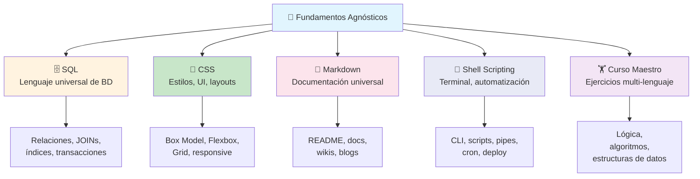
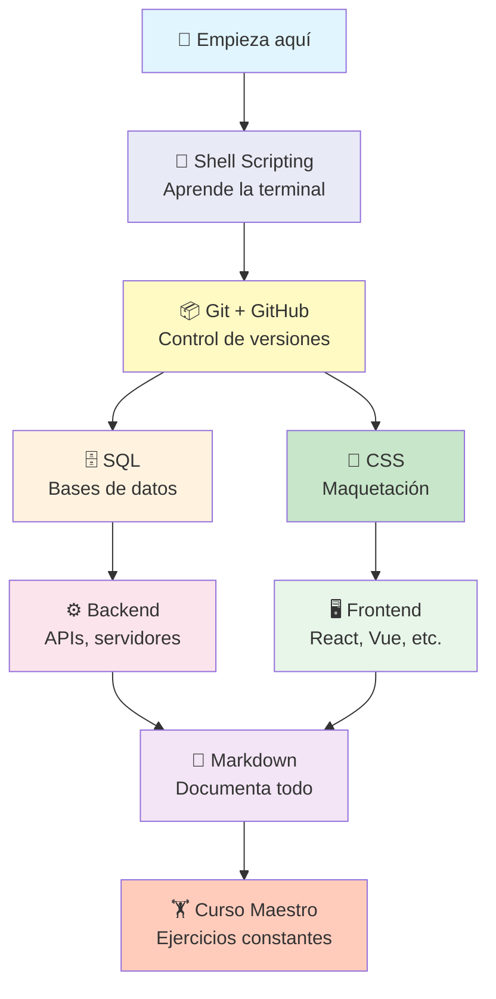

# Tecnologías Agnósticas

Son herramientas y conceptos que **no dependen de un lenguaje o framework específico**. Están presentes en todo tipo de proyectos, sin importar el stack. Dominarlas te da una base sólida y transferible.



---

## 🗄️ SQL

El lenguaje universal de bases de datos. Sin importar si usas PostgreSQL, MySQL o SQLite, los fundamentos son los mismos.

```sql
-- Lo mismo en cualquier base de datos relacional
SELECT u.name, COUNT(o.id) as orders
FROM users u
LEFT JOIN orders o ON o.user_id = u.id
WHERE u.active = true
GROUP BY u.id
ORDER BY orders DESC;
```

**Conceptos clave:**
- `SELECT`, `INSERT`, `UPDATE`, `DELETE` — el CRUD universal
- `JOIN` (INNER, LEFT, RIGHT) — relaciones entre tablas
- `GROUP BY` + funciones de agregación — agrupar y resumir
- `CREATE INDEX` — optimizar consultas
- `TRANSACTION`, `COMMIT`, `ROLLBACK` — integridad de datos

---

## 🎨 CSS

No es solo para la web. CSS se usa también en interfaces de Qt, aplicaciones GTK, y hasta en terminales (via frameworks como Ink).

```css
/* Los mismos principios en cualquier contexto */
.container {
    display: flex;
    justify-content: center;
    align-items: center;
    gap: 1rem;
}

.card {
    background: #fff;
    border-radius: 8px;
    box-shadow: 0 2px 8px rgba(0,0,0,0.1);
}
```

**Conceptos clave:**
- **Box Model**: margin, border, padding, content
- **Flexbox** / **Grid**: layouts modernos
- **Responsive**: media queries, unidades relativas
- **Selectors y especificidad**: cómo aplicar estilos
- **Variables CSS**: custom properties, theming

---

## 📝 Markdown

El estándar de facto para documentación. README, wikis, comentarios de código, blogs, y hasta libros enteros.

```markdown
# Título
## Subtítulo

- Lista
- De items

**negrita** *cursiva* `código`

> Cita

[enlace](url)
```

**Usos prácticos:**
- README de proyectos (`README.md`)
- Documentación de APIs (GitHub Wiki, MkDocs)
- Comentarios de documentación en Python (docstrings con Markdown), C# (XML + Markdown), etc.
- Blogs estáticos (Jekyll, Hugo, Astro)
- Esta academia entera está escrita en Markdown

---

## 🐚 Shell Scripting

La terminal es tu hogar como desarrollador. Scripting en bash te permite automatizar tareas repetitivas, desplegar, monitorear, y mucho más.

```bash
#!/bin/bash
set -euo pipefail

# Automatizar cualquier cosa
for dir in /opt/services/*/; do
    echo "🔄 Reiniciando $(basename $dir)..."
    sudo systemctl restart "$(basename $dir)"
done
```

**Lo esencial:**
- Navegación: `ls`, `cd`, `pwd`, `find`
- Manipulación: `cat`, `grep`, `awk`, `sed`
- Permisos: `chmod`, `chown`
- Automatización: scripts bash, cron jobs
- Redes: `ssh`, `curl`, `netstat`
- Deploy: `rsync`, `scp`, `systemctl`
- Programado: `crontab`, `at`

---

## 🏋️ Curso Maestro

Es una colección de **ejercicios y retos agnósticos al lenguaje de programación**. Ideal para practicar cualquier lenguaje que estés aprendiendo.

```python
# El mismo ejercicio en Python
def fibonacci(n):
    if n <= 1:
        return n
    return fibonacci(n-1) + fibonacci(n-2)
```

```javascript
// Y en JavaScript
function fibonacci(n) {
    if (n <= 1) return n;
    return fibonacci(n-1) + fibonacci(n-2);
}
```

**Qué encontrarás:**
- Algoritmos clásicos (búsqueda, ordenamiento)
- Estructuras de datos (listas, árboles, grafos)
- Problemas de lógica y matemáticas
- Ejercicios de strings, arrays, recursión
- Cada reto resuelto en múltiples lenguajes

---

## Mapa de aprendizaje



Estas tecnologías no son opcionales — son el **alfabeto** de la programación. Domínalas y cualquier lenguaje, framework o plataforma será más fácil de aprender.

> **Siguiente paso:** Si aún no dominas la terminal, empieza por Shell Scripting. Luego practica SQL con consultas reales. Documenta todo en Markdown. Y nunca dejes de hacer ejercicios del Curso Maestro.
