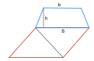

# El lote de fernando.

Fernando es un tanto excéntrico y siempre ha querido construir una casa, pero en un lote que tenga la forma de un diamante. Luego de ahorrar mucho logró comprar el lote que se muestra en azul, con la esperanza de comprar en el futuro el lote vecino que se
muestra en rojo. Lo tiene todo planeado: una vez compre el segundo lote lo dividirá por la mitad siguiendo la línea punteada, venderá la mitad que no le interesa y con ese dinero construirá su casa (que mejor ni saber la forma que quiere que tenga).

Mientras logra su sueño, y a partir de las medidas de B, b y h que se muestran en la figura, ¿le ayudas a calcular el área del lote que ya compró?

        

#### Entrada:
La entrada contiene tres líneas con los valores de B, b y h respectivamente. Todos expresados en metros.
#### Salida:
El mensaje (sin comillas) 'El lote tiene X metros cuadrados', donde X corresponde al valor que debes calcular.


| Ej. de entrada               | Ej. de salida                               |
| ---------------------------- | ------------------------------------------- |
| 40.5<br>    31.0<br>    18.5 |     El lote tiene 661.375 metros cuadrados. |


```python
def calcular_area(Base,base,altura):
    area = ((float(Base) + float(base))/2) * float(altura)
    return area
```

```python
calcular_area(40.5,31.0,18.5)
```


    661.375


