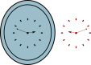

# Reflejo del reloj.
Adrián no tiene un reloj en su habitación, por lo que cuando necesita ver la hora sin tener que desplazarse lo hace mirando el que está en la sala pero por medio de un espejo que está en el corredor.

El problema es que a veces se le olvida que lo que está viendo es un reflejo y que tiene que hacer la “conversión” correspondiente. Así por ejemplo, si en el espejo ve las 2:48, es porque en realidad son las 9:12.


Ayúdale a Adrián haciendo un programa para convertir la hora reflejada en la hora real.
#### Entrada:
La entrada contiene dos líneas, la primera con un valor entero entre 1 y 12 para las horas que se ven en el espejo y la segunda con un valor entero entre 0 y 59 para los minutos.
#### Salida:
La hora correcta correspondiente en formato horas:minutos. Ten en cuenta que no es necesario anteceder 0 cuando alguno de los dos elementos es menor que 10, es decir, una salida como 3:7 es correcta y no se debe convertir a 3:07.

| Ej. de entrada | Ej. de salida |
| -------------- | ------------- |
| 8 \| 5         | 3:55          |
| 6 \| 0         | 6:00          |
| 11 \| 30       | 12:30         |


```python
def hora_reflejo(hora, minuto):
    hora = 11 - hora if hora != 11 else 12
    minuto = 60 - minuto if minuto != 0 else 0
    return hora, minuto
```

```python
hora_reflejo(6, 0)
```


    (5, 0)