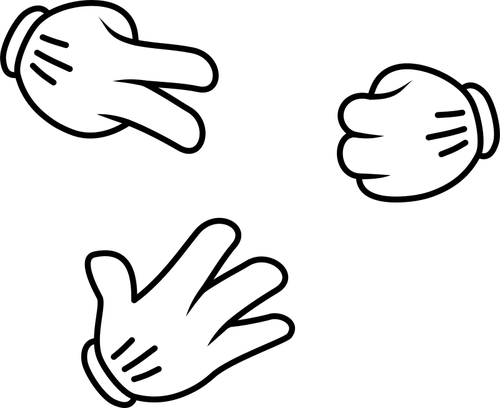

# Piedra, papel, tijera.


Todos conocemos este famoso juego. Supongamos entonces que hay dos jugadores y que debes escribir un programa que haga las veces de juez.

Es decir, dadas las elecciones de los dos jugadores, el programa debe mostrar cuál es el resultado de los 4

posibles: 
- empate.
- piedra vence tijera.
- tijera vence papel.
- papel vence piedra.

#### Entrada:
La entrada contiene dos líneas, la primera con la elección X del jugador 1 y la segunda con la elección Y del jugador 2. Cada elección será (sin comillas): 'piedra', 'papel', o 'tijera'
#### Salida:
Una única línea con uno de los siguientes tres mensajes (sin comillas) 'empate', o 'X vence Y', o 'Y vence X'.

| Ej. de entrada     | Ej. de salida       |
| ------------------ | ------------------- |
| piedra  <br>tijera | piedra vence tijera |
| papel  <br>papel   | empate              |
| piedra  <br>papel  | papel vence piedra  |


```python
def juez_ronda(jugador1, jugador2):
    if (jugador1 == 'piedra' and jugador2 == 'tijera') or (jugador2 == 'piedra' and jugador1 == 'tijera'):
        return 'piedra vence tijera'
    elif (jugador1 == 'tijera' and jugador2 == 'papel') or (jugador2 == 'tijera' and jugador1 == 'papel'):
        return 'tijera vence papel'
    elif (jugador1 == 'papel' and jugador2 == 'piedra') or (jugador2 == 'papel' and jugador1 == 'piedra'):
        return 'papel vence piedra'
    else:
        return 'empate'
    
```

```python
elecciones = ['piedra', 'papel', 'tijera']
jugador1 = int(input('1 piedra, 2 papel, 3 tijera: '))
jugador2 = int(input('1 piedra, 2 papel, 3 tijera: '))

print(juez_ronda(elecciones[jugador1-1], elecciones[jugador2-1]))
```

    tijera vence papel