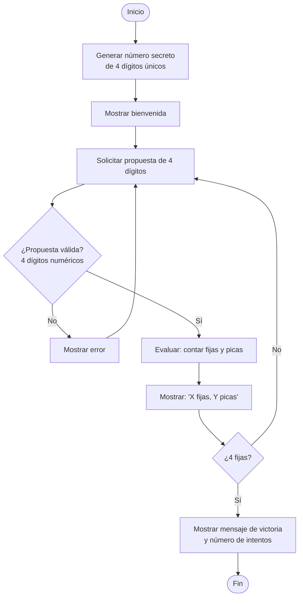
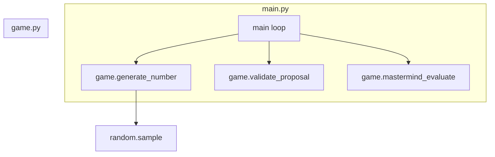

# Picas y Fijas (Mastermind) — Reto Módulo 3

## Objetivo

Implementar el juego clásico de **Picas y Fijas** (versión numérica del Mastermind) aplicando descomposición de problemas, funciones modulares y manejo de colecciones.

## Conocimientos Previos

- Expresiones lógicas y toma de decisiones
- Ciclos (`while`, `for`)
- Funciones con parámetros y retorno
- Tuplas y listas
- Módulos propios (`import`)
- Aleatoriedad (`random.sample`)

## Descripción del Reto

El juego consiste en adivinar un número secreto de **4 dígitos no repetidos**. En cada intento, el jugador propone 4 dígitos y recibe dos pistas:

- **Fijas**: dígitos que están en la posición correcta
- **Picas**: dígitos que están en el número pero en posición incorrecta

El juego termina cuando el jugador obtiene **4 fijas**.

```
Ejemplo:
  Número secreto:  (5, 3, 8, 1)
  Propuesta:       (5, 1, 7, 3)
  Resultado: 1 fija  (5)  y  2 picas  (1, 3)
```

## Flujo del juego



## Arquitectura del Código



## Implementación

### `game.py` — Lógica del juego

**Generar número secreto:**

```python
import random

def generate_number():
    digits = ('0', '1', '2', '3', '4', '5', '6', '7', '8', '9')
    cpu_choices = tuple(random.sample(digits, k=4))
    return cpu_choices
```

**Validar propuesta del usuario:**

```python
def validate_proposal():
    proposal = ''
    while not proposal.isnumeric() and len(proposal) != 4:
        print("El numero debe ser numerico y contener 4 digitos")
        proposal = input("Que codigo propones?: ")
    return proposal
```

**Evaluar picas y fijas:**

```python
def mastermind_evaluate(code, proposal):
    fijas = []
    picas = []

    for i in range(4):
        if proposal[i] == code[i]:
            fijas.append(proposal[i])
        elif proposal[i] in code and proposal[i] not in fijas:
            picas.append(proposal[i])

    return len(fijas), len(picas)
```

### `main.py` — Bucle principal

```python
import game as game

def main():
    code = game.generate_number()

    print("Bienvenidos al juego")
    print("Tienes que adivinar un numero de 4 cifras distintas.")

    attempts = 1
    sucesses = 0

    while sucesses != 4:
        proposal = game.validate_proposal()
        attempts += 1
        sucesses, coincidences = game.mastermind_evaluate(code, proposal)
        print(f"Tu propuesta ({proposal}) tiene {sucesses} fijas y {coincidences} picas.")

    print(f"Ganaste, tu numero de intentos fue: {attempts}")

if __name__ == '__main__':
    main()
```

## Criterios de Evaluación

| Criterio | Porcentaje |
|----------|------------|
| Expresiones lógicas para toma de decisiones | 25 % |
| Descomposición en subproblemas | 25 % |
| Funciones con parámetros y código reutilizable | 25 % |
| Argumentos válidos y módulos propios | 15 % |
| Tipos de datos y ciclos | 10 % |

>[!Notas]
> - El número secreto se genera con `random.sample` para garantizar dígitos únicos
> - El juego permite dígitos del 0 al 9 sin repetición
>- Las picas no se cuentan si el dígito ya está registrado como fija (evita doble conteo)
>- No hay límite de intentos; el juego continúa hasta adivinar
>- Happy Coding 🎮

---

## 🔗 Retos similares
- [[03-reto-picas-y-fijas]] — Versión resumida del juego
- [[reto-craps]] — Juego de dados con POO
- [[reto-tetris]] — Lógica de juego
- [[reto-concurso-preguntas-respuestas]] — Juego de preguntas
- [[../midudev-javascript/08-piezas-de-repuesto]] — Validación de cadenas
- [[../midudev-javascript/19-ordenando-regalos]] — Ordenamiento
