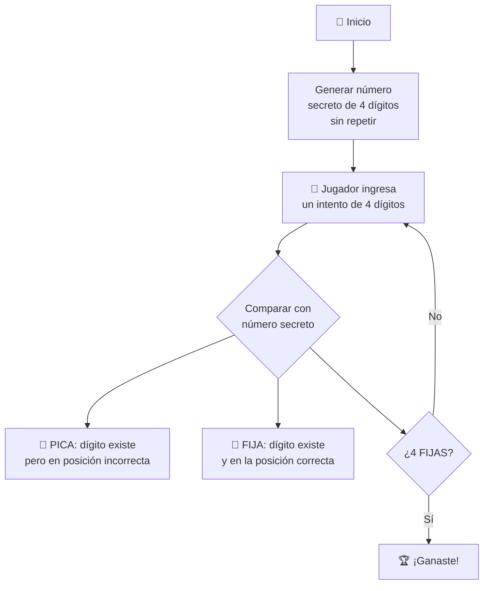

# 🎯 Reto: Picas y Fijas (Bulls and Cows)

---

## 🎯 Objetivos

- Usar tipos de datos y bucles
- Implementar expresiones lógicas
- Descomponer problemas
- Construir funciones con parámetros

---

## 📚 Conocimientos Previos

- Tipos de datos básicos (enteros, listas, strings)
- Estructuras de control: bucles y condicionales
- Funciones y parámetros
- Operaciones lógicas y de comparación

---

## 📖 Contexto

Debes programar el clásico juego **«Picas y Fijas»** (conocido internacionalmente como *Bulls and Cows*).

### Reglas del juego



### Ejemplo

```
Número secreto: 4823
Intento:      8324
Picas: 3  (8, 2, 4 existen pero están en otra posición)
Fijas: 1  (el 3 está en la posición correcta)
```

---

## 🧩 ¿Qué debes implementar?

### Funciones sugeridas

```python
import random

def generar_numero_secreto():
    """Genera un número de 4 dígitos sin repetir."""
    digitos = random.sample(range(10), 4)
    return digitos

def contar_picas(secreto, intento):
    """
    Cuenta cuántos dígitos están en el número
    pero en posición incorrecta.
    """
    # Tu código aquí
    pass

def contar_fijas(secreto, intento):
    """
    Cuenta cuántos dígitos están en la posición correcta.
    """
    # Tu código aquí
    pass
```

---

## 💡 Sugerencias de Investigación

Para resolver este reto, se recomienda investigar sobre:

- Algoritmos de generación de combinaciones sin repetición
- Técnicas de comparación de posiciones en arrays/listas
- Patrones de diseño para juegos de adivinanza
- Estrategias de optimización para reducir el número de intentos necesarios

---

## ⚠️ Advertencias

- El número secreto **no debe tener dígitos repetidos**
- Un dígito que ya se contó como **FIJA** no debe contarse como **PICA**
- Usa `random.sample()` para generar el secreto sin repetición
- Bucle principal: `while fijas < 4`

---

## 🔗 Retos similares
- [[reto-craps]] — Juego de azar con POO
- [[reto-tetris]] — Lógica de juego
- [[reto-concurso-preguntas-respuestas]] — Juego de preguntas
- [[../midudev-javascript/08-piezas-de-repuesto]] — Validación de cadenas
- [[../midudev-javascript/19-ordenando-regalos]] — Ordenamiento