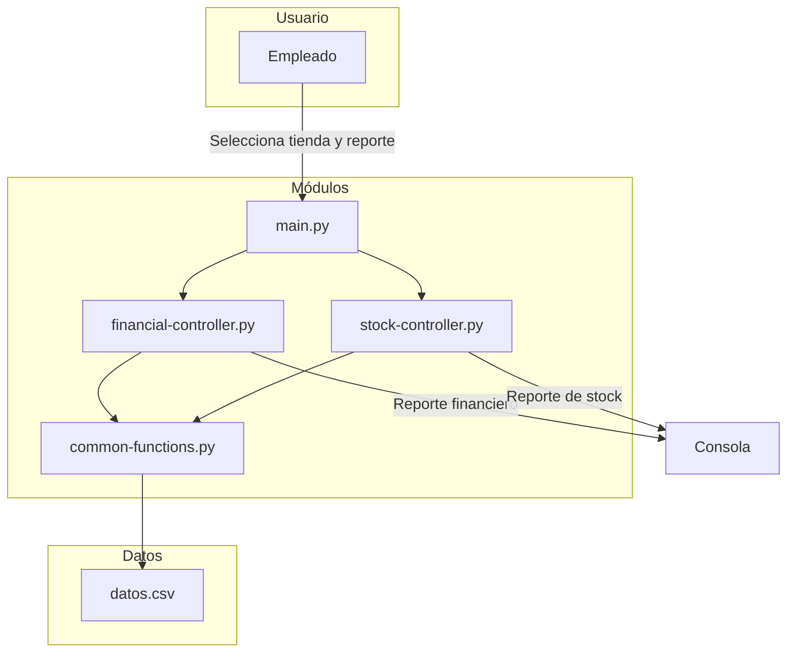
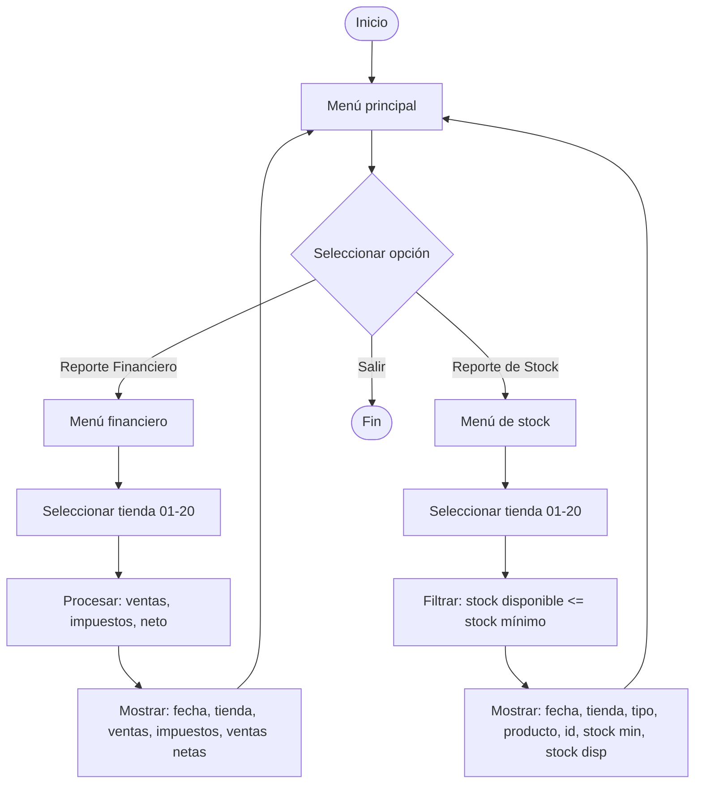

# Reportes Financieros y de Stock — Reto Módulo 4

## Objetivo

Construir un sistema de consulta de reportes financieros y de inventario para **Supertiendas S.A.**, procesando archivos CSV en tiempo real y presentando menús interactivos por consola.

## Conocimientos Previos

- Listas, ciclos y condicionales
- Manejo de archivos CSV
- División de código en módulos (`import`)
- Funciones con parámetros
- Pandas (lectura de datos)

## Descripción del Reto

Supertiendas S.A. creció de 5 a **20 tiendas** y su software financiero se quedó corto. El sistema actual puede generar archivos CSV con información actualizada, pero no procesarlos ni generar reportes rápidos.

### Funcionalidades requeridas

1. **Reporte financiero por tienda**: fecha, ventas totales, impuestos, ventas netas (ventas + impuestos)
2. **Reporte de stock por tienda**: productos cuyo inventario está igual o por debajo del stock mínimo, para que almacén prepare pedidos a proveedores
3. **Menú interactivo** para que cualquier empleado seleccione tienda y tipo de reporte

## Arquitectura del Sistema



## Estructura de Archivos

| Archivo | Rol |
|---------|-----|
| `main.py` | Menú principal e interacción con el usuario |
| `common-functions.py` | Lectura y conversión de datos CSV |
| `financial-controller.py` | Lógica de reportes financieros |
| `stock-controller.py` | Lógica de reportes de inventario |
| `datos.csv` | Datos de ventas y stock de las 20 tiendas |

## Flujo del Programa



## Implementación

### `common-functions.py` — Carga de datos

Lee el archivo CSV y convierte los campos numéricos a enteros para su procesamiento.

```python
import pandas

def get_converted_data():
    raw = open('Datos.csv', 'r')
    allLines = raw.readlines()
    raw.close()

    data = []
    for line in allLines:
        line = line.replace(r'\\n', '').strip().split(';')
        try:
            line[3] = int(line[3])   # ID
            line[5] = int(line[5])   # Objeto
            line[11] = int(line[11]) # Impuesto
            line[12] = int(line[12]) # Valor
            line[13] = int(line[13]) # Stock Inicial
            line[14] = int(line[14]) # Paquetes vendidos
            line[15] = int(line[15]) # Stock Mínimo
        except:
            line[3] = 0
            line[5] = 0
            line[11] = 0
            line[12] = 0
            line[13] = 0
            line[14] = 0
            line[15] = 0
        data.append(line)
    return data
```

### `financial-controller.py` — Reporte financiero

Calcula por tienda: total ventas (sin impuestos), total impuestos y ventas netas (con impuestos).

```python
def get_financial_info(office):
    store = office[0]
    if store != 'Tienda 10' or store != 'Tienda 20':
        store = store.replace('0', '')

    impuestos = []
    ventas = []

    for d in data.get_converted_data():
        if store in d[1] and office[1] in d[2]:
            impuestos.append(round((d[11] / 100) * (d[12] * d[14]), 2))
            ventas.append(round(d[12] * d[14], 2))

    return [fecha, store, sum(ventas), sum(impuestos), sum(ventas) + sum(impuestos)]
```

### `stock-controller.py` — Reporte de inventario

Filtra productos donde el stock disponible (inicial − vendidos) es menor o igual al stock mínimo.

```python
def get_order_report(office):
    stock = []
    for d in data.get_converted_data():
        if store in d[1] and code in d[2]:
            disponible = d[13] - d[14]
            stock.append([d[0], d[1], d[4], d[6], d[3], d[15], disponible])
    return stock
```

### `main.py` — Menú interactivo

```python
def report_menu():
    while True:
        print('┏━[Reporte financiero]━━━━━━━━━━┓')
        menu = mensaje_tiendas()
        if menu < len(oficinas):
            print('fecha', 'tienda', 'ventas', 'impuestos', 'ventas netas')
            print(*financial.get_financial_info(oficinas[menu]))
            main_menu()
```

## Formato de los reportes

### Reporte Financiero

```
fecha       tienda     ventas      impuestos   ventas netas
2021-06-01  Tienda 01  12500000.00 2125000.00  14625000.00
```

### Reporte de Stock

```
fecha       tienda     tipo    producto     id  stock min  stock disp
2021-06-01  Tienda 01  Lácteo  Leche        101 50         12
```

## Criterios de Evaluación

| Criterio | Porcentaje |
|----------|------------|
| Expresiones lógicas para toma de decisiones | 25 % |
| Descomposición en subproblemas | 25 % |
| Funciones con parámetros y reutilización de código | 25 % |
| Módulos propios (common-functions) | 15 % |
| Listas, ciclos y tipos de datos | 10 % |

## Notas

- El CSV contiene datos de ventas y stock de 20 tiendas
- Los reportes se generan en tiempo real procesando el archivo completo
- Se recomienda usar Pandas para optimizar la lectura
- Se recomienda usar Urwid para mejorar la interfaz de consola
- Las tiendas 10 y 20 tienen un tratamiento especial en el reemplazo de ceros

---

## 🔗 Retos financieros similares
- [[reto-supertiendas]] — Sistema de sucursales (original)
- [[05-reto-calculadora-financiera]] — Calculadora de préstamos
- [[05-calculadora-financiera]] — MVC + Matplotlib
- [[06-1-calculadora-financiera]] — Simulador JSON
- [[06-2-graficador-financiero]] — Gráficas
- [[../plataforma-challenges/challenge-data-analytics]] — ETL financiero
