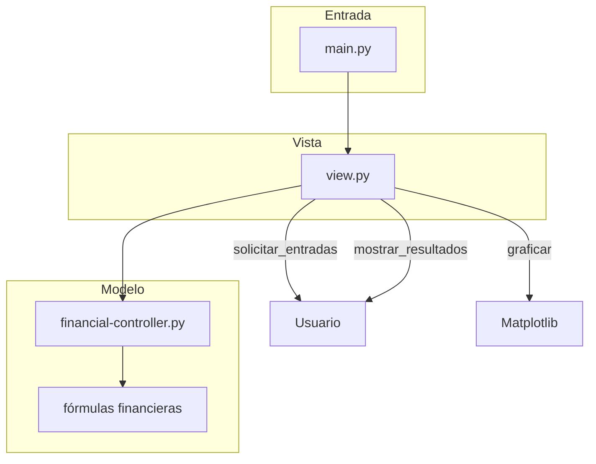
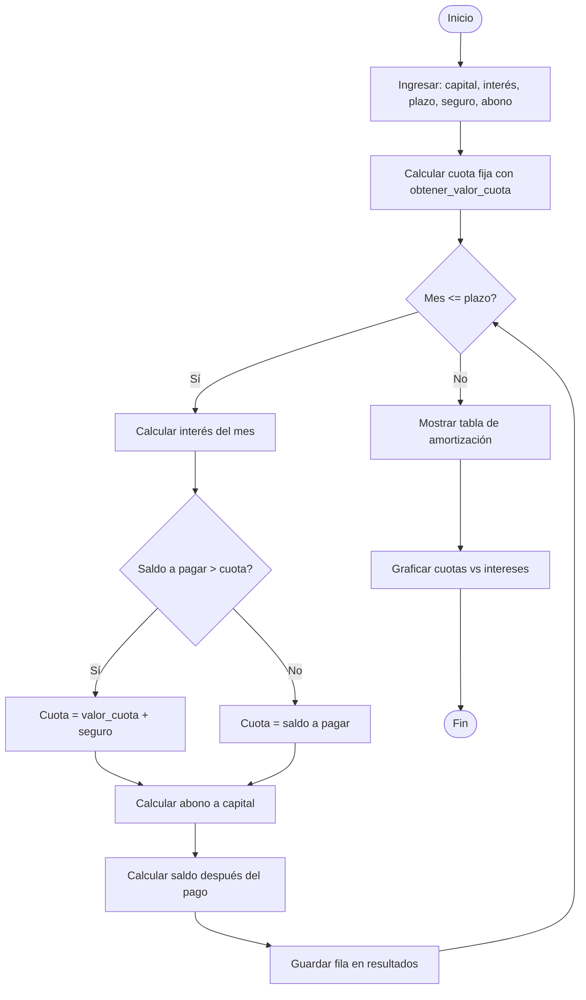

# Calculadora Financiera — Reto Módulo 5

## Objetivo

Construir una calculadora financiera que simule créditos y muestre el desglose mes a mes del saldo, intereses, cuotas, seguros y abonos a capital, utilizando el paradigma MVC (Modelo-Vista-Controlador).

## Conocimientos Previos

- Programación orientada a objetos (POO)
- Manejo de módulos y paquetes en Python
- Fórmulas financieras: interés compuesto, amortización, conversión de tasas
- Graficación con Matplotlib
- Entrada/salida por consola

## Descripción del Reto

Desarrollar una aplicación que permita simular un crédito de consumo. El usuario ingresa:

- **Capital**: monto solicitado
- **Interés efectivo anual**: porcentaje que cobra la entidad
- **Plazo**: número de meses del crédito
- **Valor del seguro**: seguro de desgravamen mensual
- **Abono a capital**: monto extra que se abona voluntariamente cada mes

El sistema calcula la cuota fija mensual usando la fórmula de anualidades y genera una tabla de amortización mes a mes, mostrando:

| Mes | Saldo Inicial | Intereses | Seguro | Total Cuota | Abono Capital | Saldo Final |
|-----|---------------|-----------|--------|-------------|---------------|-------------|

Además, grafica la evolución de cuotas e intereses en el tiempo.

## Arquitectura MVC



### Componentes

| Archivo | Rol | Responsabilidad |
|---------|-----|-----------------|
| `main.py` | Punto de entrada | Ejecuta `view.lanzar()` |
| `view.py` | Vista | Interfaz consola + gráfica |
| `financial-controller.py` | Controlador/Modelo | Lógica financiera y fórmulas |
| `errores-de-replt.py` | Traza de error | Debug de pruebas unitarias |
| `prueba-reto.xlsx` | Datos de prueba | Archivo Excel de verificación |

## Fórmulas Financieras

### Conversión de tasa efectiva anual a mensual

$$
i_m = (1 + i_a)^{\frac{1}{12}} - 1
```

### Cálculo de cuota fija (anualidades)

$$
R = P \cdot \frac{i (1 + i)^n}{(1 + i)^n - 1}
```

Donde:
- $R$ = valor de la cuota
- $P$ = principal (capital)
- $i$ = tasa de interés mensual
- $n$ = número de cuotas

### Cálculo de intereses del mes

$$
I_m = S_{m-1} \cdot i_m
```

### Saldo después del pago

$$
S_m = S_{m-1} + I_m + Seguro - Cuota - Abono
```

## Flujo de la simulación



## Implementación

### `financial-controller.py` — Lógica financiera

```python
def simular_credito(capital, interes, plazo_meses, valor_cuota, valor_seguro, abono_capital):
    result = []
    saldo_ini = float(capital)
    for m in range(1, plazo_meses + 1):
        ints = saldo_ini * convertir_interes_efectivo_anula_a_mensual(interes)
        saldo_a_pagar = saldo_ini + ints + valor_seguro

        if saldo_a_pagar > valor_cuota + valor_seguro:
            t_cuota = valor_cuota + valor_seguro
        else:
            t_cuota = saldo_a_pagar

        abono = control_abonos(saldo_a_pagar, t_cuota, abono_capital)
        saldo_fin = 0.0 if saldo_a_pagar - t_cuota - abono <= 0 else saldo_a_pagar - t_cuota - abono

        result.append({
            'mes': m, 'saldo_inicial': round(saldo_ini, 2),
            'intereses': round(ints, 2), 'total_cuota': round(t_cuota, 2),
            'abono_capital': round(abono, 2),
            'saldo_despues_pago': round(saldo_fin, 2)
        })
        saldo_ini = round(saldo_fin, 2) if saldo_fin > 0 else 0
    return result
```

### `view.py` — Interfaz de usuario

```python
def graficar(simulacion):
    mes = [d['mes'] for d in simulacion]
    intereses = [d['total_cuota'] - d['intereses'] for d in simulacion]
    cuotas = [d['total_cuota'] for d in simulacion]

    plt.bar(mes, cuotas, label='cuotas', color='blue')
    plt.bar(mes, intereses, label='intereses', color='orange')
    plt.title('Evolución del Crédito')
    plt.xlabel('Mes')
    plt.ylabel('Valor')
    plt.legend()
    plt.grid()
    plt.show()
```

## Ejemplo de salida

```
Mes 0: Desembolso: 15000000
Valor de la cuota: 551103.39
| Mes | Capital Base | Intereses | Seguro | Total Cuota | Abono Capital | Saldo después del pago |
|-----|--------------|-----------|--------|-------------|---------------|------------------------|
| 1   | 15000000.00  | 202945.83 | 22000  | 573103.39   | 0.00          | 14673842.44            |
| 2   | 14673842.44  | 198533.00 | 22000  | 573103.39   | 0.00          | 14343272.05            |
| ... | ...          | ...       | ...    | ...         | ...           | ...                    |
```

## Criterios de Evaluación

| Criterio | Porcentaje |
|----------|------------|
| Aplica principios de descomposición de problemas | 25 % |
| Implementa funciones con parámetros | 25 % |
| Invoca funciones con argumentos válidos | 15 % |
| Código reutilizable (módulos propios) | 20 % |
| Aplica listas, ciclos y tipos de datos | 15 % |

## Notas

- Si el usuario ingresa datos inválidos, se usan valores por defecto (15,000,000 COP, 17.5 % EA, 60 meses, seguro de 22,000, abono de 250,000)
- La función `calcular_nuevo_valor_adeudado` queda como TODO pendiente
- El `obtener_valor_cuota` aplica un truco (+1) para evitar un mes adicional de cuota
- Se requiere Matplotlib para ver la gráfica

---

## 🔗 Retos financieros similares
- [[05-reto-calculadora-financiera]] — Calculadora financiera básica
- [[06-1-calculadora-financiera]] — Simulador JSON
- [[06-2-graficador-financiero]] — Gráficas Matplotlib
- [[04-reportes]] — Reportes CSV
- [[lab-calculadora]] — Fundamentos de cálculo
- [[../midudev-javascript/11-progreso-scrum]] — Fracciones y proporciones
