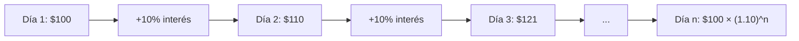

# 💰 Reto: Calculadora Financiera

---

## 🎯 Objetivo

Construir una calculadora de préstamos bancarios con interés compuesto, seguros y abonos extras a capital.

---

## 📖 Contexto

Estás planeando solicitar un crédito bancario. Los simuladores financieros solo muestran las cuotas según el cronograma, ¡pero tú puedes hacer algo mejor!

Tu calculadora incluirá:
- ✨ Abonos extras a capital (el diferenciador frente a los bancos)
- 🛡️ Valor del seguro por cuota
- 📊 Interés compuesto

---

## 🧠 Interés Compuesto



### Fórmula


$$Capital\_Final = Capital\_Inicial \times (1 + tasa)^{periodos}$$


---

## ⚙️ Especificaciones Técnicas

### Restricciones (versión beta)

- ✅ Calcular solo en **meses**
- ✅ Usar **tasa de interés efectiva anual**
- ✅ Asumir pagos mensuales puntuales (sin mora)
- ❌ No modificar las firmas de los métodos
- ❌ No alterar el orden de las funciones (ya están llamadas en el flujo)

### Parámetros de entrada

| Parámetro | Tipo | Descripción |
|-----------|------|-------------|
| `monto_prestamo` | float | Cantidad solicitada |
| `tasa_interes_anual` | float | Porcentaje anual (ej: 12.5) |
| `numero_meses` | int | Plazo en meses |
| `valor_seguro` | float | Seguro por cuota |
| `abono_extra` | float | Abono extra (opcional, default 0) |

### Formato de salida

```python
resultado = [
    {
        "mes": 1,
        "saldo_inicial": 15000000.00,
        "interes": 187500.00,
        "pago_total": 1416666.67,
        "pago_capital": 1229166.67,
        "saldo_final": 13770833.33
    },
    # ... más meses
]
```

> Redondear a 2 decimales antes de retornar.

---

## 💡 Pistas

- Para la tasa mensual: $(1 + tasa_anual)^(1/12) - 1$
- El pago del seguro se suma a la cuota mensual
- Los abonos extras reducen directamente el saldo de capital

---

## 🔗 Retos financieros similares
- [[04-reportes]] — Reportes financieros CSV
- [[05-calculadora-financiera]] — MVC + Matplotlib
- [[06-1-calculadora-financiera]] — Simulador financiero
- [[06-2-graficador-financiero]] — Gráficas Matplotlib
- [[reto-supertiendas]] — Gestión financiera de sucursales
- [[../midudev-javascript/05-optimizando-viajes]] — Optimización con restricciones
