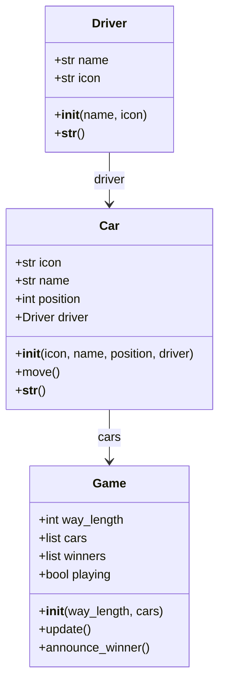
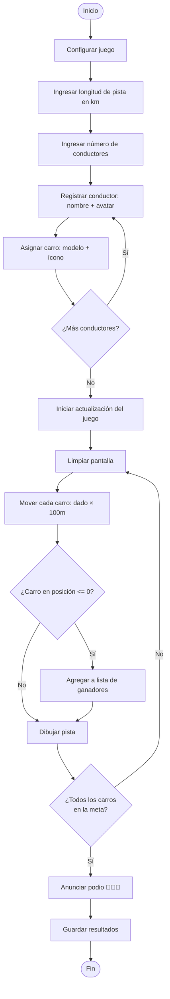

# Carrera de Carros por Consola — Reto Módulo 6

## Objetivo

Modelar un concurso de carros aplicando programación orientada a objetos, donde múltiples conductores compiten en una pista y se registra un podio con los tres primeros lugares.

## Conocimientos Previos

- Programación orientada a objetos (clases, herencia, encapsulamiento)
- Manejo de colecciones (listas)
- Persistencia de datos (archivos o base de datos)
- Control de versiones con Git
- Aleatoriedad y simulación

## Descripción del Reto

Crear un juego de carros por consola donde:

- Existe una **pista** con una longitud definida en kilómetros
- Cada **carro** tiene un **conductor** y ocupa un **carril**
- Los carros avanzan de forma aleatoria lanzando un dado (1-6) multiplicado por 100 metros
- El primer carro en cruzar la meta obtiene el primer lugar, luego el segundo y tercero
- Se debe persistir el resultado: conductores, posición en el podio y contador de victorias

## Diagrama de Clases



## Flujo del juego



## Implementación

### Clase `Driver`

```python
class Driver:
    def __init__(self, name, icon):
        self.name = name
        self.icon = icon

    def __str__(self):
        return f'{self.icon} {self.name}'
```

### Clase `Car`

```python
class Car:
    def __init__(self, icon, name, position, driver):
        self.icon = icon
        self.name = name
        self.position = position
        self.driver = driver

    def move(self):
        self.position -= random.randint(1, 6)
```

### Clase `Game`

```python
class Game:
    def __init__(self, way_length, cars):
        self.way_length = way_length
        self.cars = cars
        self.winners = []
        self.playing = True

    def update(self):
        while self.playing:
            os.system('clear')
            for car in self.cars:
                if car not in self.winners:
                    car.move()
                else:
                    car.position = 0
                if car.position <= 0:
                    self.winners.append(car)
                show_road(car, self.way_length)
            if len(self.winners) == len(self.cars):
                self.playing = False
            time.sleep(1)

    def announce_winner(self):
        for i in range(len(self.winners)):
            if i < 3:
                print(f'{"🥇🥈🥉"[i]}: {self.winners[i]} {self.winners[i].driver}')
            else:
                print(f'{self.winners[i]}')
```

### Función `show_road`

Dibuja la pista del carro usando el carácter `☲` como asfalto y el ícono del carro en su posición actual.

```python
def show_road(car, distance):
    road = ''
    for i in range(distance):
        road += car.icon if i == car.position else '☲'
    print(road)
```

## Mecánica del juego

1. **Configuración**: el usuario define la longitud de la pista en kilómetros y registra conductores (nombre + avatar emoji)
2. **Asignación de carros**: cada conductor elige un modelo (🚙 Volvo, 🚓 Patrol, 🚕 Taxi, 🚗 Sedan)
3. **Carrera**: en cada turno, los carros lanzan un dado (1-6) y avanzan `dado × 100` metros (posición decreciente desde la longitud total hasta 0)
4. **Podio**: cuando un carro llega a posición <= 0, se registra en la lista de ganadores. El juego termina cuando todos cruzan la meta
5. **Persistencia**: (requisito del reto) se debe guardar en base de datos los resultados con nombres, posiciones y contador de victorias

## Criterios de Evaluación

| Criterio | Porcentaje |
|----------|------------|
| Aplica principios de POO | 31 % |
| Creación de objetos: pista, juego, carril, carro, conductor, jugador, podio | 30 % |
| Persistencia de resultados de ganadores | 31 % |
| Métodos con menos de 6 líneas segregados en métodos pequeños | 8 % |

## Notas

- [ ] La pista se mide en kilómetros, pero el avance es en metros (se convierten internamente)
- [ ] El dado va de 1 a 6 y se multiplica por 100 para obtener metros de avance
- [ ] Los carros ganadores dejan de moverse (su posición se fija en 0)
- [ ] El reto debe presentarse en GitHub como sistema de control de versiones
- [ ] Tiempo estimado: 3 días

---

## 🔗 Retos similares
- [[reto-craps]] — Juego con POO y dados
- [[03-reto-picas-y-fijas]] — Juego de lógica
- [[reto-concurso-preguntas-respuestas]] — Juego con POO
- [[reto-tetris]] — Lógica de juego
- [[reto-formulario-transporte]] — POO en Java
- [[../midudev-javascript/20-viajes-retadores]] — Distribución de recursos
