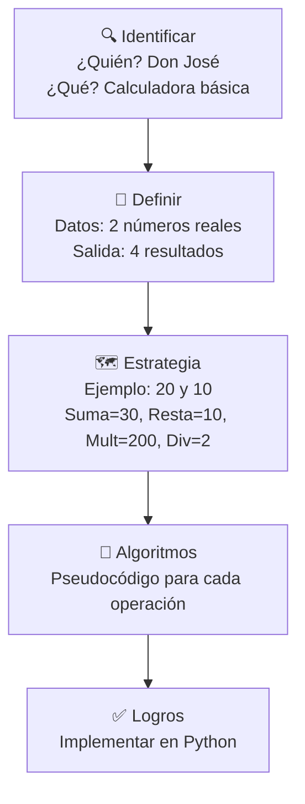

# 🖩 Laboratorio: Calculadora — Proceso IDEAL

**Elaborado por:** Oscar Franco-Bedoya — Proyecto Misión TIC 2022

---

## 🎯 Objetivo

Unificar conceptos de programación: variables, tipos de datos, entrada/salida, funciones y el proceso **IDEAL**.

---

## 🏪 Contexto: La Tienda de la Esquina

Don José «Esquina» necesita un programa para realizar las 4 operaciones aritméticas básicas con dos números reales.

---

## 🧠 Proceso IDEAL



### 📋 Pseudocódigo

```
Función sumar_numeros(n1, n2)
    Retornar n1 + n2
Fin

Función restar_numeros(n1, n2)
    Retornar n1 - n2
Fin

... (multiplicar, dividir)
```

### 🐍 Implementación

```python
def sumar_numeros(numero_uno, numero_dos):
    return numero_uno + numero_dos

def restar_numeros(numero_uno, numero_dos):
    return numero_uno - numero_dos

def multiplicar_numeros(numero_uno, numero_dos):
    return numero_uno * numero_dos

def dividir_numeros(numero_uno, numero_dos):
    return numero_uno / numero_dos

# Programa principal
n1 = float(input("Número 1: "))
n2 = float(input("Número 2: "))

print("Suma:", sumar_numeros(n1, n2))
print("Resta:", restar_numeros(n1, n2))
print("Multiplicación:", multiplicar_numeros(n1, n2))
print("División:", dividir_numeros(n1, n2))
```

---

## 🧪 Pruebas

| n1 | n2 | Suma | Resta | Mult | Div |
|----|----|------|-------|------|-----|
| 100 | 20 | 120 | 80 | 2000 | 5 |
| 20 | 100 | 120 | -80 | 2000 | 0.2 |
| 10 | 3 | 13 | 7 | 30 | 3.33 |
| 0 | 0 | 0 | 0 | 0 | Error |
| 0 | 20 | 0 | -20 | 0 | 0 |
| -100 | -20 | -120 | -80 | 2000 | 5 |

---

## 🔗 Laboratorios relacionados
- [[lab-hola-mundo]] — Fundamentos
- [[lab-expresiones]] — Expresiones aritméticas
- [[lab-entrada-estandar]] — Ingreso de datos
- [[reto-puerta-castillo]] — Proceso IDEAL aplicado
- [[08-reto-calculadora]] — Calculadora con GUI
- [[05-reto-calculadora-financiera]] — Cálculos financieros
- [[../midudev-javascript/11-progreso-scrum]] — Fracciones y GCD
