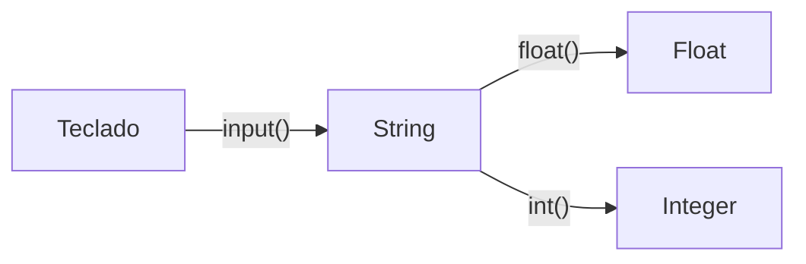

# ⌨️ Laboratorio: Entrada Estándar

**Elaborado por:** Oscar Franco-Bedoya — Proyecto Misión TIC 2022

---

## 🎯 Objetivo

Aprender a ingresar datos desde el teclado usando la función `input()`.

---

## 📥 La función `input()`



```python
nombre = input("Digita tu nombre: ")
print("Hola", nombre)
```

> `input()` siempre devuelve un **string**. Para operaciones numéricas debes convertir con `float()` o `int()`.

---

## 🧪 Ejercicio: El Censo (1871)

Simula un censo de 1871. Lee los siguientes datos e imprímelos formateados:

```python
nombre = input("Nombre: ")
apellido = input("Apellido: ")
edad = input("Edad: ")
# ... Continúa con: profesión, ciudad, número de hijos
```

---

## 🐛 Error Común: Concatenación vs Suma

```python
numero_uno = input("Digite un número: ")
numero_dos = input("Digite otro número: ")
suma = numero_uno + numero_dos
print(suma)   # ¡Devuelve "10.522.3" en vez de 32.8!
```

### 🔧 Solución: Conversión de tipos

```python
numero_uno = float(input("Digite un número: "))
numero_dos = float(input("Digite otro número: "))
suma = numero_uno + numero_dos
print(suma)   # ✅ 32.8
```

---

## 💪 Ejercicio V4.0

Modifica el programa para que realice **las 4 operaciones básicas y potenciación**:

| Operación | Símbolo |
|-----------|---------|
| Suma | `+` |
| Resta | `-` |
| Multiplicación | `*` |
| División | `/` |
| Potencia | `**` |

---

## 🔗 Laboratorios relacionados
- [[lab-hola-mundo]] — `print()` básico
- [[lab-expresiones]] — Operadores aritméticos
- [[lab-calculadora]] — Calculadora con funciones
- [[reto-supertiendas]] — Menús interactivos
- [[../midudev-javascript/02-horas-extra]] — Cálculo con fechas
