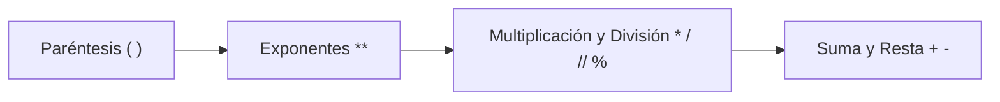

# 🧮 Laboratorio: Expresiones

**Elaborado por:** Oscar Franco-Bedoya — Proyecto Misión TIC 2022

---

## 🎯 Objetivo

Practicar el manejo de **expresiones aritméticas** en Python: suma, resta, multiplicación y división.

---

## 🌡️ Ejercicio 1: Fahrenheit a Celsius

En época de COVID-19 los termómetros digitales se volvieron esenciales. Convierte grados Fahrenheit a Celsius usando la fórmula:

```math
C = (F - 32) × 5/9
```

```python
f = 50
c = (f - 32) * 5 / 9
print(f, "°F equivale a", c, "°C")
```

**Ahora hazlo inverso:** Celsius → Fahrenheit:

```math
F = (C × 9/5) + 32
```

---

## 📐 Ejercicio 2: Precedencia de Operadores

Python respeta el orden de las operaciones:



Evalúa mentalmente estas expresiones y luego verifica con Python:

```python
print(2 * (3 - 1))      # ¿?
print(10 + 5 * 2)       # ¿?
print((10 + 5) * 2)     # ¿?
print(2 ** 3 + 1)       # ¿?
print(2 ** (3 + 1))     # ¿?
```

---

## 💱 Ejercicio 3: Conversor de Moneda

Convierte dólares a pesos colombianos. Consulta la TRM en el [Banco de la República](https://www.banrep.gov.co/es/estadisticas/trm).

---

## ⚖️ Ejercicio 4: Índice de Masa Corporal (IMC)

```math
IMC = \frac{peso\,(kg)}{altura\,(m)^2}
```

```python
altura = 1.75   # metros
peso = 85       # kilogramos
# Completa el programa aquí
imc = peso / (altura ** 2)
print("Tu IMC es:", imc)
```

> **Nota:** El IMC es solo un indicador; no juzgues el resultado.

---

## 🔗 Laboratorios relacionados
- [[lab-hola-mundo]] — Sintaxis básica
- [[lab-entrada-estandar]] — Entrada por teclado
- [[lab-calculadora]] — Funciones y proceso IDEAL
- [[05-reto-calculadora-financiera]] — Cálculos financieros
- [[../midudev-javascript/06-cubo-navideño]] — Patrones ASCII
