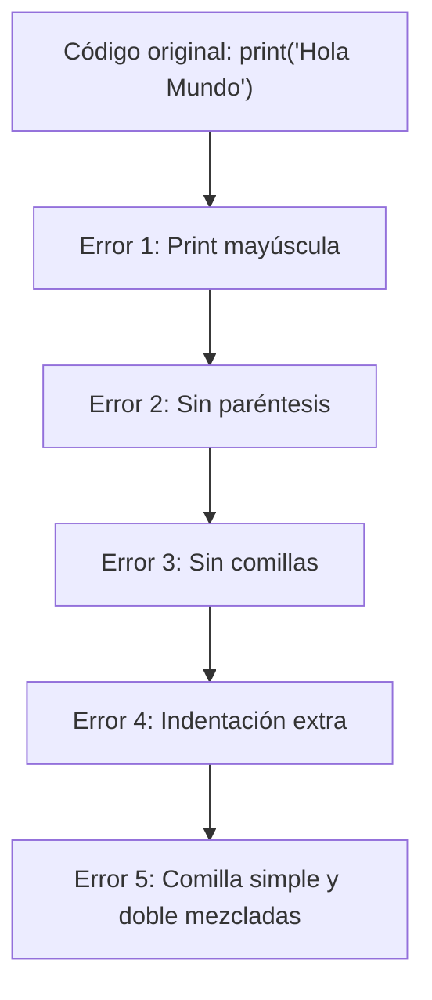

# 🌍 Laboratorio: Hola Mundo

**Elaborado por:** Oscar Franco-Bedoya — Proyecto Misión TIC 2022

---

## 🎯 Objetivo

Escribir el primer programa en Python que imprime «Hello World».

---

## 📚 Conocimientos Previos

- Conceptos básicos de sintaxis de programación
- Comprensión de funciones de salida/impresión
- No se requiere experiencia previa en programación

---

## 📖 Contexto

Todo programador comienza con un «Hola Mundo». Es el ritual de iniciación: escribir un programa mínimo que demuestra que el entorno funciona.

---

## 🧪 Actividad: Aprendamos de los Errores

Introduce cada uno de estos errores deliberados, ejecuta el programa, observa el error y luego corrígelo:



| Error | Código erroneo | ¿Qué mensaje da Python? |
|-------|----------------|------------------------|
| 1 | `Print('Hola Mundo')` | |
| 2 | `print('Hola Mundo')` sin paréntesis | |
| 3 | `print(Hola Mundo)` | |
| 4 | ` print('Hola Mundo')` (espacio antes) | |
| 5 | `print('Hola Mundo")` | |

---

## 🌎 Ejercicio: Políglota

Escribe un programa que imprima saludos en tres idiomas:

```python
# Salida esperada:
# Hola
# Hello
# Olá
```

---

## 🤖 Ejercicio: Mundo ASCII

Dibuja a **R2-D2 (Arturito)** usando arte ASCII con `print()`:

```python
# Pista: así se ve Arturito
print("    /\\")
print("   /  \\")
# ... completa tú el dibujo
```

---

## 💡 Sugerencias de Investigación

Para comprender mejor los conceptos de este laboratorio, se recomienda investigar sobre:

- Historia del programa "Hola Mundo" en la programación
- Diferentes formas de producir salida en diversos lenguajes de programación
- Conceptos de sintaxis básica: comillas, paréntesis, indentación

---

## 📝 Entregables

1. Código Python funcionando con los 3 ejercicios
2. Captura de pantalla mostrando la salida

---

## 🔗 Laboratorios relacionados
- [[lab-expresiones]] — Operadores y precedencia
- [[lab-entrada-estandar]] — Entrada por teclado
- [[lab-calculadora]] — Proceso IDEAL
- [[reto-puerta-castillo]] — Proceso IDEAL aplicado
- [[../midudev-javascript/18-sin-tinta]] — Filtrado de dígitos