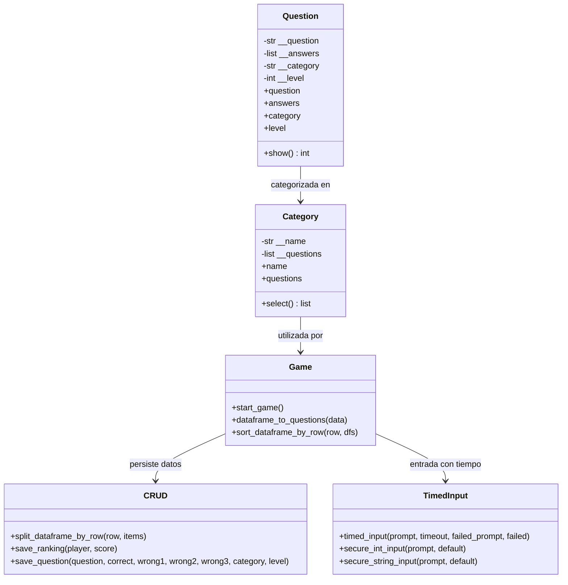
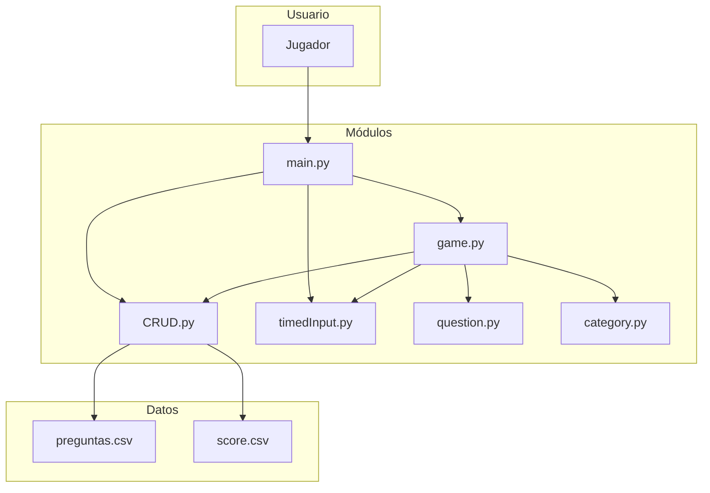
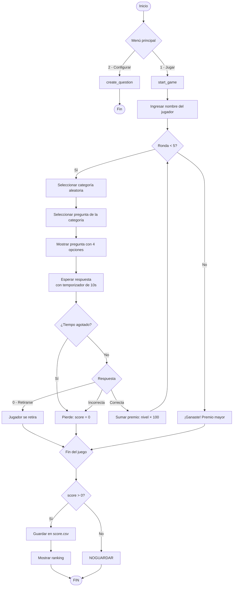

# Concurso de Preguntas y Respuestas — Reto

**Versión:** 2021.08.26

## Objetivo

Modelar un concurso de preguntas y respuestas al estilo *"¿Quién quiere ser millonario?"*, aplicando programación orientada a objetos, persistencia de datos, manejo de colecciones y lógica de rondas progresivas con premios acumulables.

## Conocimientos Previos

- Programación orientada a objetos (clases, encapsulamiento, propiedades)
- Manejo de archivos CSV con Pandas
- Colecciones y ciclos de control
- Módulos y funciones reutilizables
- Control de versiones con Git
- Aleatoriedad (`random.shuffle`, `random.sample`)

## Descripción del Reto

Se debe construir un juego donde:

- Existe un **banco de 28+ preguntas**, cada una con 4 opciones (1 correcta, 3 incorrectas)
- Las preguntas se agrupan en **5 categorías** (Lógica, Historia, Cine, Literatura, Videojuegos)
- Cada categoría tiene **5 niveles de dificultad** (1–5)
- El juego tiene **5 rondas**, cada ronda usa una categoría distinta
- Cada ronda asigna un premio al jugador si responde correctamente
- El jugador puede **retirarse** antes de responder y conservar el acumulado
- Si el jugador **falla**, pierde todo el acumulado
- Si el jugador **supera la ronda 5**, gana el premio mayor

### Ejemplo de flujo

1. **Precondición**: 25+ preguntas distribuidas en 5 categorías × 5 niveles
2. El jugador inicia en la ronda 1; el sistema selecciona una categoría aleatoria
3. Se muestra una pregunta con 4 opciones; si acierta, avanza a la siguiente ronda
4. Cada ronda usa una categoría de mayor complejidad
5. Si llega a la ronda 5 y gana, obtiene el premio mayor

## Diagrama de Clases



## Arquitectura del Sistema



## Flujo del Juego



## Estructura de Archivos

| Archivo | Rol |
|---------|-----|
| `main.py` | Punto de entrada: menú principal (jugar / configurar) |
| `game.py` | Lógica del juego: rondas, puntuación, control de flujo |
| `question.py` | Clase `Question`: encapsula pregunta, respuestas, categoría, nivel |
| `category.py` | Clase `Category`: agrupa preguntas por categoría |
| `CRUD.py` | Persistencia: lectura/escritura de preguntas y puntajes en CSV |
| `timedInput.py` | Utilidades: entrada con temporizador, entrada segura de enteros |
| `preguntas.csv` | Banco de preguntas (28 preguntas en 5 categorías) |
| `score.csv` | Histórico de puntajes de jugadores |

## Implementación

### `question.py` — Clase Question

```python
class Question:
    def __init__(self, question, answers, category, level):
        self.__question = question
        self.__answers = answers
        self.__category = category
        self.__level = level

    def show(self):
        rand = self.__answers.copy()
        correct = self.__answers[0]
        random.shuffle(rand)
        print(f' {self.__category} '.center(50, '='))
        print(f'Pregunta: {self.__question}')
        print(f'1. {rand[0]}\n2. {rand[1]}\n3. {rand[2]}\n4. {rand[3]}')
        index = rand.index(correct)
        return index + 1
```

Los 4 elementos de `answers` siempre son: `[correcta, errónea1, errónea2, errónea3]`. El método `show()` los mezcla y retorna el índice (1–4) de la opción correcta.

### `category.py` — Clase Category

```python
class Category:
    def __init__(self, name, questions):
        self.__name = name
        self.__questions = questions

    def select(self):
        return self.__questions.copy()  # Retorna copia para no mutar original
```

### `game.py` — Lógica del juego

```python
def start_game():
    categories = ['Lógica', 'Historia', 'Cine', 'Literatura', 'Videojuegos']
    category_dfs = crd.split_dataframe_by_row('Categoria', categories)
    category_questions = sort_dataframe_by_row('Nivel', category_dfs)
    all_categories = [cat.Category(categories[i], category_questions[i])
                      for i in range(len(categories))]
    random.shuffle(all_categories)

    player = input('Nombre: ') or 'Anónimo'
    score = 0
    _round = 0
    end_game = False

    while _round < 5 and not end_game:
        current_question = all_categories[_round].select()
        answer = current_question[_round].show()
        player_answer = int(tmi.timed_input(
            'Escribe 1-4 para responder o 0 para retirarse: ', 10,
            'Se acabó el tiempo', 9))

        if player_answer == answer:
            score += current_question[_round].level * 100
        elif player_answer == 0:
            end_game = True
        else:
            score = 0
            end_game = True
        _round += 1

    print(f'{player} has ganado un total de: $ {score}')
    if score > 0:
        crd.save_ranking(player, score)
```

### `CRUD.py` — Persistencia

```python
def save_ranking(player, score):
    ranking = pd.read_csv('score.csv', header=0)
    ranking.loc[len(ranking.index)] = [player, score]
    ranking = ranking.sort_values(by='Score', ascending=0)
    print(ranking)
    ranking.to_csv('score.csv', index=False)

def save_question(question, correct, wrong1, wrong2, wrong3, category, level):
    questions = pd.read_csv('Preguntas.csv', header=0)
    questions.loc[len(questions.index)] = [question, correct, wrong1, wrong2, wrong3, category, level]
    questions = questions.sort_values(by='Categoria', ascending=0)
    print(questions)
    questions.to_csv('Preguntas.csv', index=False)
```

### `timedInput.py` — Entrada con temporizador

```python
def input_with_timeout(prompt, timeout):
    sys.stdout.write(prompt)
    sys.stdout.flush()
    ready, _, _ = select.select([sys.stdin], [], [], timeout)
    if ready:
        return sys.stdin.readline().rstrip('\n')
    raise TimeoutExpired

def timed_input(prompt, timeout, failed_prompt, failed=None):
    try:
        return input_with_timeout(prompt, timeout)
    except TimeoutExpired:
        print(failed_prompt)
        return failed
```

## Banco de Preguntas (Ejemplos)

| Categoría | Nivel | Pregunta | Respuesta Correcta |
|-----------|-------|----------|-------------------|
| Lógica | 1 | ¿De qué color es el caballo blanco de Bolívar? | Blanco |
| Lógica | 2 | Si un tren eléctrico viaja de norte a sur, ¿en qué dirección viaja el humo? | A ninguna parte |
| Videojuegos | 1 | ¿Cuál es el primer juego de Donkey Kong en 3D? | Donkey Kong 64 |
| Videojuegos | 5 | Compositor musical de Ninja Gaiden | Keiji Yamagishi |
| Historia | 1 | ¿Quién escribió Romeo y Julieta? | William Shakespeare |
| Historia | 5 | ¿Qué emperador intentó operarse para cambio de sexo? | Eliogábalo |
| Cine | 1 | ¿Quién interpreta a Neo en Matrix? | Keanu Reeves |
| Cine | 5 | Compositor de la banda sonora de Matrix | Rob Dougan |
| Literatura | 1 | ¿Quién escribió Romeo y Julieta? | William Shakespeare |
| Literatura | 5 | ¿Quién escribió la Ilíada? | Homero |

## Sistema de Premios por Ronda

| Ronda | Categoría | Premio (puntos) |
|-------|-----------|-----------------|
| 1 | Aleatoria nivel 1 | Nivel × 100 = hasta 500 |
| 2 | Aleatoria nivel 2 | Nivel × 100 = hasta 1000 |
| 3 | Aleatoria nivel 3 | Nivel × 100 = hasta 1500 |
| 4 | Aleatoria nivel 4 | Nivel × 100 = hasta 2000 |
| 5 | Aleatoria nivel 5 | Nivel × 100 = hasta 2500 |

## Criterios de Evaluación

| Criterio | Porcentaje |
|----------|------------|
| Modelamiento de objetos aplicando principios POO | 30 % |
| Creación de entidades: ronda, jugador, categoría, premio, pregunta, opciones | 30 % |
| Lógica del juego con buenas prácticas, estructura y sintaxis coherente | 30 % |
| Persistencia de resultados de ganadores | 10 % |

## Historial de Puntajes (score.csv)

| Jugador | Puntaje |
|---------|---------|
| Karen | 3200 |
| Braulio | 2333 |
| Manuel | 2100 |
| José | 1100 |
| Yeison | 500 |
| María | 200 |
| Karla | 100 |

## Funcionalidades

- [ ] **Configurar juego**: crear preguntas con 4 opciones (1 válida + 3 erróneas), categoría y nivel de dificultad
- [ ] **Iniciar juego**: comienza en ronda 1 con categoría aleatoria
- [ ] **Responder**: seleccionar opción 1–4 (con temporizador de 10 segundos)
- [ ] **Aumentar nivel**: al acertar, avanza a la siguiente ronda con premio acumulado
- [ ] **Retiro voluntario**: el jugador puede retirarse con el premio acumulado (opción 0)
- [ ] **Fin forzado**: si falla o se agota el tiempo, pierde todo
- [ ] **Persistencia**: guarda puntajes en `score.csv` ordenados de mayor a menor

## Notas

- [ ] El reto debe entregarse en un repositorio de GitHub con README.md
- [ ] Las preguntas del CSV se cargan con Pandas y se convierten en objetos `Question`
- [ ] El método `show()` de `Question` mezcla las opciones aleatoriamente cada vez
- [ ] El temporizador usa `select.select` (compatible con Unix/Linux)
- [ ] Tiempo estimado: **3 días**

---

## 🔗 Retos similares
- [[reto-craps]] — Juego de dados con POO
- [[03-reto-picas-y-fijas]] — Juego de lógica
- [[reto-tetris]] — Lógica condicional
- [[reto-formulario-transporte]] — POO y persistencia
- [[reto-gestion-pedidos]] — Arquitectura MVC
- [[../midudev-javascript/11-progreso-scrum]] — Progresión por niveles
