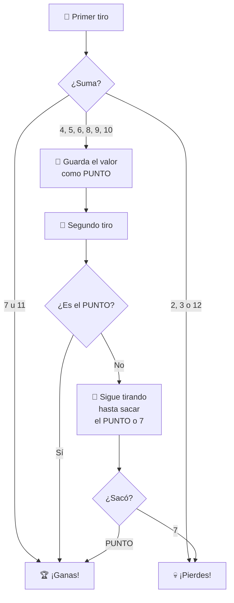

# 🎲 Reto: Craps (Juego de Dados)

---

## 🎯 Objetivo

Implementar el juego de dados **Craps** usando una clase `Dice` y lógica de juego.

---

## 📖 Reglas del Juego



---

## 🧩 Clase Dado

Ya tienes la clase `Dice`:

```python
import random

class Dice:
    def __init__(self, faces):
        self.__random = random.Random()
        self.__faces = faces
        self.__value = self.shoot()
    
    def shoot(self):
        """Lanza el dado y actualiza el valor."""
        self.__value = self.__random.randint(1, self.__faces)
        return self.__value
    
    def get_value(self):
        """Obtiene el valor actual (sin relanzar)."""
        return self.__value
```

> ⚠️ Importante: `shoot()` cambia el valor, `get_value()` solo lo lee.

---

## 🧪 Prueba de concepto

```python
dado = Dice(6)
dado.shoot()
print(dado.get_value())  # Muestra el mismo valor 4 veces
print(dado.get_value())  # porque get_value() no relanza
print(dado.get_value())
print(dado.get_value())
```

---

## 🎯 Tu tarea

Completa la lógica del juego usando dos dados (`Dice(6)`):

```python
def jugar_craps():
    dado1 = Dice(6)
    dado2 = Dice(6)
    
    # Primer tiro
    dado1.shoot()
    dado2.shoot()
    suma = dado1.get_value() + dado2.get_value()
    
    print(f"Primer tiro: {dado1.get_value()} + {dado2.get_value()} = {suma}")
    
    # Determinar resultado
    if suma in [7, 11]:
        print("¡Ganaste!")
    elif suma in [2, 3, 12]:
        print("¡Perdiste!")
    else:
        punto = suma
        print(f"Punto establecido: {punto}")
        
        # Sigue tirando hasta obtener punto o 7
        while True:
            dado1.shoot()
            dado2.shoot()
            suma = dado1.get_value() + dado2.get_value()
            print(f"Tiro: {suma}")
            
            if suma == punto:
                print("¡Ganaste!")
                break
            elif suma == 7:
                print("¡Perdiste!")
                break
```

---

## 🔗 Retos similares
- [[03-reto-picas-y-fijas]] — Juego de lógica
- [[reto-tetris]] — Lógica de juego
- [[reto-concurso-preguntas-respuestas]] — Juego con POO
- [[reto-formulario-transporte]] — POO en Java
- [[../midudev-javascript/20-viajes-retadores]] — Distribución óptima
