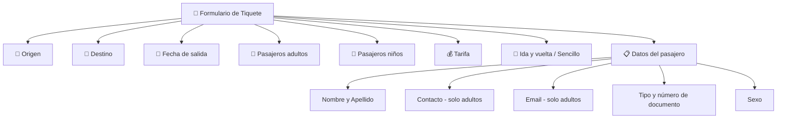

# 🚌 Reto: Formulario de Transporte

**Módulo 3**

---

## 🎯 Objetivos

- Usar expresiones lógicas
- Descomponer problemas en subproblemas
- Construir funciones con parámetros
- Aplicar divide y vencerás
- **Java** (entorno offline)

---

## 📖 Contexto

Has sido contratado para implementar un sistema de **creación de tiquetes** para una nueva empresa de transporte. Debe funcionar en estaciones de servicio con **internet intermitente**, por lo que se construye en **Java** (funciona offline) con un módulo de sincronización posterior.

---

## 🧾 Campos del Formulario

### Datos del viaje (obligatorios)



---

## 🧩 ¿Qué debes implementar?

### 1. Clase para almacenar datos

```java
public class Tiquete {
    private String origen;
    private String destino;
    private String fechaSalida;
    private int pasajerosAdultos;
    private int pasajerosNinos;
    private double tarifa;
    private boolean idaVuelta;
    private Pasajero[] pasajeros;
    // Getters y setters...
}
```

### 2. Método de impresión

```java
public String imprimirTiquete(Tiquete tiquete) {
    // Devuelve el tiquete formateado como String
    // para mostrarlo en consola
}
```

### 3. Persistencia

> Almacenar la información en un objeto para persistencia futura.

---

## 💡 Pistas

- [ ] Los minutos deben incrementarse de **5 en 5** (00, 05, 10…)
- [ ] Los datos de contacto y email solo se piden para adultos
- [ ] La tarifa tiene múltiples opciones (inicialmente硬codeadas)

---

## 🔗 Retos Java similares
- [[reto-graficas-excel]] — JFreeChart, MySQL, POI
- [[reto-gestion-pedidos]] — MVC, UML, composite
- [[reto-java-jdbc]] — JDBC, CRUD, Netbeans
- [[reto-pruebas-unitarias]] — JUnit, Mockito
- [[reto-uml]] — Diagramas UML
- [[reto-mer]] — Modelo entidad-relación
