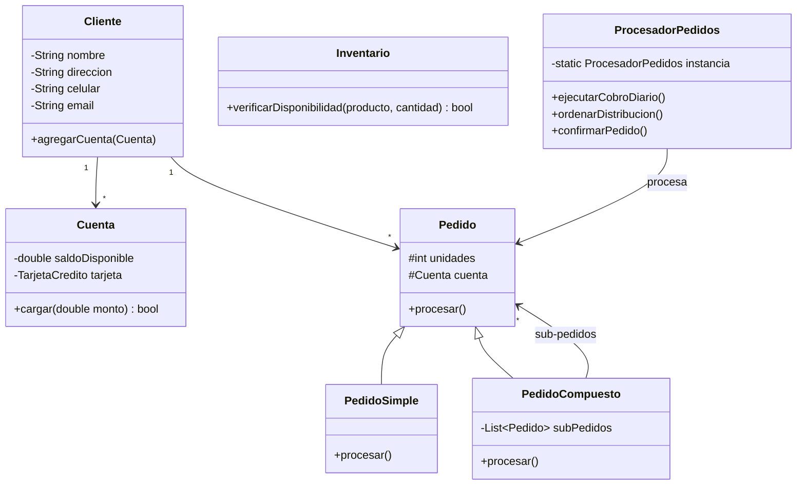

# 📦 Reto: Gestión de Pedidos

---

## 🎯 Objetivo

Implementar un sistema de gestión de pedidos en **Java** con arquitectura **MVC**, basado en un diagrama **UML**.

---

## 📖 Contexto

Una empresa de logística necesita un software para gestionar pedidos de clientes. El sistema debe manejar clientes, cuentas, productos y pedidos simples/compuestos.

---

## ⚙️ Requerimientos

---

## 📋 Reglas de Negocio

| # | Regla |
|---|-------|
| 1 | Un cliente puede tener **una o más cuentas** pre-asociadas |
| 2 | Un cliente **solo puede iniciar un pedido** si tiene una cuenta con saldo disponible |
| 3 | **Pedido simple:** máximo 20 unidades, paga con una sola cuenta |
| 4 | **Pedido compuesto:** 2+ sub-pedidos, todos se pagan con cuentas del mismo cliente |
| 5 | Solo se pueden pedir **productos en inventario** |
| 6 | **ProcesadorPedidos** es singleton: cobro, distribución y confirmación |
| 7 | El cobro se ejecuta **una vez al día**: revisa pedidos pendientes y cobra. Si una cuenta no tiene saldo, **todo el pedido compuesto se rechaza** |
| 8 | Una vez cobrado, se ordena la distribución; al entregar, se confirma |

---

## 🧩 Tu tarea

1. [ ] Implementar todas las clases del **UML** en Java
2. [ ] Seguir el **estándar de nombrado** definido
3. [ ] Usar arquitectura **MVC básica**
4. [ ] Entregar el proyecto en Netbeans

---

## 🔗 Retos Java similares
- [[reto-formulario-transporte]] — POO, formularios
- [[reto-graficas-excel]] — JFreeChart, MySQL, POI
- [[reto-java-jdbc]] — JDBC, CRUD, Netbeans
- [[reto-pruebas-unitarias]] — JUnit, Mockito
- [[reto-uml]] — Diagramas UML
- [[reto-mer]] — Modelo entidad-relación
- [[reto-supertiendas]] — Gestión empresarial (Python)
