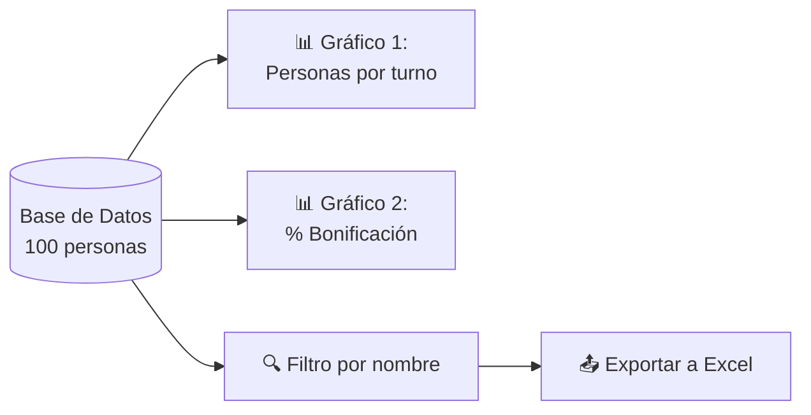

# 📊 Reto: Generación de Gráficas y Exportación a Excel

---

## 🎯 Objetivo

Crear un formulario en Java con **JFreeChart** para visualizar datos y exportar a **Excel**.

---

## 📖 Contexto

Tienes un script de base de datos que genera **100 registros de personas** con los campos:

| Campo | Tipo |
|-------|------|
| Nombre | Texto |
| Documento | Texto |
| Fecha de nacimiento | Fecha |
| Teléfono | Texto |
| Dirección | Texto |
| Email | Texto |
| Salario | Numérico |
| Turno | 1 / 2 / 3 |
| Bonificación | Sí / No |

---

## ⚙️ Tareas



### 1. Gráfico de Barras — Personas por Turno

Usa **JFreeChart** para mostrar cuántas personas trabajan en cada turno (1, 2, 3).

### 2. Gráfico de Pastel — Bonificación

Muestra el porcentaje de personas que reciben bonificación vs. las que no.

### 3. Exportación a Excel

- [ ] Un campo de texto para filtrar por **nombre** (usando `LIKE` de MySQL)
- [ ] Un botón para aplicar el filtro
- [ ] Exportar los resultados a un archivo **Excel** (.xlsx) usando Apache POI

---

## 🧩 Código base

```java
// Conexión a la base de datos
Connection conn = DriverManager.getConnection(
    "jdbc:mysql://localhost:3306/mi_bd", "root", "password"
);

// Consulta con filtro
String sql = "SELECT * FROM personas WHERE nombre LIKE ?";
PreparedStatement stmt = conn.prepareStatement(sql);
stmt.setString(1, "%" + filtro + "%");
ResultSet rs = stmt.executeQuery();
```

---

## 🔗 Retos Java similares
- [[reto-formulario-transporte]] — POO, formularios
- [[reto-gestion-pedidos]] — MVC, UML, composite
- [[reto-java-jdbc]] — JDBC, CRUD, Netbeans
- [[reto-pruebas-unitarias]] — JUnit, Mockito
- [[06-2-graficador-financiero]] — Gráficas Matplotlib (Python)
- [[../midudev-javascript/21-tabla-de-regalos]] — Tablas y visualización
