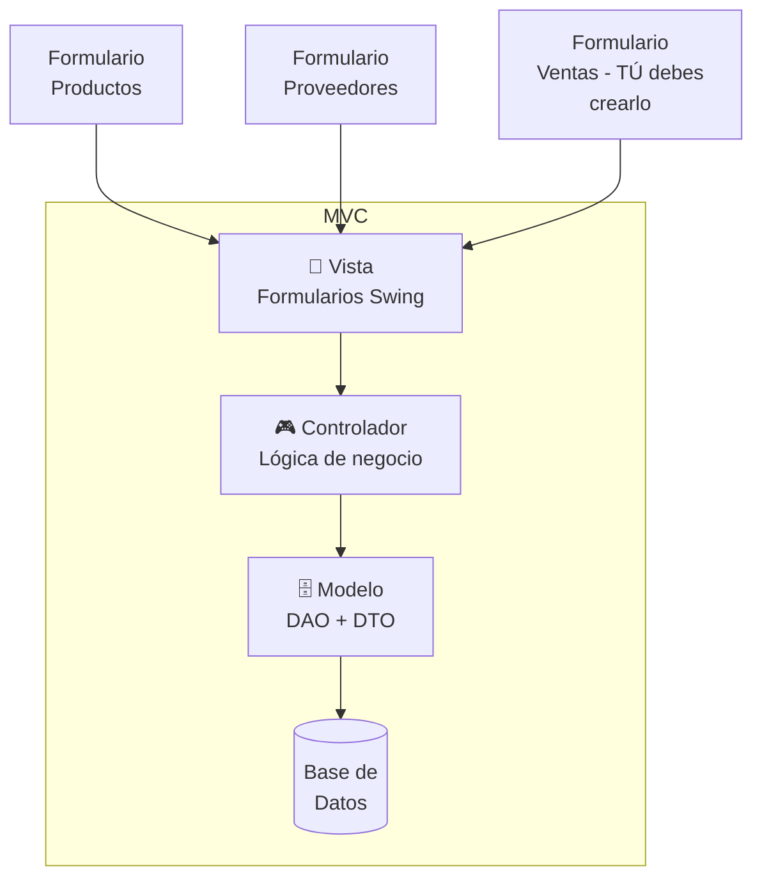

# ☕ Reto: Java + JDBC + MVC

---

## 🎯 Objetivo

Desarrollar una aplicación Java con conexión a base de datos usando **JDBC** y arquitectura **MVC**.

---

## 📋 Partes del Reto

### Parte 1: 5 Ejercicios en Java

Escoge 5 ejercicios del Ciclo 1 (cualquier taller) y resuélvelos en **Java** usando Netbeans. Cada ejercicio debe tener su propia clase ejecutable dentro del mismo proyecto.

### Parte 2: Estructura UML

Basado en el diseño UML de otro reto, construye la estructura del proyecto en Netbeans organizado por **paquetes**. Crea instancias de ejemplo y verifica su funcionamiento.

### Parte 3: JDBC + MVC



### Requerimientos

- [ ] Conectar a la base de datos usando **JDBC**
- [ ] Implementar **CRUD completo** para **Productos, Proveedores y Ventas**
- [ ] Seguir el patrón **MVC** (Modelo-Vista-Controlador)
- [ ] El proyecto adjunto tiene los formularios de Producto y Proveedor; tú debes desarrollar el **formulario de Ventas**

---

## 🧩 Estructura del Proyecto

```
src/
├── controlador/
│   ├── ProductoController.java
│   ├── ProveedorController.java
│   └── VentaController.java
├── modelo/
│   ├── ProductoDAO.java
│   ├── ProveedorDAO.java
│   ├── VentaDAO.java
│   └── dto/
│       ├── ProductoDTO.java
│       ├── ProveedorDTO.java
│       └── VentaDTO.java
└── vista/
    ├── ProductoForm.java
    ├── ProveedorForm.java
    └── VentaForm.java  ← Tú lo creas
```

---

## 🔗 Retos Java similares
- [[reto-formulario-transporte]] — POO, formularios
- [[reto-graficas-excel]] — JFreeChart, MySQL, POI
- [[reto-gestion-pedidos]] — MVC, UML, composite
- [[reto-pruebas-unitarias]] — JUnit, Mockito
- [[reto-mer]] — Modelo entidad-relación
- [[../plataforma-challenges/challenge-backend-node]] — API CRUD similar
