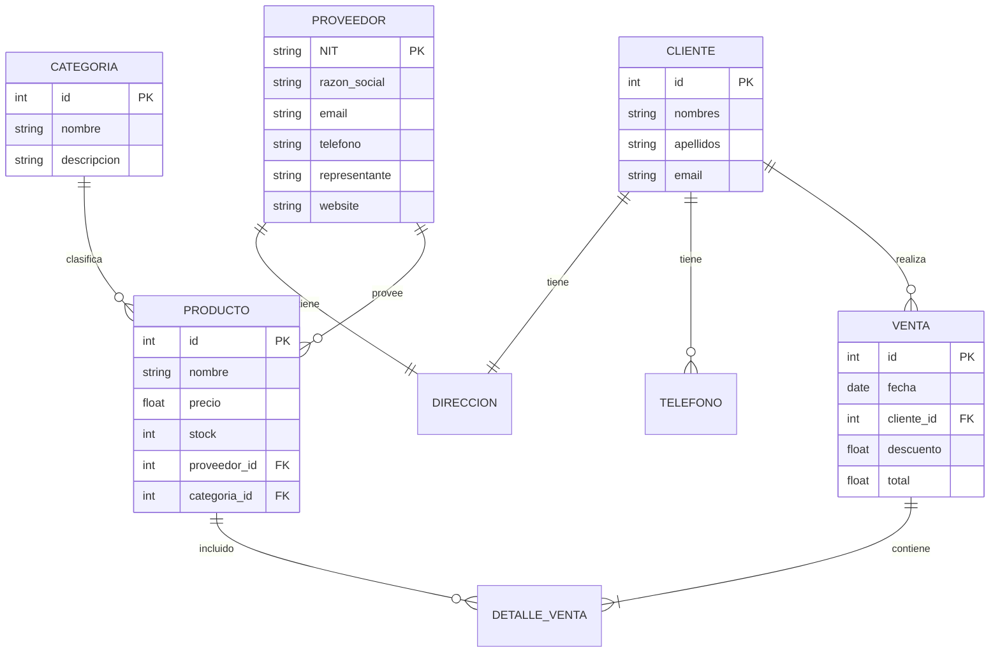

# 🗄️ Reto: Modelo Entidad-Relación (MER)

---

## 🎯 Objetivo

Diseñar un Modelo Entidad-Relación para una base de datos de supermercado e implementar las consultas SQL.

---

## 📖 Contexto

Has sido contratado por un supermercado para analizar sus necesidades y diseñar el **Modelo Entidad-Relación** de su base de datos.

---

## 📋 Requerimientos

### Proveedores

| Campo | Descripción |
|-------|-------------|
| NIT | Identificación única |
| Razón social | Nombre legal |
| Dirección | Vía, número, barrio, ciudad |
| Teléfono | Contacto |
| Email | Correo electrónico |
| Representante legal | Persona a cargo |
| Sitio web | URL |

### Clientes

| Campo | Descripción |
|-------|-------------|
| ID | Identificación única |
| Nombres | |
| Apellidos | |
| Dirección de entrega | Compuesta (vía, número, barrio, ciudad) |
| Email | |
| Teléfonos | Puede tener **múltiples** teléfonos |

### Productos

| Campo | Descripción |
|-------|-------------|
| ID único | |
| Nombre | |
| Precio actual | |
| Stock | Cantidad disponible |
| Proveedor | ID del proveedor |
| Categoría | ID, nombre, descripción |

### Ventas

| Campo | Descripción |
|-------|-------------|
| ID único | |
| Fecha | |
| Cliente | ID del cliente |
| Descuento | Por defecto 0 |
| Valor total | |
| Productos | Múltiples productos por venta |

---

## 🧩 Diagrama ER



---

## 📝 Tareas

### 1. Diseña el MER completo

Incluye todas las entidades, atributos y relaciones del diagrama.

### 2. Crea las tablas SQL

```sql
CREATE TABLE tb_proveedores (
    nit VARCHAR(20) PRIMARY KEY,
    razon_social VARCHAR(100) NOT NULL,
    direccion VARCHAR(200),
    email VARCHAR(100),
    telefono VARCHAR(20),
    representante_legal VARCHAR(100),
    website VARCHAR(100)
);

CREATE TABLE tb_productos (
    id INT PRIMARY KEY AUTO_INCREMENT,
    nombre VARCHAR(100) NOT NULL,
    precio_actual DECIMAL(12,2),
    stock INT DEFAULT 0,
    proveedor_id VARCHAR(20),
    categoria_id INT,
    FOREIGN KEY (proveedor_id) REFERENCES tb_proveedores(nit)
);
```

### 3. Implementa CRUD (mínimo 5 registros cada uno)

- Insertar, consultar, actualizar y eliminar proveedores
- Insertar, consultar, actualizar y eliminar productos
- Insertar, consultar, actualizar y eliminar ventas

### 4. Consulta con INNER JOIN

```sql
-- Ejemplo: productos comprados por un cliente
SELECT c.nombres, p.nombre, dv.cantidad
FROM tb_clientes c
JOIN tb_ventas v ON c.id = v.cliente_id
JOIN tb_detalle_venta dv ON v.id = dv.venta_id
JOIN tb_productos p ON dv.producto_id = p.id
WHERE c.id = 1;
```

---

## 🔗 Retos similares
- [[reto-uml]] — Diagramas UML
- [[reto-gestion-pedidos]] — UML + Java MVC
- [[reto-java-jdbc]] — JDBC + CRUD
- [[reto-supertiendas]] — Gestión de datos
- [[reto-graficas-excel]] — Consultas MySQL
- [[../plataforma-challenges/challenge-backend-node]] — API con BD
