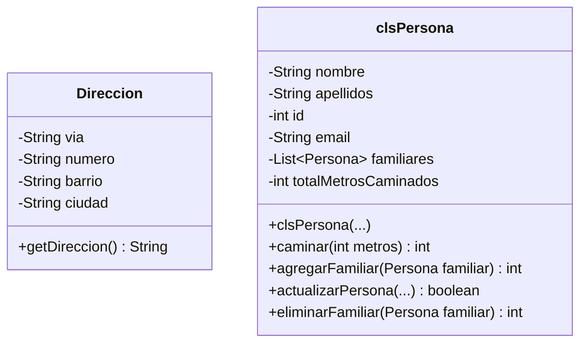

# 🧪 Reto: Pruebas Unitarias

---

## 🎯 Objetivo

Practicar la lógica de **pruebas unitarias** en Java usando **JUnit** y **Mock objects**.

---

## 📖 Contexto

Tienes un proyecto Java con dos paquetes: `Clases` e `Inicio`.

### Paquete: `Clases`



### Métodos existentes

```java
public class clsPersona {
    private String nombre;
    private String apellidos;
    private int id;
    private String email;
    private List<Persona> familiares;
    private int totalMetrosCaminados;

    public clsPersona(String nombre, String apellidos, int id, String email) {
        this.nombre = nombre;
        this.apellidos = apellidos;
        this.id = id;
        this.email = email;
        this.familiares = new ArrayList<>();
        this.totalMetrosCaminados = 0;
    }

    /**
     * Acumula los metros caminados.
     * Retorna la suma total de todas las ejecuciones.
     */
    public int caminar(int metros) {
        totalMetrosCaminados += metros;
        return totalMetrosCaminados;
    }

    /**
     * Agrega un familiar a la lista.
     * Retorna la posición en la que fue agregado.
     */
    public int agregarFamiliar(Persona familiar) {
        familiares.add(familiar);
        return familiares.size() - 1;
    }
}
```

---

## 🧩 Tu Tarea

### 1. Completar `clsPersona`

```java
/**
 * Modifica los datos de la persona.
 * Retorna true si se actualizó correctamente.
 */
public boolean actualizarPersona(String nombre, String apellidos, String email) {
    // Tu código aquí
    return false; // placeholder
}

/**
 * Elimina un familiar de la lista.
 * Lanza una excepción si no existe.
 * Retorna 1 si se eliminó correctamente.
 */
public int eliminarFamiliar(Persona familiar) throws Exception {
    // Tu código aquí
    return 0; // placeholder
}
```

### 2. Generar Pruebas Unitarias para TODOS los métodos

```java
import org.junit.jupiter.api.*;
import static org.junit.jupiter.api.Assertions.*;

public class clsPersonaTest {
    
    private clsPersona persona;
    
    @BeforeEach
    void setUp() {
        persona = new clsPersona("Juan", "Pérez", 123, "juan@mail.com");
    }
    
    @Test
    void testCaminar() {
        int resultado = persona.caminar(100);
        assertEquals(100, resultado);
        
        resultado = persona.caminar(50);
        assertEquals(150, resultado);  // Acumulativo
    }
    
    @Test
    void testAgregarFamiliar() {
        clsPersona familiar = new clsPersona("Ana", "López", 456, "ana@mail.com");
        int posicion = persona.agregarFamiliar(familiar);
        assertEquals(0, posicion);
    }
    
    // ... más pruebas
}
```

### 3. Usar Mock Objects donde sea necesario

Para aislar las pruebas, usa **Mockito**:

```java
import static org.mockito.Mockito.*;

@Test
void testEliminarFamiliarConMock() {
    Persona mockFamiliar = mock(Persona.class);
    persona.agregarFamiliar(mockFamiliar);
    
    int resultado = persona.eliminarFamiliar(mockFamiliar);
    assertEquals(1, resultado);
}
```

---

## ✅ Cobertura esperada

| Método | ¿Prueba unitaria? | ¿Mock? |
|--------|-------------------|--------|
| `Direccion.getDireccion()` | ✅ | |
| `clsPersona.caminar()` | ✅ | |
| `clsPersona.agregarFamiliar()` | ✅ | |
| `clsPersona.actualizarPersona()` | ✅ | |
| `clsPersona.eliminarFamiliar()` | ✅ | ✅ |

---

## 🔗 Retos similares
- [[reto-formulario-transporte]] — POO en Java
- [[reto-gestion-pedidos]] — Arquitectura MVC
- [[reto-java-jdbc]] — JDBC + MVC
- [[reto-graficas-excel]] — JFreeChart + MySQL
- [[reto-uml]] — Diagramas de clases
- [[../midudev-javascript/08-piezas-de-repuesto]] — Validación de cadenas
