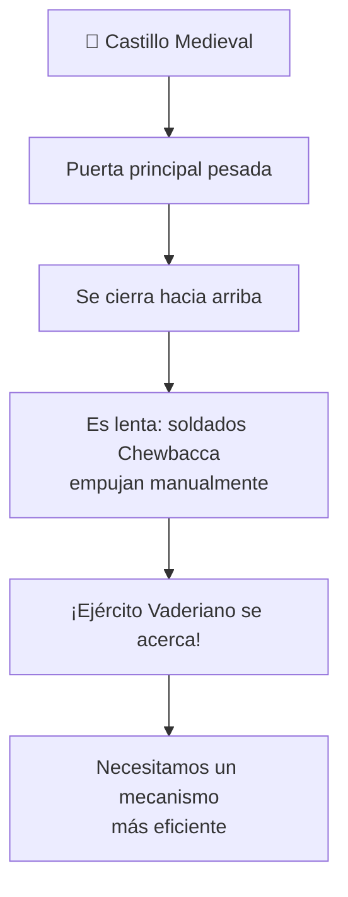

# 🏰 Reto: Protegiendo al Castillo Medieval

---

## 🎯 Objetivos

- Aplicar todos los conceptos de las semanas 1 y 2
- Usar el proceso **IDEAL** para resolver un problema
- Implementar funciones con parámetros, documentación y pruebas

---

## 📖 Contexto

El Rey **Arturito** (antecesor de R2-D2) está preocupado. El ejército **Vaderiano** se acerca a su castillo. El punto débil es la **puerta principal**, que es lenta de cerrar porque los soldados Chewbacca deben empujarla hacia arriba manualmente.

Arquímedes propuso un plan… pero faltan los detalles.

### El problema



---

## 📝 Entregables

1. **Documento** con el proceso IDEAL aplicado al problema (subir a Moodle)
2. **Programa en Python** que soluciona el problema

---

## 🧠 Aplica el Proceso IDEAL

| Fase | Preguntas guía |
|------|---------------|
| **Identificar** | ¿Cuál es el problema? ¿Quiénes están involucrados? ¿Qué se necesita? |
| **Definir** | ¿Qué datos tenemos? ¿Qué datos necesitamos? Subproblemas |
| **Estrategia** | Ejemplos concretos. Divide y vencerás |
| **Algoritmos** | Pseudocódigo de cada función |
| **Logros** | Implementación en Python con funciones documentadas |

---

>[!💡 Pistas]
>- Piensa en términos de **fuerza, distancia y trabajo**
>- ¿Existe algún principio físico (poleas, palancas) que pueda ayudar?
>- Descompón el problema: levantar la puerta requiere vencer su peso
>- Tu programa podría calcular la **fuerza necesaria** o la **ventaja mecánica** de un sistema de poleas

```python
def calcular_fuerza(masa_puerta, gravedad=9.8):
    """
    Calcula la fuerza necesaria para levantar la puerta.
    F = m * g
    """
    return masa_puerta * gravedad
```

---

## 🔗 Retos similares
- [[lab-calculadora]] — Proceso IDEAL básico
- [[reto-tetris]] — Lógica condicional
- [[reto-supertiendas]] — Menús y reportes
- [[../midudev-javascript/03-distribuyendo-regalos]] — Distribución óptima
- [[../midudev-javascript/12-trineos-electricos]] — Optimización con restricciones
