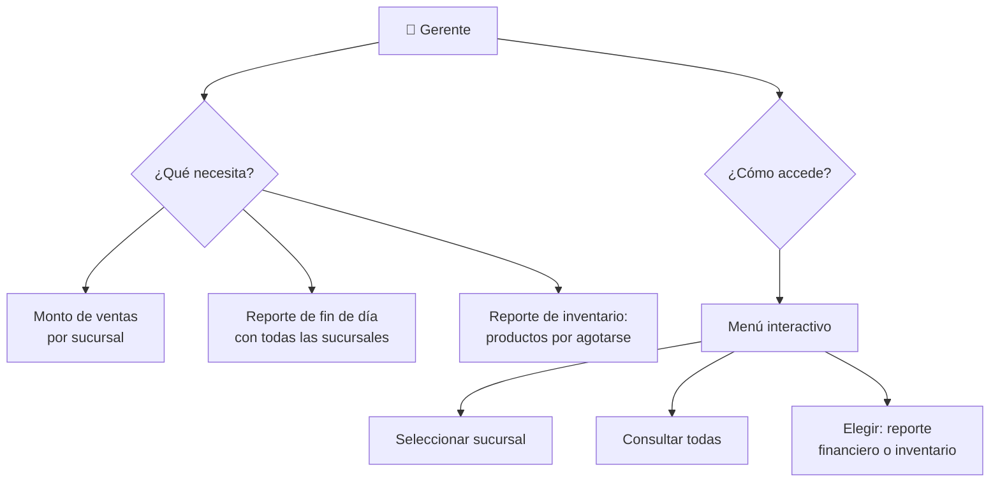

# 🏪 Reto: Supertiendas S.A.

---

## 🎯 Objetivos

- Implementar expresiones lógicas
- Descomponer problemas en subproblemas
- Construir y reutilizar funciones vía módulos
- Aplicar listas y bucles
- Aplicar divide y vencerás

---

## 📖 Contexto

Has sido contratado como asistente financiero de **Supertiendas S.A.** La empresa creció de 5 a 20 sucursales y el software financiero anterior se quedó corto.

El sistema actual genera un archivo con información actualizada bajo demanda, pero **no puede procesar ni generar reportes rápidamente**.

---

## ⚙️ Requerimientos



### Menú del sistema

```
=== SISTEMA SUPER TIENDAS S.A. ===
1. Ver ventas de una sucursal
2. Ver reporte general de ventas
3. Ver reporte de inventario
4. Salir
----------------------------------
Seleccione una opción:
```

---

## 🧩 ¿Qué debes hacer?

1. [ ] **Leer archivos** de datos de sucursales
2. [ ] **Procesar** montos de ventas (valor total y valor con impuestos)
3. [ ] **Generar reportes** de fin de día
4. [ ] **Detectar** productos con stock bajo
5. [ ] **Implementar** el menú de navegación

### Estructura de datos sugerida

```python
sucursales = [
    {
        "nombre": "Sucursal Centro",
        "ventas": [120.50, 230.00, 89.90],
        "productos": [
            {"nombre": "Arroz", "stock": 45, "minimo": 20},
            {"nombre": "Leche", "stock": 5, "minimo": 10},  # ¡Agotándose!
        ]
    },
    # ... más sucursales
]
```

---

>[!💡 Pistas]
>- Usa funciones separadas para cada tipo de reporte
>- Un producto «por agotarse» tiene `stock < minimo`
>- El IVA puede ser del 19%

---

## 🔗 Retos similares
- [[04-reportes]] — Reportes financieros CSV
- [[reto-gestion-pedidos]] — Gestión empresarial Java
- [[reto-java-jdbc]] — CRUD con persistencia
- [[reto-mer]] — Modelado de datos
- [[lab-entrada-estandar]] — Entrada de datos básica
- [[../midudev-javascript/07-inventario-de-regalos]] — Inventarios
