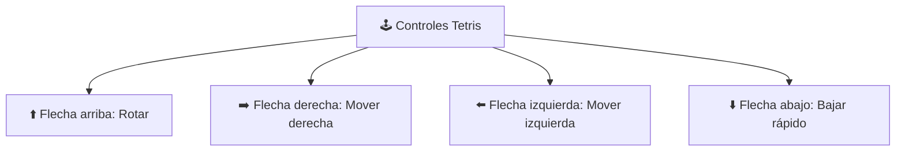

# 🟦 Reto: Tetris

---

## 🎯 Objetivos

- Implementar expresiones lógicas para toma de decisiones
- Descomponer problemas en subproblemas
- Construir funciones con parámetros
- Demostrar reutilización de código vía módulos
- Aplicar divide y vencerás

---

## 📖 Contexto

Has sido contratado por una empresa de videojuegos que desarrolla juegos en Python. Necesitan completar el código de un **Tetris**. El director ha dejado las especificaciones en el código.

### Controles del juego



---

## 🧩 ¿Qué debes hacer?

El ingeniero líder identificó puntos clave y creó un archivo `conditionals.py` con las funciones documentadas. También añadió las llamadas a funciones en los lugares correctos, pero **no pudo implementarlas** porque le llegaban «números sin significado».

Tu tarea es **implementar la lógica** de cada función en `conditionals.py`.

### Ejemplo de función a implementar:

```python
def puede_mover_izquierda(posicion_x, tablero):
    """
    Verifica si la ficha puede moverse a la izquierda.
    
    Parámetros:
        posicion_x (int): posición actual en el eje X
        tablero (list): matriz del tablero de juego
    
    Retorna:
        bool: True si puede moverse, False en caso contrario
    """
    # Tu código aquí
    pass
```

---

>[!📝 Reglas]
>- El código debe escribirse en **inglés** (especificación del cliente)
>- Los comentarios pueden ir en inglés o español
>- Prueba cada función por separado antes de integrarla

---

>[!💡 Pistas]
>- Identifica los **límites del tablero** (no salirse)
>- Revisa que la casilla destino esté **vacía**
>- Las piezas tienen diferentes **formas y rotaciones**
>- El `conditionals.py` debe importarse como módulo

---

## 🔗 Retos similares
- [[reto-craps]] — Juego de dados con POO
- [[03-reto-picas-y-fijas]] — Juego de lógica
- [[reto-concurso-preguntas-respuestas]] — Juego con POO
- [[reto-puerta-castillo]] — Condicionales y funciones
- [[../midudev-javascript/24-el-laberinto]] — BFS/DFS en juego
- [[../midudev-javascript/06-cubo-navideño]] — Matrices y dibujo ASCII
