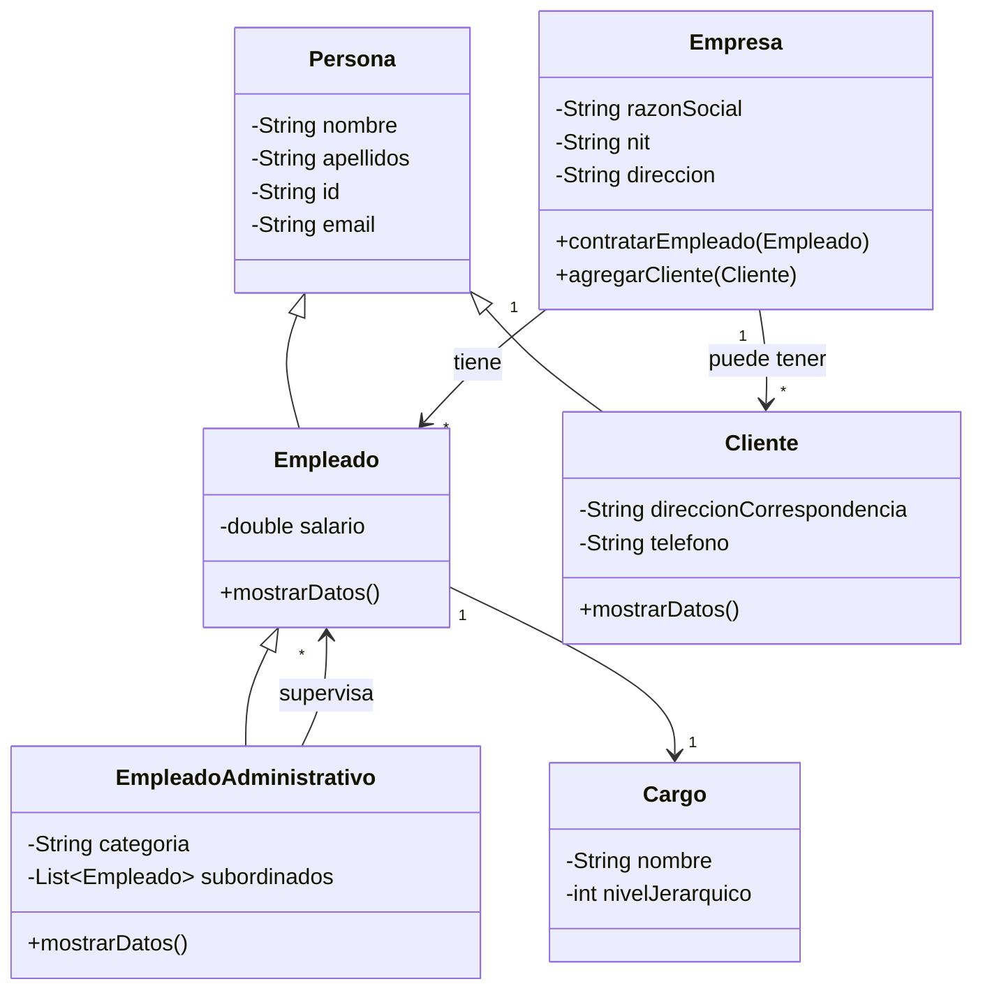

# 📐 Reto: Diagramas UML

---

## 🎯 Objetivo

Diseñar diagramas de clases UML y documentar el análisis.

---

## 📋 Parte 1: Sistema de Gestión Empresarial

### Requerimientos

Un software que gestiona información de **empresas, empleados y clientes**.



### Tu tarea

1. [ ] Diseña el diagrama UML completo usando una herramienta (Lucidchart, Draw.io, etc.)
2. [ ] Acompaña el diagrama con un **documento** explicando:
   - [ ] Análisis realizado
   - [ ] Elementos de diseño añadidos
   - [ ] Justificación de las relaciones

---

## 📋 Parte 2: Clase Persona

### Diseña el UML

Propón atributos y métodos para una clase `Persona`.

### Implementa en Java

```java
public class Persona {
    private String nombre;
    private int edad;
    
    public Persona(String nombre, int edad) {
        this.nombre = nombre;
        this.edad = edad;
    }
    
    public void saludar() {
        System.out.println("Hola, soy " + nombre);
    }
    
    public void cumplirAnios() {
        edad++;
        System.out.println("¡Feliz cumpleaños! Ahora tengo " + edad);
    }
}
```

### Prueba la instanciación

```java
public class Main {
    public static void main(String[] args) {
        Persona p = new Persona("María", 25);
        p.saludar();
        p.cumplirAnios();
    }
}
```

---

## 🔗 Retos similares
- [[reto-mer]] — Modelo entidad-relación
- [[reto-gestion-pedidos]] — UML + Java MVC
- [[reto-formulario-transporte]] — POO en Java
- [[reto-java-jdbc]] — JDBC + MVC
- [[reto-pruebas-unitarias]] — Testing con JUnit
- [[solucion-hotel-california]] — Solución completa con UML
