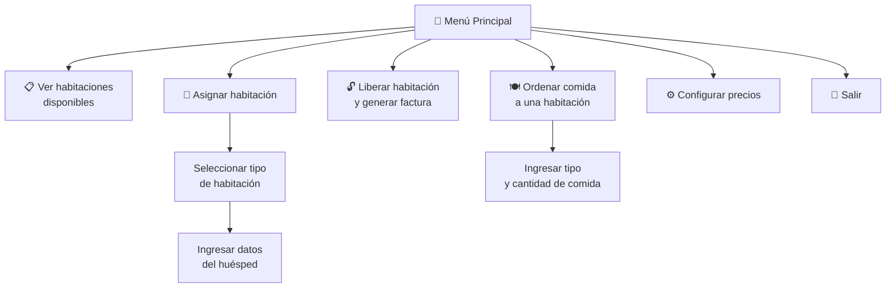
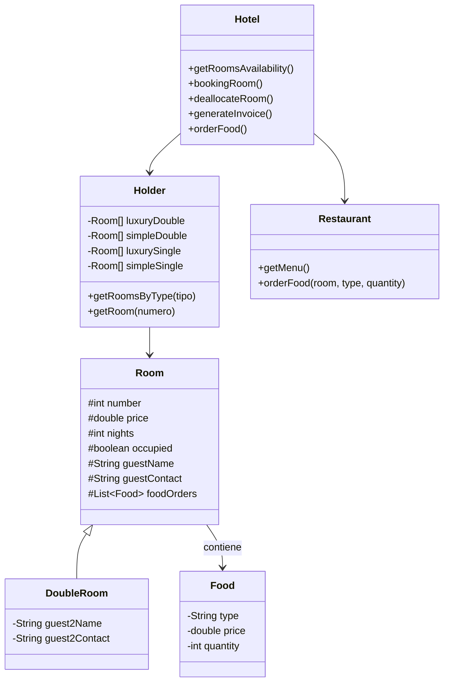

# 🏨 Solución: Hotel California

Código fuente completo de la solución del sistema de gestión hotelera **Hotel California**, implementado en **Java** y **Python**.

---

## 📋 Funcionalidades



---

## 🏠 Tipos de Habitación

| Tipo | Nombre | Habitaciones | Capacidad |
|------|--------|--------------|-----------|
| 1 | Doble de lujo | 1–10 | 2 personas |
| 2 | Doble sencilla | 11–20 | 2 personas |
| 3 | De lujo simple | 21–40 | 1 persona |
| 4 | Simple sencilla | 41–60 | 1 persona |

---

## 📁 Estructura del Código

### Python

| Archivo | Descripción |
|---------|-------------|
| `hotel.py` | Clase `Hotel`: lógica de reservas, liberación y facturación |
| `room.py` | Clase `Room`: datos de la habitación y huésped |
| `double-room.py` | Clase `DoubleRoom`: extiende Room con datos del segundo huésped |
| `food.py` | Clase `Food`: tipo, precio y cantidad de comida |
| `holder.py` | Clase `Holder`: contenedor con arrays para los 4 tipos de habitación |
| `restaurant.py` | Clase `Restaurant`: menú y pedidos de comida |
| `input.py` | Utilidad de entrada por teclado |
| `hotel-california-25.py` | Menú principal y controlador |

### Java

| Archivo | Descripción |
|---------|-------------|
| `hotel.java` | Clase `Hotel` (equivalente Java) |
| `room.java` | Clase `Room` |
| `double-room.java` | Clase `DoubleRoom` |
| `food.java` | Clase `Food` |
| `holder.java` | Clase `Holder` |
| `restaurant.java` | Clase `Restaurant` |
| `input.java` | Utilidad de entrada |
| `hotel-california25.java` | Menú principal y controlador |

---

## 🐍 Código Python (Clase `Hotel`)

```python
class Hotel:
    def __init__(self):
        self.rooms = Holder()  # Contenedor de habitaciones
        self.restaurant = Restaurant()
    
    def get_rooms_availability(self):
        """Retorna disponibilidad de cada tipo de habitación."""
        availability = {}
        for room_type in range(1, 5):
            count = 0
            rooms = self.rooms.get_rooms_by_type(room_type)
            for room in rooms:
                if room is not None and not room.occupied:
                    count += 1
            availability[room_type] = count
        return availability
    
    def booking_room(self, room_number, guest_data):
        """Reserva una habitación con los datos del huésped."""
        room = self.rooms.get_room(room_number)
        if room and not room.occupied:
            room.occupied = True
            room.guest_name = guest_data["name"]
            room.guest_contact = guest_data["contact"]
            # ... más datos
            return True
        return False
    
    def deallocate_room(self, room_number):
        """Libera la habitación y genera factura."""
        room = self.rooms.get_room(room_number)
        if room and room.occupied:
            invoice = self.generate_invoice(room)
            room.occupied = False
            room.guest_name = ""
            # ... limpiar datos
            return invoice
        return None
    
    def generate_invoice(self, room):
        """Genera la factura con costo de habitación y alimentos."""
        nights_cost = room.price * room.nights
        food_cost = sum(item.price * item.quantity for item in room.food_orders)
        total = nights_cost + food_cost
        return {
            "room": room.number,
            "guest": room.guest_name,
            "nights": room.nights,
            "nights_cost": nights_cost,
            "food_cost": food_cost,
            "total": total
        }
```

### Menú Principal

```python
def main():
    hotel = Hotel()
    
    while True:
        print("\n=== HOTEL CALIFORNIA ===")
        print("1. Ver habitaciones disponibles")
        print("2. Asignar habitación")
        print("3. Liberar habitación")
        print("4. Ordenar comida")
        print("5. Configurar precios")
        print("6. Salir")
        
        option = input("Seleccione: ")
        
        if option == "1":
            availability = hotel.get_rooms_availability()
            for room_type, count in availability.items():
                print(f"Tipo {room_type}: {count} disponibles")
        
        elif option == "2":
            room_type = select_type_room_menu()
            room_number = int(input("Número de habitación: "))
            guest = {
                "name": input("Nombre del huésped: "),
                "contact": input("Contacto: ")
            }
            hotel.booking_room(room_number, guest)
        
        elif option == "3":
            room_number = int(input("Número de habitación a liberar: "))
            invoice = hotel.deallocate_room(room_number)
            if invoice:
                print("\n=== FACTURA ===")
                print(f"Habitación: {invoice['room']}")
                print(f"Huésped: {invoice['guest']}")
                print(f"Noches: {invoice['nights']}")
                print(f"Total: ${invoice['total']:.2f}")
        
        elif option == "4":
            room_number = int(input("Número de habitación: "))
            food_type = input("Tipo de comida: ")
            quantity = int(input("Cantidad: "))
            hotel.order_food(room_number, food_type, quantity)
        
        elif option == "5":
            hotel.ConfigureRoomTypePrices()
        
        elif option == "6":
            break
```

---

## ☕ Código Java (Clase `Hotel`)

```java
public class Hotel {
    private Holder rooms;
    private Restaurant restaurant;
    
    public Hotel() {
        rooms = new Holder();
        restaurant = new Restaurant();
    }
    
    public int getRoomsAvailability(int roomType) {
        int count = 0;
        Room[] roomsOfType = rooms.getRoomsByType(roomType);
        for (Room room : roomsOfType) {
            if (room != null && !room.isOccupied()) {
                count++;
            }
        }
        return count;
    }
    
    public boolean bookingRoom(int roomNumber, String name, String contact) {
        Room room = rooms.getRoom(roomNumber);
        if (room != null && !room.isOccupied()) {
            room.setOccupied(true);
            room.setGuestName(name);
            room.setGuestContact(contact);
            return true;
        }
        return false;
    }
    
    public String generateInvoice(int roomNumber) {
        Room room = rooms.getRoom(roomNumber);
        if (room == null || !room.isOccupied()) return "";
        
        double nightsCost = room.getPrice() * room.getNights();
        double foodCost = 0;
        for (Food food : room.getFoodOrders()) {
            foodCost += food.getPrice() * food.getQuantity();
        }
        
        return "=== FACTURA ===\n"
            + "Habitación: " + room.getNumber() + "\n"
            + "Huésped: " + room.getGuestName() + "\n"
            + "Total: $" + (nightsCost + foodCost);
    }
}
```

---

## 🔗 Relación entre Componentes



---

## 🔗 Retos similares
- [[reto-formulario-transporte]] — POO + persistencia (Java)
- [[reto-gestion-pedidos]] — MVC + UML (Java)
- [[reto-java-jdbc]] — JDBC + CRUD (Java)
- [[reto-uml]] — Diagramas de clases
- [[reto-mer]] — Modelado de datos
- [[reto-craps]] — POO en Python
- [[reto-concurso-preguntas-respuestas]] — POO + persistencia (Python)
