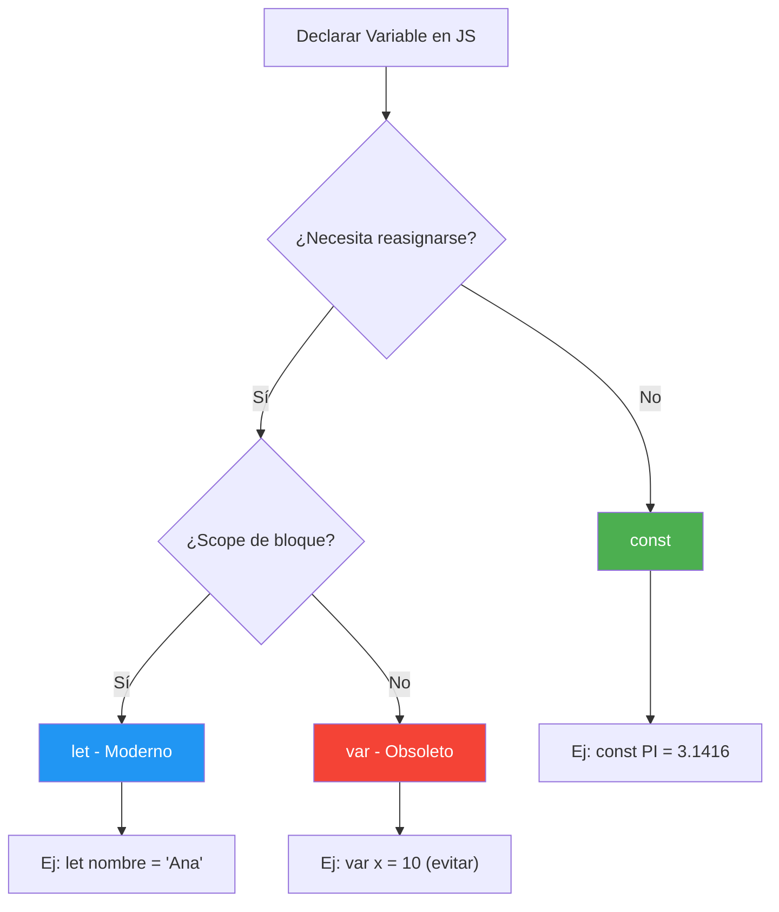

# Sintaxis y Variables en JavaScript

JavaScript es un lenguaje versátil, pero entender cómo gestiona la memoria a través de sus variables es fundamental. A diferencia de lenguajes como Python, aquí tenemos tres formas principales de declarar contenedores.

## 📚 Objetivos de Aprendizaje

- Diferenciar entre `var`, `let` y `const`
- Aplicar convenciones de nomenclatura en JS
- Usar template literals para concatenación moderna
- Identificar variables globales de Node.js

## Comparativa de Declaración de Variables



### 1. `var` (La vieja escuela)
- **Mutable**: Permite sobreescribir completamente la variable.
- **Scope Global**: Se declara globalmente, lo que puede afectar el rendimiento y causar errores difíciles de rastrear.
- **Mala Praxis**: Hoy en día se evita su uso en favor de `let`.

### 2. `let` (El estándar moderno)
- **Mutable**: Permite cambiar el valor.
- **Scope Local**: Solo existe dentro del bloque (contexto) donde fue creada.
- **Seguridad**: Evita la sobreescritura accidental si la referencia ya existe.

### 3. `const` (Seguridad total)
- **Inmutable**: No permite la reasignación.
- **Convención**: Los desarrolladores suelen usar **MAYÚSCULAS** para valores de solo lectura (`const MAX_SPEED = 100`).

> [!WARNING]
> Intentar reasignar una `const` lanzará un error:
> `TypeError: Assignment to constant variable.`

---

## Convenciones de Nomenclatura

| Elemento | Convención | Ejemplo |
| :--- | :--- | :--- |
| Variables | `camelCase` | `miVariableMutable` |
| Constantes | `SNAKE_CASE_MAX` | `PI_VALUE` |
| Clases | `PascalCase` | `UsuarioAdmin` |

---

## Tips de Sintaxis Rápida

- **Concatenación Moderna**: Usa plantillas de cadena (Template Literals) con comillas invertidas `` ` `` y `${expression}`.
    ```javascript
    let a = 5;
    let b = 3;
    console.log(`El resultado es ${a + b}`); // "El resultado es 8"
    ```
- **Inmutabilidad de Strings**: Al igual que en Python, los strings son inmutables.
- **Propiedad Length**: Para contar caracteres, se usa como propiedad: `"texto".length` (sin paréntesis).

---

## Variables Globales en Node.js

A diferencia del entorno web, Node.js nos da acceso a información del sistema:

- `__dirname`: Ruta del directorio actual.
- `__filename`: Ruta completa del archivo actual.
- `process.argv`: Argumentos pasados por la línea de comandos.

```javascript
let path = require('path');
console.log(path.basename(__filename)); // Obtiene solo el nombre del archivo
```

---

## Relacionado con

- [[CLI-interaccion-terminal]] - Uso de `process.argv` para crear CLIs
- [[estructuras-arrays-objetos]] - Arrays y Objetos para almacenar datos
- [[calculadora-climatica-psicrometrica]] - Proyecto que utiliza variables y constantes
- [[mundo-3D-ThreeJS]] - Proyecto 3D con Three.js
